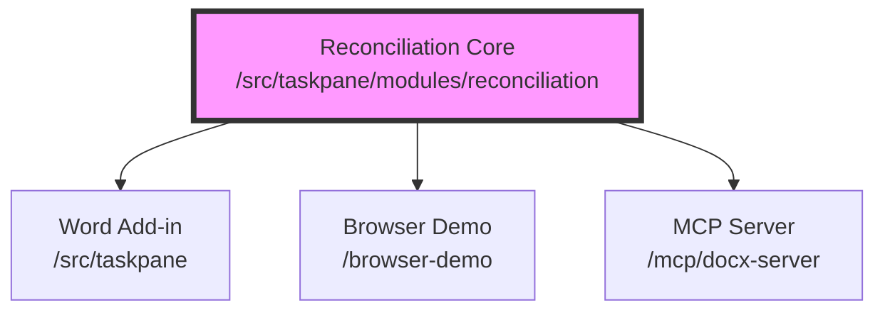

# System Architecture & Project Map

> Role: **System understanding** and technical design map for the host-agnostic OOXML engine and its runtimes.

## Project Map (The GSD Multi-Project Vision)

This repository serves as a mono-repo for a suite of tools built around a common **OOXML Reconciliation Core**.



### Sub-Projects
1. **[Reconciliation Core](file:///c:/Users/Phara/Desktop/Projects/AIWordPlugin/AIWordPlugin/src/taskpane/modules/reconciliation)**: The host-independent engine for `.docx` manipulation. No Office.js dependencies.
2. **[Word Add-in](file:///c:/Users/Phara/Desktop/Projects/AIWordPlugin/AIWordPlugin/src/taskpane)**: The Microsoft Word implementation. Acts as the primary host.
3. **[Browser Demo](file:///c:/Users/Phara/Desktop/Projects/AIWordPlugin/AIWordPlugin/browser-demo)**: Client-side demonstration. Reuses `standalone.js`, handles package-level artifacts (numbering, comments), and validates output package consistency via JSZip.
4. **[MCP Server](file:///c:/Users/Phara/Desktop/Projects/AIWordPlugin/AIWordPlugin/mcp/docx-server)**: Node.js automation tool. Uses the same standalone entrypoint to edit paragraphs and annotate documents without a Word host.

> [!TIP]
> **Cross-Environment Validation**: Demo environments are critical for validating reconciliation changes independently of Word's runtime constraints.

---

# Detailed Architecture: OOXML Reconciliation

This document outlines the architectural logic of the **Gemini AI for Office Word Add-in**, with a deep dive into the **OOXML Reconciliation Engine**.

## High-Level Architecture

The system follows a **Chat-Centric** architecture where the Taskpane acts as the orchestrator between the User, the Word Document (via Office.js), and the Gemini API.

```mermaid
graph TD
    User[User Input] --> Taskpane[Taskpane.js]
    Taskpane --> Context[Context Extraction]
    Context --> Word[Word Document]
    Taskpane --> Gemini[Gemini API]
    Gemini --> Tools[Tool Definitions (JSON)]
    Gemini --Function Call--> Taskpane
    Taskpane --> Agentic[Agentic Tools]
    Agentic --> Logic[Decision Logic]
    Logic --Text/List/Table--> OOXML[OOXML Engine]
    Logic --Surgical Format--> rPrChange[w:rPrChange Engine]
    OOXML --> Word
    rPrChange --> Word
```

---

## 1. The OOXML Reconciliation Engine (`src/taskpane/modules/reconciliation/`)

The core of the project is a portable engine that converts AI-generated Markdown into valid Office Open XML (Word) structures while preserving formatting and generating precise "Track Changes" (Redlines).

### Hybrid Operating Modes

The engine (`oxml-engine.js`) automatically selects the best strategy based on the operation:

| Mode | Trigger | Focus |
|------|---------|-------|
| **FORMAT-ONLY** | Text unchanged, has formatting | Surgical Bold, Italic, etc. via `w:rPrChange`. |
| **FORMAT-REMOVAL** | Clear formatting requested | Explicitly emits "OFF" attributes (e.g., `w:b w:val="0"`). |
| **SURGICAL** | Existing tables/structure detected | In-place edits that preserve node integrity. |
| **RECONSTRUCTION** | Standard text edits | Rebuilds paragraph via RunModel pipeline. |
| **LIST EXPANSION** | Paragraph -> Markdown List | Generates `w:numPr` and list structure. |
| **TABLE RECON** | Markdown Table input | Virtual Grid diffing for merged cell safety. |
| **TEXT-TO-TABLE** | Markdown Table -> No Table | Generates a new `w:tbl` from markdown text. |

### The Reconciliation Pipeline (`pipeline.js`)

Used for text and list operations through a 5-stage process:
1. **Ingestion**: Flattening OOXML into a linear `RunModel` with offset mapping.
2. **Markdown Pre-processing**: Stripping markers and capturing `FormatHints`.
3. **Word-Level Diffing**: Hashing words to unique characters for "native-looking" redlines.
4. **Patching**: Splitting runs at boundaries and applying `keep`/`insert`/`delete` operations.
5. **Serialization**: Reconstructing the XML from the patched `RunModel`.

### Key Architectural Concepts

#### Virtual Grid for Tables
OOXML tables use sparse, row-based structures with complex merges (`vMerge`, `gridSpan`). We convert these into a flat **Virtual Grid** (2D array) for spatial reasoning before diffing, then re-calculate merges during serialization.

#### Surgical Property Modification (`w:rPrChange`)
To ensure formatting changes appear as native Word formatting comments in the margin (e.g., "Formatted: Bold"), we inject delta snapshots into the `<w:rPr>` element instead of performing full text replacements.

#### Table Cell Paragraph Handling (Unwrap/Rewrap)
Word's API often returns the entire table when asking for a paragraph inside a cell. We surgically extract the target `w:p`, perform the edit, and wrap it back into a minimal package to avoid nesting tables unexpectedly.

---

## 2. Portability Layer

The engine is designed to be **Host-Independent**:
- **XML Utility**: Uses `DOMParser` in browsers and `@xmldom/xmldom` in Node.js.
- **No Global Dependencies**: Core logic is isolated from `Office.js` globals.
- **Standalone Entrypoint**: `standalone.js` provides the API for external consumers.

## 3. Implementation Workflow

### For New Features
1. **Prefer OOXML**: Always attempt OOXML-based manipulation first.
2. **Consult [ROADMAP.md](file:///c:/Users/Phara/Desktop/Projects/AIWordPlugin/AIWordPlugin/ROADMAP.md)**: Check if a similar pattern is already implemented or planned.
3. **Update Documentation**: Log architectural decisions in [STATE.md](file:///c:/Users/Phara/Desktop/Projects/AIWordPlugin/AIWordPlugin/STATE.md).

---

## 4. Standalone Integration (`standalone.js`)

The `standalone.js` entry point provides a host-agnostic API for non-Word environments (Browser Demo, MCP Server).

### Key Features
- **Normalization**: Automatically handles `useNativeApi` fallbacks. If the engine requests a Word-native operation, `standalone.js` intercepts it and returns the original OOXML with a warning, preventing runtime errors in non-Word hosts.
- **Structural List Fallback**: Provides `applyRedlineToOxmlWithListFallback`. This detects if a redline is a no-op but contains list markers (e.g., "1. "), then forces a structural conversion to a real Word list.
- **Utility Re-exports**: Centralizes access to:
    - `configureXmlProvider`: For injecting `xmldom` or `jsdom`.
    - `paragraph-targeting`: For resolving `[P#]` indices in arbitrary XML documents.
    - `table-targeting`: For spatial reasoning about tables in flat text.

---

## 5. Deep Dive Documentation

For low-level implementation details of the reconciliation components, refer to the internal module documentation:

- [Reconciliation Core Architecture](file:///c:/Users/Phara/Desktop/Projects/AIWordPlugin/AIWordPlugin/src/taskpane/modules/reconciliation/ARCHITECTURE.md): Detailed breakdown of `core`, `engine`, `pipeline`, and `services`.
- [Pipeline Flow](file:///c:/Users/Phara/Desktop/Projects/AIWordPlugin/AIWordPlugin/src/taskpane/modules/reconciliation/ARCHITECTURE.md#pipeline-flow): 5-stage ingestion and patching lifecycle.
- [List Integration](file:///c:/Users/Phara/Desktop/Projects/AIWordPlugin/AIWordPlugin/src/taskpane/modules/reconciliation/ARCHITECTURE.md#list-edit-integration-command-layer): How structural list conversion is handled in the command layer.
