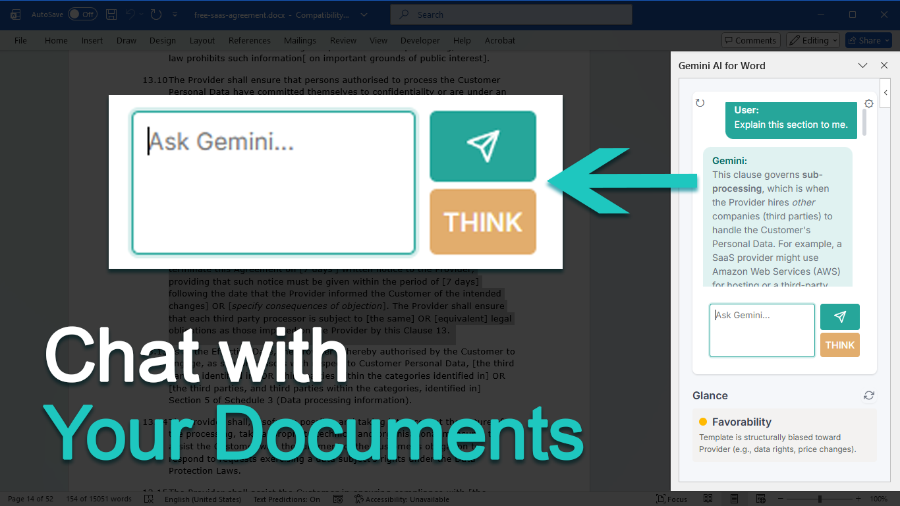

# Gemini AI for Office - AI Assistant for Microsoft Word

**✨ Available on the Microsoft Marketplace:** [Download Here](https://marketplace.microsoft.com/en-ca/product/saas/wa200009707)



## Quick Start

1. **Install** — Get the add-in from the [Microsoft Marketplace](https://marketplace.microsoft.com/en-ca/product/saas/wa200009707) (free)
2. **Add your API key** — Click the ⚙️ icon and enter your [Google Gemini API key](https://makersuite.google.com/app/apikey)
3. **Start chatting** — Ask the AI to summarize, edit, or review your document!

---

Gemini AI for Office integrates Google Gemini AI to draft, edit, and review your document directly. Unlock the power of Google's Gemini AI directly inside Microsoft Word.

Gemini AI for Office is the ultimate writing companion, designed to help you draft, edit, and perfect your documents using your own Google API key. Whether you are a student, professional, or creative writer, this add-in streamlines your workflow while giving you full control over your AI usage and costs.

## Key Features

### Bring Your Own Key (BYOK)
Connect your personal Google AI Studio key directly. This ensures complete privacy and allows you to pay Google directly for usage (or utilize their free tier) without the massive middleman markups.

### AI Chat Assistant
Chat naturally with your document. Ask for summaries, clarifications, or rewrites using the latest Gemini models from Google.

### Direct Document Editing
The AI doesn't just suggest changes; it applies them. It rewrites sections with full Track Changes (redline) support, so you always stay in control. You can accept what you like and reject the rest.

### Automated "Glance" Checks
Set up custom criteria—like "Check for Grammar" or "Verify Factual Accuracy"—and get an instant analysis every time you open a document.

### Built-in Research
Need to verify a fact? The AI can perform Google Searches to find the latest information and cite sources directly in your text.

### Custom Personas
Tailor the AI's personality and expertise. Make it a helpful tutor, a strict legal editor, or a creative writing coach.

### Safety & Versioning
Experiment freely with built-in state checkpoints. Easily revert to previous versions of your document if you change your mind.

Transform how you write today with Gemini AI for Office.

## Installation

### For Users (Recommended)
Simply get the add-in from the **[Microsoft Marketplace](https://marketplace.microsoft.com/en-ca/product/saas/wa200009707)** for an easy one-click free download.

### For Developers (Build from Source)
Follow these steps if you want to modify the code or run it locally.

#### Prerequisites

- Node.js (v14 or higher)
- npm or yarn
- Microsoft Word (Desktop version recommended)
- Google Gemini API key ([Get one here](https://makersuite.google.com/app/apikey))

#### Setup Steps

1. **Clone the repository**
   ```bash
   git clone <your-repo-url>
   cd AIWordPlugin
   ```

2. **Install dependencies**
   ```bash
   npm install
   ```

3. **Trust the development certificate**
   ```bash
   npx office-addin-dev-certs install
   ```

## Running the Add-in

1. **Start the development server**
   ```bash
   npm start
   ```
   
   This will:
   - Build the add-in
   - Start a local HTTPS server on port 3000
   - Open Word and sideload the add-in

2. **After making code changes**
   - Stop the server (Ctrl+C)
   - Rebuild: `npm run build:dev`
   - Restart: `npm start`
   - Refresh the task pane in Word (close and reopen it)

3. **Manual sideloading (if needed)**
   - In Word, go to Insert > Add-ins > My Add-ins
   - Click "Upload My Add-in"
   - Select the `manifest.xml` file from the project root

## Usage

### Setting Up Your API Key

1. Click the ⚙️ (gear) icon in the top right
2. Enter your Google Gemini API key
3. Click "Save"
4. The key is stored in your browser's localStorage

### Using the Chat Interface

1. Type your question in the chat input box
2. Press Enter or click "Send"
3. Wait for Gemini's response
4. Continue the conversation as needed

**Example questions:**
- "Summarize the key terms of this contract"
- "What are the termination clauses?"
- "Explain the liability section"

### Using the Redline Tool

1. (Optional) Select text in your document for context
2. Enter your editing instruction in the "AI Redline Tool" section
3. Click "Apply Changes as Redlines"
4. The AI will analyze the document and apply changes with track changes enabled

**Tips:**
- Be specific in your instructions
- The AI analyzes the entire document, not just selected text
- Review all changes before accepting them
- Changes are applied with Word's Track Changes feature

### Managing Checkpoints

**Save a Checkpoint:**
- Click "Save Checkpoint" to save the current document state
- Checkpoints are stored in browser localStorage

**Revert to Last Checkpoint:**
- Click "Revert Last" to restore the previous checkpoint
- The checkpoint is removed from the stack after reverting

**Clear All Checkpoints:**
- Click "Clear All" to delete all saved checkpoints

## Best Practices & Personas

Get the most out of Gemini AI by tailoring it to your specific needs. Here are some optimized setups for different workflows:

### Legal Professional
**System Message:**
> You are assisting an in-house lawyer at AnsonCorp. You will mainly be working on legal documents. You must be specific, precise, and double-check all your advice and suggested changes. Maintain a professional and helpful tone. Be proactive in suggesting and brainstorming.

**Glance Settings:**
- **Summary:** "Please give me a one sentence summary of this document."
- **Favorability:** "Does this contract favor my client or its affiliates? If neutral, leave green."
- **Red Flags:** "Identify any high-risk clauses or unusual terms."

### Student & Academic
**System Message:**
> You are an academic writing tutor. Help me improve my detailed arguments and clarity without writing the essay for me. Focus on structure, thesis strength, and proper tone. Ensure I avoid passive voice where possible.

**Glance Settings:**
- **Thesis Check:** "Does the introduction clearly state a strong thesis?"
- **Clarity:** "Are there any overly complex sentences that should be simplified?"
- **Passive Voice:** "Flag any excessive use of passive voice."

### Creative Writer
**System Message:**
> You are a creative writing coach. Assist with character development, "show, don't tell," and pacing. Do not rewrite my style, but offer suggestions to make descriptions more vivid and dialogue more natural.

**Glance Settings:**
- **Adverb Check:** "Am I overusing adverbs? Point out weak verbs relying on adverbs."
- **Dialogue:** "Does the dialogue sound natural and distinct for each character?"
- **Pacing:** "Is the pacing of this chapter consistent?"

### Business Professional
**System Message:**
> You are a senior executive assistant. You edit for brevity, impact, and actionability. Remove fluff and corporate jargon. Ensure the bottom line (BLUF) is clear.

**Glance Settings:**
- **TL;DR:** "Provide a one sentence executive summary."
- **Action Items:** "Extract all clear action items and deadlines."
- **Tone:** "Is the tone confident and professional?"

## Project Structure

```
AIWordPlugin/
├── src/
│   ├── taskpane/
│   │   ├── taskpane.html      # Main UI
│   │   ├── taskpane.js        # Core functionality
│   │   ├── taskpane.css       # Styling
│   └── commands/
│       ├── commands.html
│       └── commands.js
├── assets/                     # Icons
├── manifest.xml               # Add-in manifest
├── package.json
├── webpack.config.js
└── README.md
```

## Development

### Building for Production

```bash
npm run build
```

### Linting

```bash
npm run lint
npm run lint:fix
```

### Debugging

- Use browser DevTools (F12) in the task pane
- Check the console for error messages
- Enable verbose logging in `taskpane.js` if needed

### DOCX XML Harness (Testing)

For package-level debugging (without opening Word), use the XML harness:

```powershell
npm run docx:harness -- -Action summary -InputPath "tests/Sample NDA.docx" -AsJson
```

You can also list parts, grep XML, run XPath queries, and extract the package:

```powershell
npm run docx:harness -- -Action list -InputPath "tests/Sample NDA.docx"
npm run docx:harness -- -Action grep -InputPath "tests/Sample NDA.docx" -Pattern "<w:numPr>"
npm run docx:harness -- -Action query -InputPath "tests/Sample NDA.docx" -Part "word/numbering.xml" -XPath "//w:num"
```

See `tests/docx-harness/README.md` for full usage.

The add-in uses Google Gemini models (e.g., `gemini-1.5-flash`, `gemini-1.5-pro`). You can modify the default models in [`taskpane.js`](src/taskpane/taskpane.js).

```javascript
// In taskpane.js, the loadModel function determines which model to use:
function loadModel(type = 'fast') {
  // ...
  return type === 'slow' ? "gemini-1.5-pro" : "gemini-1.5-flash";
}

const geminiModel = loadModel(modelType);
const apiUrl = `https://generativelanguage.googleapis.com/v1beta/models/${geminiModel}:generateContent?key=${geminiApiKey}`;
```

## Security Notes

⚠️ **Important Security Considerations:**

1. **API keys in localStorage** - Keys are stored in browser storage (not encrypted)
2. **Production deployment** - Use environment variables or secure key management
3. **HTTPS required** - Office Add-ins require HTTPS in production

## Troubleshooting

### Add-in won't load
- Ensure the dev server is running (`npm start`)
- Check that port 3000 is not in use
- Verify the certificate is trusted
- Try clearing Office cache: `npx office-addin-dev-settings clear`

### API errors
- Verify your API key is correct
- Check your Gemini API quota
- Ensure you have internet connectivity
- Check browser console for detailed error messages

### Track changes not working
- Ensure you have edit permissions on the document
- Try manually enabling Track Changes in Word
- Check that the document isn't protected

### Checkpoints not saving
- Check browser localStorage isn't full
- Ensure you have a valid document open
- Try clearing old checkpoints

## Future Enhancements

Potential features for future versions:
- [ ] Conversation history persistence
- [ ] Export chat conversations
- [ ] Custom AI prompts/templates
- [ ] Multi-document comparison
- [ ] Advanced checkpoint management (named checkpoints, branching)
- [ ] Markdown rendering in chat
- [ ] Document analysis reports
- [ ] Integration with other AI models

## Contributing

Contributions are welcome! Please:
1. Fork the repository
2. Create a feature branch
3. Make your changes
4. Submit a pull request

## License

MIT License - See LICENSE file for details

## Support

For issues and questions:
- Check the [Troubleshooting](#troubleshooting) section
- Review [Office Add-ins documentation](https://docs.microsoft.com/en-us/office/dev/add-ins/)
- Check [Google Gemini API docs](https://ai.google.dev/docs)

## Acknowledgments

- Built with [Yeoman Office Add-in generator](https://github.com/OfficeDev/generator-office)
- Powered by [Google Gemini AI](https://deepmind.google/technologies/gemini/)
- Uses [Office.js API](https://docs.microsoft.com/en-us/office/dev/add-ins/reference/javascript-api-for-office)
