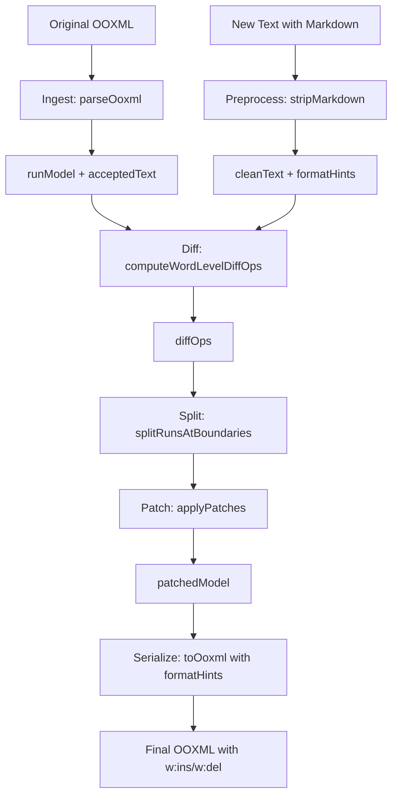
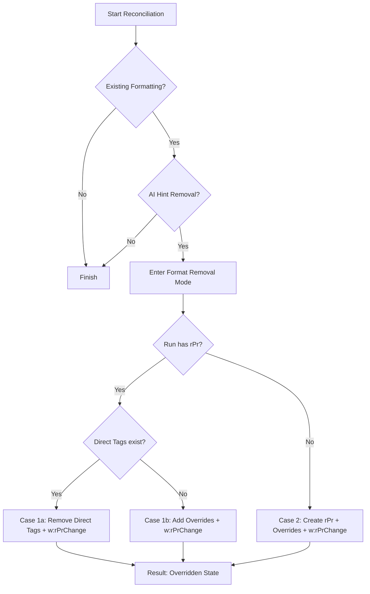

# Word Add-in: Document Reconciliation Architecture

This document describes the diff/reconciliation system for the Word Add-in. The architecture follows a **Virtual DOM pattern** where a lightweight text representation manages a heavier OOXML document structure, preserving all formatting through surgical edits.

---

## Architecture Overview



**Key Insight**: The "Virtual DOM" is the `acceptedText` string + `runModel` array. We diff on the lightweight string, then apply changes back to the structured model that preserves formatting.

---

## ⚠️ IMPORTANT: V5.1 Hybrid Mode Engine

> **Word API Limitation**: The Word JavaScript API's `insertOoxml()` method does NOT respect pre-embedded `<w:ins>`/`<w:del>` track change markup. When OOXML is inserted, Word performs its own content comparison and treats the operation as a single replacement, regardless of internal track change tags.

### Solution: DOM Manipulation Instead of Serialization

The **V5.1 Hybrid Mode Engine** (`oxml-engine.js`) solves this by modifying the OOXML DOM **in-place** rather than serializing new content:

```javascript
// Instead of this (which doesn't work):
// 1. Build new OOXML string with w:ins/w:del
// 2. Call insertOoxml() - Word ignores our track changes

// We do this (which works):
// 1. Parse original OOXML to DOM tree
// 2. Modify DOM nodes in-place (split runs, wrap in w:del/w:ins)
// 3. Serialize modified DOM back to string
// 4. Call insertOoxml() - Word sees our embedded track changes
```

### Three Operating Modes

The engine automatically selects the appropriate mode based on content analysis:

| Mode | Trigger | Use Case |
|------|---------|----------|
| **FORMAT-ONLY** | Text unchanged, has format hints | Bolding/italicizing existing text |
| **SURGICAL** | Has tables | Safe in-place edits preserving structure |
| **RECONSTRUCTION** | No tables | Allows paragraph splitting/creation |

#### FORMAT-ONLY MODE
When the AI applies markdown formatting to existing text (e.g., `**bold this**`), the underlying text is unchanged after stripping markers. The engine:

1. Detects `hasTextChanges = false` AND `hasFormatHints = true`
2. Builds a TextSpan map from original OOXML
3. For each format hint, finds affected runs
4. **Splits runs** at format boundaries (critical for precision!)
5. Applies formatting (`<w:b/>`, `<w:i/>`, etc.) only to targeted runs

> **Key Learning**: When only PART of a run needs formatting, you MUST split the run into three parts:
> - Before text (unformatted)
> - Target text (formatted)  
> - After text (unformatted)

#### SURGICAL MODE (for tables)
- Modifies existing run elements in place
- Never creates or deletes paragraph structure
- Newlines in insertions converted to spaces
- Safe for complex layouts

#### RECONSTRUCTION MODE (for body without tables)
- Rebuilds paragraph content allowing new paragraphs
- Supports list splitting via newlines
- More flexible but requires stable container references

### Markdown Formatting Support

The engine preprocesses markdown and captures format hints with character offsets:

| Markdown | OOXML Element | Example |
|----------|---------------|---------|
| `**text**` | `<w:b/>` | Bold |
| `*text*` | `<w:i/>` | Italic |
| `++text++` | `<w:u w:val="single"/>` | Underline |
| `~~text~~` | `<w:strike/>` | Strikethrough |
| `***text***` | `<w:b/>` + `<w:i/>` | Bold + Italic |

Format hints are applied during both text changes (insertions) and format-only changes.

### Run Splitting for Partial Formatting

When a format hint covers only part of a run:

```
Original run: "The quick brown fox jumps"
Format hint:  bold "brown fox" (positions 10-19)

Result:
  Run 1: "The quick " (unformatted)
  Run 2: "brown fox" (<w:b/>)
  Run 3: " jumps" (unformatted)
```

```javascript
// Splitting logic
const beforeText = fullText.substring(0, localStart);
const formattedText = fullText.substring(localStart, localEnd);
const afterText = fullText.substring(localEnd);

// Create 3 separate runs, remove original
parent.insertBefore(beforeRun, run);
parent.insertBefore(formattedRunWithBold, run);
parent.insertBefore(afterRun, run);
parent.removeChild(run);
```

### Usage

```javascript
import { applyRedlineToOxml } from './modules/reconciliation/index.js';

const result = applyRedlineToOxml(
  originalOoxml,      // The paragraph's OOXML (pkg:package format)
  originalText,       // Plain text extracted from paragraph
  newText,            // New text from AI (may include markdown)
  { author: 'AI' }    // Track change author
);

if (result.hasChanges) {
  targetParagraph.insertOoxml(result.oxml, 'Replace');
}
```

---

## Formatting Reconciliation & Removal

One of the most complex aspects of the Hybrid Engine is reconciling existing formatting with the AI's requested state, particularly when the AI wants to **remove** formatting (e.g., unbolding text).

### The Challenge: Invisible Formatting

Formatting in Word isn't always direct tags on a run. It can be:
- **Direct**: `<w:b/>` on a `w:r`
- **Inherited**: Defined in Paragraph Properties (`w:pPr/w:rPr`)
- **Style-based**: Referenced via `<w:rStyle w:val="Strong"/>`

### Three-Step Reconciliation Logic

When the AI sends text without markdown markers (implying plain text), the engine performs a **Semantic Extraction**:

1.  **Extract Formatting**: The engine walks the `w:p` structure and builds a `formatHints` map from the *original* OOXML. This map merges paragraph-level defaults and style-referenced formatting into a uniform "Calculated State" for every character.
2.  **Detect Removal**: If `hasTextChanges = false` but `formatHints` (from AI) is empty while `existingFormatHints` (from OOXML) is NOT, the engine enters **Format Removal Mode**.
3.  **Apply Explicit Overrides**: Since simple tag removal doesn't work for inherited or style-based formatting, the engine adds **Explicit Overrides**.



### Removal Cases & Implementation

| Case | Scenario | Logic | Example XML (Result) |
|------|----------|-------|----------------------|
| **1a** | Direct tag `<w:b/>` exists | Remove `<w:b/>`, add `<w:rPrChange>` | `<w:rPr><w:rPrChange...><w:rPr><w:b/></w:rPr></w:rPrChange></w:rPr>` |
| **1b** | Inherited from Style | Keep style, add `<w:b w:val="0"/>` override | `<w:rPr><w:rStyle w:val="Strong"/><w:b w:val="0"/><w:rPrChange.../></w:rPr>` |
| **2** | Inherited from Para | Create `<w:rPr>`, add `<w:b w:val="0"/>` override | `<w:rPr><w:b w:val="0"/><w:rPrChange.../></w:rPr>` |

### Tracked Changes for Formatting

All formatting changes (addition or removal) are wrapped in `w:rPrChange`. This captures a snapshot of the `rPr` state *before* the change, allowing Word to display the redline correctly in the "Review" pane even if no text was changed.


---

## Core Data Types

```javascript
// operations.js
export const DiffOp = Object.freeze({
    EQUAL: 'equal',
    DELETE: 'delete',
    INSERT: 'insert'
});

export const PatchOp = Object.freeze({
    KEEP: 'keep',
    DELETE_TRACKED: 'delete_tracked',
    DELETE_SILENT: 'delete_silent',
    INSERT_TRACKED: 'insert_tracked',
    INSERT_SILENT: 'insert_silent'
});

export const RunKind = Object.freeze({
    TEXT: 'run',
    DELETION: 'deletion',
    INSERTION: 'insertion',
    HYPERLINK: 'hyperlink',
    BOOKMARK: 'bookmark'
});
```

---

## Pipeline Stages

The reconciliation pipeline has 6 explicit stages, each independently testable:

```javascript
class ReconciliationPipeline {
    constructor(options = {}) {
        this.generateRedlines = options.generateRedlines ?? true;
        this.author = options.author ?? 'AI';
    }
    
    async execute(originalOoxml, newText) {
        // Stage 1: Ingest OOXML
        const { runModel, acceptedText, pPr } = ingestOoxml(originalOoxml);
        
        // Stage 2: Preprocess markdown
        const { cleanText, formatHints } = preprocessMarkdown(newText);
        
        // Stage 3: Compute word-level diff
        const diffOps = computeWordLevelDiffOps(acceptedText, cleanText);
        
        // Stage 4: Pre-split runs at boundaries
        const splitModel = splitRunsAtDiffBoundaries(runModel, diffOps);
        
        // Stage 5: Apply patches
        const patchedModel = applyPatches(splitModel, diffOps, {
            generateRedlines: this.generateRedlines,
            author: this.author,
            formatHints
        });
        
        // Stage 6: Serialize to OOXML
        return serializeToOoxml(patchedModel, pPr);
    }
}
```

---

## Stage 1: OOXML Ingestion (Unified Container-Aware)

Converts OOXML into a structured run model with character-level offset mapping. This **single unified implementation** handles all content types:
- Basic runs (`w:r`)
- Track changes (`w:ins`, `w:del`)
- Hyperlinks (`w:hyperlink`)
- Fields (`w:fldSimple`)
- Content controls (`w:sdt`)
- Smart tags (`w:smartTag`)

### Extended Run Types

```javascript
const RunKind = Object.freeze({
    TEXT: 'run',
    DELETION: 'deletion',
    INSERTION: 'insertion',
    HYPERLINK: 'hyperlink',
    BOOKMARK: 'bookmark',
    FIELD: 'field',
    
    // Container delimiters for preserving hierarchy
    CONTAINER_START: 'container_start',
    CONTAINER_END: 'container_end'
});

const ContainerKind = Object.freeze({
    SDT: 'sdt',                 // Content Control
    SMART_TAG: 'smartTag',      // Smart Tag
    CUSTOM_XML: 'customXml',    // Custom XML
    FIELD_COMPLEX: 'fldComplex' // Complex field (fldChar-based)
});
```

### Unified Ingestion Function

```javascript
let containerIdCounter = 0;

function buildRunAwareTextModel(ooxmlDoc) {
    const runModel = [];
    let acceptedText = '';
    const offsetMap = new Map();

    const paragraph = ooxmlDoc.getElementsByTagNameNS(NS_W, 'p')[0];
    if (!paragraph) return { runModel, acceptedText, offsetMap };

    const result = processNodeRecursive(paragraph, 0, runModel, offsetMap);
    acceptedText = result.text;

    return { runModel, acceptedText, offsetMap };
}

/**
 * Unified recursive processor - handles all node types in a single function.
 * Container tokens (START/END) are emitted for complex elements to preserve hierarchy.
 * Simple runs are processed directly without container tokens.
 */
function processNodeRecursive(node, currentOffset, runModel, offsetMap) {
    let localOffset = currentOffset;
    let text = '';

    for (const child of node.childNodes) {
        const nodeName = child.nodeName;

        // Skip: paragraph properties, deleted content, proofing markers
        if (nodeName === 'w:pPr') continue;
        if (nodeName === 'w:del') continue;
        if (nodeName === 'w:proofErr') continue;

        // Bookmarks: preserve but no text contribution
        if (nodeName === 'w:bookmarkStart' || nodeName === 'w:bookmarkEnd') {
            runModel.push({
                kind: RunKind.BOOKMARK,
                nodeXml: new XMLSerializer().serializeToString(child),
                startOffset: localOffset,
                endOffset: localOffset,
                text: ''
            });
            continue;
        }

        // Insertions: content IS part of accepted text (recurse)
        if (nodeName === 'w:ins') {
            const result = processNodeRecursive(child, localOffset, runModel, offsetMap);
            localOffset = result.offset;
            text += result.text;
            continue;
        }

        // Hyperlinks: preserve structure, extract text
        if (nodeName === 'w:hyperlink') {
            const hyperlinkEntry = processHyperlink(child, localOffset);
            runModel.push(hyperlinkEntry);
            for (let i = 0; i < hyperlinkEntry.text.length; i++) {
                offsetMap.set(localOffset + i, { runIndex: runModel.length - 1, localOffset: i });
            }
            localOffset += hyperlinkEntry.text.length;
            text += hyperlinkEntry.text;
            continue;
        }

        // Simple fields: treat as atomic run
        if (nodeName === 'w:fldSimple') {
            const fieldEntry = processFieldSimple(child, localOffset);
            runModel.push(fieldEntry);
            localOffset += fieldEntry.text.length;
            text += fieldEntry.text;
            continue;
        }

        // Content Controls (SDT): emit container tokens
        if (nodeName === 'w:sdt') {
            const containerId = `sdt_${containerIdCounter++}`;
            const sdtPr = child.getElementsByTagNameNS(NS_W, 'sdtPr')[0];
            const sdtContent = child.getElementsByTagNameNS(NS_W, 'sdtContent')[0];

            runModel.push({
                kind: RunKind.CONTAINER_START,
                containerKind: ContainerKind.SDT,
                containerId,
                propertiesXml: sdtPr ? new XMLSerializer().serializeToString(sdtPr) : '',
                startOffset: localOffset,
                endOffset: localOffset,
                text: ''
            });

            if (sdtContent) {
                const result = processNodeRecursive(sdtContent, localOffset, runModel, offsetMap);
                localOffset = result.offset;
                text += result.text;
            }

            runModel.push({
                kind: RunKind.CONTAINER_END,
                containerKind: ContainerKind.SDT,
                containerId,
                startOffset: localOffset,
                endOffset: localOffset,
                text: ''
            });
            continue;
        }

        // Smart Tags: emit container tokens
        if (nodeName === 'w:smartTag') {
            const containerId = `smartTag_${containerIdCounter++}`;

            runModel.push({
                kind: RunKind.CONTAINER_START,
                containerKind: ContainerKind.SMART_TAG,
                containerId,
                propertiesXml: serializeAttributes(child),
                startOffset: localOffset,
                endOffset: localOffset,
                text: ''
            });

            const result = processNodeRecursive(child, localOffset, runModel, offsetMap);
            localOffset = result.offset;
            text += result.text;

            runModel.push({
                kind: RunKind.CONTAINER_END,
                containerKind: ContainerKind.SMART_TAG,
                containerId,
                startOffset: localOffset,
                endOffset: localOffset,
                text: ''
            });
            continue;
        }

        // Standard runs
        if (nodeName === 'w:r') {
            const runEntry = processRun(child, localOffset);
            if (runEntry && runEntry.text) {
                runModel.push(runEntry);
                for (let i = 0; i < runEntry.text.length; i++) {
                    offsetMap.set(localOffset + i, { runIndex: runModel.length - 1, localOffset: i });
                }
                localOffset += runEntry.text.length;
                text += runEntry.text;
            }
        }
    }

    return { offset: localOffset, text };
}

function processHyperlink(hyperlinkNode, startOffset) {
    const rId = hyperlinkNode.getAttribute('r:id') || '';
    const anchor = hyperlinkNode.getAttribute('w:anchor') || '';
    
    let text = '';
    const innerRuns = [];
    
    for (const child of hyperlinkNode.childNodes) {
        if (child.nodeName === 'w:r') {
            const runText = extractTextFromRun(child);
            innerRuns.push({ text: runText, rPrXml: extractRPr(child) });
            text += runText;
        }
    }
    
    return {
        kind: RunKind.HYPERLINK,
        text,
        startOffset,
        endOffset: startOffset + text.length,
        rId,
        anchor,
        innerRuns,
        nodeXml: new XMLSerializer().serializeToString(hyperlinkNode)
    };
}

function processFieldSimple(fieldNode, startOffset) {
    const instr = fieldNode.getAttribute('w:instr') || '';
    const text = extractTextFromNode(fieldNode);
    
    return {
        kind: RunKind.FIELD,
        text,
        startOffset,
        endOffset: startOffset + text.length,
        instruction: instr,
        nodeXml: new XMLSerializer().serializeToString(fieldNode)
    };
}
```

### Run Entry Structure

```javascript
// Standard text run
{
    kind: RunKind.TEXT,
    text: 'Hello world',
    rPrXml: '<w:rPr><w:b/></w:rPr>',  // Serialized formatting (preserved exactly)
    startOffset: 0,
    endOffset: 11
}

// Container start token (e.g., Content Control)
{
    kind: RunKind.CONTAINER_START,
    containerKind: ContainerKind.SDT,
    containerId: 'sdt_0',
    propertiesXml: '<w:sdtPr>...</w:sdtPr>',
    startOffset: 15,
    endOffset: 15,
    text: ''  // Container tokens have no text contribution
}
```

---

## Stage 2: Markdown Preprocessing

Strips markdown syntax BEFORE diffing to prevent markers from corrupting word boundaries. Format information is captured as position-based hints.

**Supported Formatting:**
| Syntax | Format | OOXML Element |
|--------|--------|---------------|
| `**text**` | Bold | `<w:b/>` |
| `*text*` | Italic | `<w:i/>` |
| `++text++` | Underline | `<w:u w:val="single"/>` |
| `~~text~~` | Strikethrough | `<w:strike/>` |
| `^^TEXT^^` | ALL CAPS | `<w:caps/>` |
| `***text***` | Bold + Italic | `<w:b/><w:i/>` |
| `**++text++**` | Bold + Underline | `<w:b/><w:u/>` |

```javascript
function preprocessMarkdown(text) {
    const formatHints = [];
    let cleanText = '';
    let offset = 0;
    
    // Order matters: check longer/compound patterns first
    // Patterns: ***bold+italic***, **++bold+underline++**, **bold**, *italic*, 
    //           ++underline++, ~~strikethrough~~, ^^CAPS^^
    const regex = /(\*\*\*(.+?)\*\*\*)|(\*\*\+\+(.+?)\+\+\*\*)|(\*\*(.+?)\*\*)|(\+\+(.+?)\+\+)|(~~(.+?)~~)|(\^\^(.+?)\^\^)|(\*(.+?)\*)/g;
    let lastIndex = 0;
    let match;
    
    while ((match = regex.exec(text)) !== null) {
        const beforeText = text.slice(lastIndex, match.index);
        cleanText += beforeText;
        offset += beforeText.length;
        
        let innerText, format;
        if (match[2]) {
            innerText = match[2];
            format = { bold: true, italic: true };           // ***
        } else if (match[4]) {
            innerText = match[4];
            format = { bold: true, underline: true };        // **++...++**
        } else if (match[6]) {
            innerText = match[6];
            format = { bold: true };                          // **
        } else if (match[8]) {
            innerText = match[8];
            format = { underline: true };                     // ++
        } else if (match[10]) {
            innerText = match[10];
            format = { strikethrough: true };                 // ~~
        } else if (match[12]) {
            innerText = match[12];
            format = { caps: true };                          // ^^
        } else if (match[14]) {
            innerText = match[14];
            format = { italic: true };                        // *
        }
        
        formatHints.push({ start: offset, end: offset + innerText.length, format });
        cleanText += innerText;
        offset += innerText.length;
        lastIndex = regex.lastIndex;
    }
    
    cleanText += text.slice(lastIndex);
    return { cleanText, formatHints };
}
```

**Example**:
```
Input:  "^^LIMITATION OF LIABILITY^^ - ~~old text~~ new text"
Output: { 
    cleanText: "LIMITATION OF LIABILITY - old text new text",
    formatHints: [
        { start: 0, end: 23, format: { caps: true } },
        { start: 26, end: 34, format: { strikethrough: true } }
    ]
}
```

### Applying Format to OOXML

```javascript
function injectFormatting(baseRPrXml, format, options = {}) {
    const { generateRedlines, author } = options;
    if (!baseRPrXml) baseRPrXml = '<w:rPr></w:rPr>';
    
    let content = baseRPrXml.replace(/<\/?w:rPr[^>]*>/g, '');
    const originalContent = content;
    
    if (format.bold && !content.includes('<w:b')) {
        content = '<w:b/>' + content;
    }
    if (format.italic && !content.includes('<w:i')) {
        content = '<w:i/>' + content;
    }
    if (format.underline && !content.includes('<w:u')) {
        content = '<w:u w:val="single"/>' + content;
    }
    if (format.strikethrough && !content.includes('<w:strike')) {
        content = '<w:strike/>' + content;
    }
    if (format.caps && !content.includes('<w:caps')) {
        content = '<w:caps/>' + content;
    }
    
    // Style Redline: If formatting changed on existing text, add rPrChange
    if (generateRedlines && content !== originalContent) {
        const date = new Date().toISOString();
        content += `<w:rPrChange w:author="${author}" w:date="${date}"><w:rPr>${originalContent}</w:rPr></w:rPrChange>`;
    }
    
    return `<w:rPr>${content}</w:rPr>`;
}
```


---

## Stage 3: Word-Level Diffing

Tokenizes text into words before diffing for cleaner results.

```javascript
function computeWordLevelDiffOps(originalText, newText) {
    const { chars1, chars2, tokenArray } = wordsToChars(originalText, newText);

    const dmp = new diff_match_patch();
    const charDiffs = dmp.diff_main(chars1, chars2);
    dmp.diff_cleanupSemantic(charDiffs);

    const operations = [];
    let originalOffset = 0;

    for (const [op, chars] of charDiffs) {
        let text = '';
        for (const char of chars) {
            text += tokenArray[char.charCodeAt(0)];
        }

        if (op === 0) {
            operations.push({ type: DiffOp.EQUAL, startOffset: originalOffset, endOffset: originalOffset + text.length, text });
            originalOffset += text.length;
        } else if (op === -1) {
            operations.push({ type: DiffOp.DELETE, startOffset: originalOffset, endOffset: originalOffset + text.length, text });
            originalOffset += text.length;
        } else if (op === 1) {
            operations.push({ type: DiffOp.INSERT, startOffset: originalOffset, endOffset: originalOffset, text });
        }
    }

    return operations;
}
```

---

## Stage 4: Pre-Split Runs at Boundaries

Before patching, split runs precisely at diff operation boundaries. This simplifies the patching stage - each run either stays, gets deleted, or receives an insertion.

```javascript
function splitRunsAtDiffBoundaries(runModel, diffOps) {
    const boundaries = new Set();
    for (const op of diffOps) {
        boundaries.add(op.startOffset);
        boundaries.add(op.endOffset);
    }
    
    const newModel = [];
    for (const run of runModel) {
        const runBoundaries = [...boundaries]
            .filter(b => b > run.startOffset && b < run.endOffset)
            .sort((a, b) => a - b);
        
        if (runBoundaries.length === 0) {
            newModel.push(run);
        } else {
            let currentStart = run.startOffset;
            for (const boundary of runBoundaries) {
                newModel.push({
                    ...run,
                    text: run.text.slice(currentStart - run.startOffset, boundary - run.startOffset),
                    startOffset: currentStart,
                    endOffset: boundary
                });
                currentStart = boundary;
            }
            newModel.push({
                ...run,
                text: run.text.slice(currentStart - run.startOffset),
                startOffset: currentStart,
                endOffset: run.endOffset
            });
        }
    }
    return newModel;
}
```

---

## Stage 5: Apply Patches

Walks through the split run model and applies diff operations. The `generateRedlines` flag controls whether changes are tracked or applied destructively.

### Style Inheritance Strategy

When inserting text, determines which run's formatting to inherit:

```javascript
const StyleInheritance = {
    forInsertion(runModel, offset, insertText) {
        const prevRun = this.findRunBefore(runModel, offset);
        const nextRun = this.findRunAfter(runModel, offset);
        
        if (!prevRun && !nextRun) return null;
        if (!prevRun) return nextRun;
        if (!nextRun) return prevRun;
        
        // Text ending with space = new phrase → inherit from NEXT
        if (insertText && insertText.endsWith(' ')) return nextRun;
        
        // Text starting with space = continuation → inherit from PREV
        if (insertText && insertText.startsWith(' ')) return prevRun;
        
        return prevRun;
    },
    
    findRunBefore(model, offset) {
        return model.filter(r => r.endOffset <= offset && r.kind === RunKind.TEXT).pop();
    },
    
    findRunAfter(model, offset) {
        return model.find(r => r.startOffset >= offset && r.kind === RunKind.TEXT);
    }
};
```

### Patch Application

```javascript
function applyPatches(splitModel, diffOps, options) {
    const { generateRedlines, author, formatHints } = options;
    const patchedModel = [];
    
    for (const run of splitModel) {
        const op = diffOps.find(o => 
            o.startOffset <= run.startOffset && o.endOffset >= run.endOffset
        );
        
        if (!op || op.type === DiffOp.EQUAL) {
            patchedModel.push({ ...run, kind: RunKind.TEXT });
            continue;
        }
        
        if (op.type === DiffOp.DELETE) {
            if (generateRedlines) {
                patchedModel.push({ ...run, kind: RunKind.DELETION, author });
            }
            // If not generating redlines, simply omit the run
            continue;
        }
        
        if (op.type === DiffOp.INSERT) {
            const styleSource = StyleInheritance.forInsertion(splitModel, op.startOffset, op.text);
            const newRun = {
                kind: generateRedlines ? RunKind.INSERTION : RunKind.TEXT,
                text: op.text,
                rPrXml: styleSource?.rPrXml || '',
                startOffset: op.startOffset,
                author
            };
            patchedModel.push(newRun);
        }
    }
    
    return patchedModel;
}
```

---

## Stage 6: Serialize to OOXML

Converts the patched run model back to OOXML, applying format hints during serialization.

```javascript
function serializeToOoxml(patchedModel, pPr, formatHints = []) {
    let runsContent = '';

    for (const item of patchedModel) {
        switch (item.kind) {
            case RunKind.TEXT:
                runsContent += buildRunXmlWithHints(item.text, item.rPrXml, formatHints, item.startOffset);
                break;
            case RunKind.DELETION:
                runsContent += buildDeletionXml(item.text, item.rPrXml, item.revisionId, item.author);
                break;
            case RunKind.INSERTION:
                runsContent += buildInsertionXmlWithHints(item.text, item.rPrXml, formatHints, item.startOffset, item.author);
                break;
            case RunKind.BOOKMARK:
            case RunKind.HYPERLINK:
                runsContent += item.nodeXml;
                break;
        }
    }

    const pPrContent = pPr ? new XMLSerializer().serializeToString(pPr) : '';
    return `<w:p xmlns:w="...">${pPrContent}${runsContent}</w:p>`;
}
```

### Applying Format Hints

```javascript
function buildRunXmlWithHints(text, baseRPrXml, formatHints, runStartOffset) {
    const relevantHints = formatHints.filter(h => 
        h.start < runStartOffset + text.length && h.end > runStartOffset
    );
    
    if (relevantHints.length === 0) {
        return `<w:r>${baseRPrXml}<w:t xml:space="preserve">${escapeXml(text)}</w:t></w:r>`;
    }
    
    const runs = [];
    let pos = 0;
    
    for (const hint of relevantHints) {
        const localStart = Math.max(0, hint.start - runStartOffset);
        const localEnd = Math.min(text.length, hint.end - runStartOffset);
        
        // Text before hint
        if (localStart > pos) {
            runs.push(`<w:r>${baseRPrXml}<w:t xml:space="preserve">${escapeXml(text.slice(pos, localStart))}</w:t></w:r>`);
        }
        
        // Formatted text
        const rPr = injectFormatting(baseRPrXml, hint.format.bold, hint.format.italic);
        runs.push(`<w:r>${rPr}<w:t xml:space="preserve">${escapeXml(text.slice(localStart, localEnd))}</w:t></w:r>`);
        pos = localEnd;
    }
    
    // Remaining text
    if (pos < text.length) {
        runs.push(`<w:r>${baseRPrXml}<w:t xml:space="preserve">${escapeXml(text.slice(pos))}</w:t></w:r>`);
    }
    
    return runs.join('');
}
```

---

## Redline vs. Direct Change Modes

The `generateRedlines` parameter controls output mode:

| Mode | Deletions | Insertions | Output |
|------|-----------|------------|--------|
| **Redline** (`true`) | `w:del` elements | `w:ins` elements | Track changes visible |
| **Direct** (`false`) | Omitted | Regular `w:r` | Clean replacement |

```javascript
// Determined by user's Advanced Settings
const isTrackingOn = context.document.changeTrackingMode !== Word.ChangeTrackingMode.off;
const pipeline = new ReconciliationPipeline({
    generateRedlines: isTrackingOn,
    author: getAuthorForTracking()
});
```

---

## Unified Block Model

Paragraphs, list items, and table cells share a common abstraction:

```javascript
class Block {
    constructor({ type, runModel, pPrXml, metadata = {} }) {
        this.type = type;  // 'paragraph' | 'list_item' | 'table_cell'
        this.runModel = runModel;
        this.pPrXml = pPrXml;
        this.metadata = metadata;  // { ilvl, numId, rowIdx, colIdx }
    }
    
    getText() {
        return this.runModel.map(r => r.text).join('');
    }
    
    diff(other) {
        return computeWordLevelDiffOps(this.getText(), other.getText());
    }
    
    applyPatch(diffOps, options) {
        const split = splitRunsAtDiffBoundaries(this.runModel, diffOps);
        this.runModel = applyPatches(split, diffOps, options);
        return this;
    }
    
    serialize(formatHints) {
        const content = serializeToOoxml(this.runModel, null, formatHints);
        switch (this.type) {
            case 'paragraph':
            case 'list_item':
                return `<w:p>${this.pPrXml}${content}</w:p>`;
            case 'table_cell':
                return `<w:tc><w:p>${content}</w:p></w:tc>`;
        }
    }
}
```

### List Item Structure

```xml
<w:p>
    <w:pPr>
        <w:pStyle w:val="ListParagraph"/>
        <w:numPr>
            <w:ilvl w:val="1"/>  <!-- Level 1 = subbullet -->
            <w:numId w:val="1"/>
        </w:numPr>
        <w:ind w:left="1440" w:hanging="360"/>
    </w:pPr>
    <w:r><w:t>Sub-item text</w:t></w:r>
</w:p>
```

---

## Error Recovery Strategy Chain

Fallback strategies execute in order until one succeeds:

```javascript
const patchStrategies = [
    {
        name: 'run-aware',
        requirement: (ctx) => ctx.textMatches && ctx.runModel.length > 0,
        execute: runAwarePatch
    },
    {
        name: 'simple-diff-ooxml',
        requirement: (ctx) => ctx.ooxmlDoc !== null,
        execute: simpleDiffOoxmlPatch
    },
    {
        name: 'text-replacement',
        requirement: () => true,
        execute: textReplacementFallback
    }
];

async function executeWithFallback(context) {
    for (const strategy of patchStrategies) {
        if (!strategy.requirement(context)) continue;
        
        try {
            const result = await strategy.execute(context);
            console.log(`✅ ${strategy.name} succeeded`);
            return result;
        } catch (error) {
            console.warn(`❌ ${strategy.name} failed:`, error.message);
        }
    }
    throw new Error('All patching strategies exhausted');
}
```

---

## AI Content Generation

When AI creates new structured content (lists, tables, subbullets), the preprocessing stage parses extended markdown syntax and converts it to Block structures.

### Extended Markdown Syntax

The AI uses format specifiers to indicate numbering style. Format is detected from the marker used:

```
# Bullet lists
- Item 1
  - Sub-item 1.1

# Numbered lists (auto-detect format from marker)
1. Decimal              → 1, 2, 3
a. Lowercase alpha      → a, b, c
A. Uppercase alpha      → A, B, C
i. Lowercase roman      → i, ii, iii
I. Uppercase roman      → I, II, III
(a) Parenthesized alpha → (a), (b), (c)
(i) Parenthesized roman → (i), (ii), (iii)
(1) Parenthesized num   → (1), (2), (3)

# Hierarchical outline numbering (legal contracts)
1. Section One
   1.1. Subsection
      1.1.1. Sub-subsection
         1.1.1.1. Clause

# Mixed hierarchy (common in legal)
1. First Article
   (a) First paragraph
      (i) First sub-paragraph
   (b) Second paragraph
2. Second Article

# Tables
| Header 1 | Header 2 |
|----------|----------|
| Cell 1   | Cell 2   |
```

### Numbering Format Types

```javascript
const NumberFormat = Object.freeze({
    DECIMAL: 'decimal',           // 1, 2, 3
    LOWER_ALPHA: 'lowerLetter',   // a, b, c
    UPPER_ALPHA: 'upperLetter',   // A, B, C
    LOWER_ROMAN: 'lowerRoman',    // i, ii, iii
    UPPER_ROMAN: 'upperRoman',    // I, II, III
    BULLET: 'bullet',             // •
    OUTLINE: 'outline'            // 1.1.2.3
});

const NumberSuffix = Object.freeze({
    PERIOD: '.',                  // 1.
    PAREN_RIGHT: ')',             // 1)
    PAREN_BOTH: '()'              // (1)
});
```

### Marker Pattern Detection

```javascript
function detectNumberingFormat(marker) {
    // Hierarchical outline: 1.1.2 or 4.1.2.3
    if (/^\d+(\.\d+)+\.?$/.test(marker)) {
        return { format: NumberFormat.OUTLINE, suffix: NumberSuffix.PERIOD };
    }
    
    // Parenthesized formats: (a), (i), (1)
    if (/^\([a-z]\)$/.test(marker)) {
        return { format: NumberFormat.LOWER_ALPHA, suffix: NumberSuffix.PAREN_BOTH };
    }
    if (/^\([ivxlc]+\)$/i.test(marker)) {
        const isLower = marker === marker.toLowerCase();
        return { format: isLower ? NumberFormat.LOWER_ROMAN : NumberFormat.UPPER_ROMAN, suffix: NumberSuffix.PAREN_BOTH };
    }
    if (/^\(\d+\)$/.test(marker)) {
        return { format: NumberFormat.DECIMAL, suffix: NumberSuffix.PAREN_BOTH };
    }
    
    // Standard formats with period: 1., a., A., i., I.
    if (/^\d+\.$/.test(marker)) {
        return { format: NumberFormat.DECIMAL, suffix: NumberSuffix.PERIOD };
    }
    if (/^[a-z]\.$/.test(marker)) {
        return { format: NumberFormat.LOWER_ALPHA, suffix: NumberSuffix.PERIOD };
    }
    if (/^[A-Z]\.$/.test(marker)) {
        return { format: NumberFormat.UPPER_ALPHA, suffix: NumberSuffix.PERIOD };
    }
    if (/^[ivxlc]+\.$/i.test(marker)) {
        const isLower = marker === marker.toLowerCase();
        return { format: isLower ? NumberFormat.LOWER_ROMAN : NumberFormat.UPPER_ROMAN, suffix: NumberSuffix.PERIOD };
    }
    
    // Bullet
    if (/^[-*•]$/.test(marker)) {
        return { format: NumberFormat.BULLET, suffix: null };
    }
    
    return { format: NumberFormat.DECIMAL, suffix: NumberSuffix.PERIOD };
}
```

### Parsing Legal Lists with Formats

```javascript
function parseListItems(text) {
    const lines = text.split('\n');
    const items = [];
    
    // Regex captures: indent, marker, content
    const lineRegex = /^(\s*)((?:\d+(?:\.\d+)*\.?|\([a-zA-Z0-9ivxlc]+\)|[a-zA-Z]\.|\d+\.|[ivxlcIVXLC]+\.|-|\*|•)\s*)(.*)$/;
    
    for (const line of lines) {
        const match = line.match(lineRegex);
        if (!match) continue;
        
        const [, indent, marker, content] = match;
        const level = Math.floor(indent.length / 3);  // 3 spaces per level (legal convention)
        const { format, suffix } = detectNumberingFormat(marker.trim());
        
        items.push({
            text: content.trim(),
            level,
            format,
            suffix,
            marker: marker.trim()
        });
    }
    
    return items;
}
```

### Hierarchical Outline Numbering

For legal contracts with `1.1.2.3` style numbering:

```javascript
function parseOutlineMarker(marker) {
    // "4.1.2.3." → [4, 1, 2, 3]
    const parts = marker.replace(/\.$/, '').split('.').map(Number);
    return {
        level: parts.length - 1,  // 0-indexed
        numbers: parts
    };
}

function generateOutlineLevel(level) {
    // Word uses abstract numbering definitions
    // Level 0: 1, 2, 3
    // Level 1: 1.1, 1.2
    // Level 2: 1.1.1, 1.1.2
    return {
        format: NumberFormat.DECIMAL,
        levelText: Array(level + 1).fill('%').map((_, i) => `%${i + 1}`).join('.') + '.',
        // %1. at level 0, %1.%2. at level 1, etc.
    };
}
```

### OOXML Number Format Mapping

```javascript
function formatToOoxmlNumFmt(format) {
    const map = {
        [NumberFormat.DECIMAL]: 'decimal',
        [NumberFormat.LOWER_ALPHA]: 'lowerLetter',
        [NumberFormat.UPPER_ALPHA]: 'upperLetter',
        [NumberFormat.LOWER_ROMAN]: 'lowerRoman',
        [NumberFormat.UPPER_ROMAN]: 'upperRoman',
        [NumberFormat.BULLET]: 'bullet'
    };
    return map[format] || 'decimal';
}

function suffixToOoxmlLevelText(format, suffix) {
    const num = '%1';  // Placeholder for current level number
    switch (suffix) {
        case NumberSuffix.PERIOD: return `${num}.`;
        case NumberSuffix.PAREN_RIGHT: return `${num})`;
        case NumberSuffix.PAREN_BOTH: return `(${num})`;
        default: return `${num}.`;
    }
}
```

### Generating Custom Numbering Definition

When AI uses a specific format, generate a custom numbering definition:

```javascript
function generateNumberingDefinition(items) {
    // Collect unique format/level combinations
    const levels = new Map();
    for (const item of items) {
        if (!levels.has(item.level)) {
            levels.set(item.level, { format: item.format, suffix: item.suffix });
        }
    }
    
    // Generate abstractNum with levels
    let levelsXml = '';
    for (const [level, config] of levels) {
        const numFmt = formatToOoxmlNumFmt(config.format);
        const levelText = config.format === NumberFormat.OUTLINE
            ? generateOutlineLevel(level).levelText
            : suffixToOoxmlLevelText(config.format, config.suffix);
        
        levelsXml += `
            <w:lvl w:ilvl="${level}">
                <w:start w:val="1"/>
                <w:numFmt w:val="${numFmt}"/>
                <w:lvlText w:val="${levelText}"/>
                <w:lvlJc w:val="left"/>
                <w:pPr>
                    <w:ind w:left="${720 * (level + 1)}" w:hanging="360"/>
                </w:pPr>
            </w:lvl>
        `;
    }
    
    const abstractNumId = getNextAbstractNumId();
    return {
        abstractNum: `
            <w:abstractNum w:abstractNumId="${abstractNumId}">
                <w:multiLevelType w:val="multilevel"/>
                ${levelsXml}
            </w:abstractNum>
        `,
        numId: abstractNumId
    };
}
```

### Common Legal Contract Numbering Schemes

| Pattern | Levels | Example |
|---------|--------|---------|
| **Outline** | 0→1→2→3 | 1. → 1.1. → 1.1.1. → 1.1.1.1. |
| **Article/Section** | 0→1→2 | 1. → (a) → (i) |
| **US Contract** | 0→1→2→3 | 1. → A. → i. → (a) |
| **UK Contract** | 0→1→2 | 1. → 1.1 → (a) |

```javascript
const LegalSchemes = {
    OUTLINE: [
        { format: 'decimal', suffix: '.' },      // 1.
        { format: 'decimal', suffix: '.' },      // 1.1.
        { format: 'decimal', suffix: '.' },      // 1.1.1.
        { format: 'decimal', suffix: '.' }       // 1.1.1.1.
    ],
    ARTICLE_SECTION: [
        { format: 'decimal', suffix: '.' },      // 1.
        { format: 'lowerLetter', suffix: '()' }, // (a)
        { format: 'lowerRoman', suffix: '()' }   // (i)
    ],
    US_CONTRACT: [
        { format: 'decimal', suffix: '.' },      // 1.
        { format: 'upperLetter', suffix: '.' },  // A.
        { format: 'lowerRoman', suffix: '.' },   // i.
        { format: 'lowerLetter', suffix: '()' }  // (a)
    ]
};
```

### Content Type Detection

```javascript
const ContentType = Object.freeze({
    PARAGRAPH: 'paragraph',
    BULLET_LIST: 'bullet_list',
    NUMBERED_LIST: 'numbered_list',
    TABLE: 'table'
});

function detectContentType(text) {
    const trimmed = text.trim();
    
    // Table: starts with | ... |
    if (/^\|.+\|/.test(trimmed) && trimmed.includes('\n')) {
        return ContentType.TABLE;
    }
    
    // Outline numbering: 1.1.2
    if (/^\d+(\.\d+)+/.test(trimmed)) {
        return ContentType.NUMBERED_LIST;
    }
    
    // Parenthesized: (a), (i), (1)
    if (/^\([a-zA-Z0-9ivxlc]+\)/.test(trimmed)) {
        return ContentType.NUMBERED_LIST;
    }
    
    // Standard numbered: 1., a., A., i., I.
    if (/^(\d+\.|[a-zA-Z]\.|[ivxlcIVXLC]+\.)/.test(trimmed)) {
        return ContentType.NUMBERED_LIST;
    }
    
    // Bullet list: starts with - or * or •
    if (/^[-*•]\s/.test(trimmed)) {
        return ContentType.BULLET_LIST;
    }
    
    return ContentType.PARAGRAPH;

}
```

### List Parsing with Levels

```javascript
function parseListItems(text) {
    const lines = text.split('\n');
    const items = [];
    
    for (const line of lines) {
        // Count leading spaces (2 spaces = 1 level)
        const leadingSpaces = line.match(/^(\s*)/)[1].length;
        const level = Math.floor(leadingSpaces / 2);
        
        // Strip marker (-, *, 1., a., etc.)
        const content = line.replace(/^\s*[-*]|\d+\.|[a-z]\.\s*/, '').trim();
        
        if (content) {
            items.push({ text: content, level });
        }
    }
    
    return items;  // [{ text: 'Item 1', level: 0 }, { text: 'Sub-item', level: 1 }, ...]
}
```

### Table Parsing

```javascript
function parseTable(text) {
    const lines = text.split('\n').filter(l => l.trim().startsWith('|'));
    
    // Skip separator row (|---|---|)
    const dataLines = lines.filter(l => !l.includes('---'));
    
    const rows = dataLines.map(line => {
        return line
            .split('|')
            .slice(1, -1)  // Remove empty first/last from split
            .map(cell => cell.trim());
    });
    
    return {
        headers: rows[0],
        rows: rows.slice(1),
        hasHeader: lines.some(l => l.includes('---'))
    };
}
```

### Block Generation from Parsed Content

```javascript
function generateBlocks(contentType, parsedData, options = {}) {
    switch (contentType) {
        case ContentType.BULLET_LIST:
        case ContentType.NUMBERED_LIST:
            return generateListBlocks(parsedData, contentType, options);
        case ContentType.TABLE:
            return generateTableBlocks(parsedData, options);
        default:
            return [new Block({ type: 'paragraph', runModel: [], pPrXml: '' })];
    }
}

function generateListBlocks(items, listType, options) {
    const numId = listType === ContentType.BULLET_LIST ? '1' : '2';
    
    return items.map(item => {
        const { cleanText, formatHints } = preprocessMarkdown(item.text);
        
        const pPrXml = `
            <w:pPr>
                <w:pStyle w:val="ListParagraph"/>
                <w:numPr>
                    <w:ilvl w:val="${item.level}"/>
                    <w:numId w:val="${numId}"/>
                </w:numPr>
                ${item.level > 0 ? `<w:ind w:left="${720 * (item.level + 1)}" w:hanging="360"/>` : ''}
            </w:pPr>
        `;
        
        return new Block({
            type: 'list_item',
            runModel: textToRunModel(cleanText, formatHints),
            pPrXml,
            metadata: { ilvl: item.level, numId }
        });
    });
}
```

### Table Block Generation

```javascript
function generateTableBlocks(tableData, options) {
    const { headers, rows, hasHeader } = tableData;
    const allRows = hasHeader ? [headers, ...rows] : rows;
    
    // Generate table grid (column widths)
    const colCount = headers.length;
    const gridCols = Array(colCount).fill('<w:gridCol w:w="2000"/>').join('');
    
    // Generate rows
    const rowsXml = allRows.map((row, rowIdx) => {
        const cellsXml = row.map(cellText => {
            const { cleanText, formatHints } = preprocessMarkdown(cellText);
            const runs = textToRunModelXml(cleanText, formatHints);
            
            // Bold header row
            const rPr = (hasHeader && rowIdx === 0) ? '<w:rPr><w:b/></w:rPr>' : '';
            
            return `
                <w:tc>
                    <w:tcPr><w:tcW w:w="0" w:type="auto"/></w:tcPr>
                    <w:p><w:pPr/>${runs}</w:p>
                </w:tc>
            `;
        }).join('');
        
        return `<w:tr>${cellsXml}</w:tr>`;
    }).join('');
    
    // Return as special table block
    return [{
        type: 'table',
        ooxml: `
            <w:tbl>
                <w:tblPr>
                    <w:tblStyle w:val="TableGrid"/>
                    <w:tblW w:w="0" w:type="auto"/>
                    <w:tblBorders>
                        <w:top w:val="single" w:sz="4"/>
                        <w:left w:val="single" w:sz="4"/>
                        <w:bottom w:val="single" w:sz="4"/>
                        <w:right w:val="single" w:sz="4"/>
                        <w:insideH w:val="single" w:sz="4"/>
                        <w:insideV w:val="single" w:sz="4"/>
                    </w:tblBorders>
                </w:tblPr>
                <w:tblGrid>${gridCols}</w:tblGrid>
                ${rowsXml}
            </w:tbl>
        `
    }];
}
```

### Unified Pipeline (No Generation Branch)

**Key Insight**: Generation is just reconciliation against empty content. By treating all operations as reconciliation, we eliminate branching and use a single code path.

```javascript
async execute(originalOoxml, newText) {
    const newContentType = detectContentType(newText);
    
    // Detect what we're working with (for logging/metrics, not branching)
    const originalType = originalOoxml ? detectContentTypeFromOoxml(originalOoxml) : null;
    console.log(`Reconciling: ${originalType || 'empty'} → ${newContentType}`);
    
    // Unified approach: Always use reconciliation
    // For "generation", originalOoxml is empty/null, so diff produces all INSERTs
    const originalText = originalOoxml ? extractTextFromOoxml(originalOoxml) : '';
    const { runModel, pPr } = originalOoxml 
        ? ingestOoxml(originalOoxml) 
        : { runModel: [], pPr: null };
    
    // Preprocess new content (strip markdown, get format hints)
    const { cleanText, formatHints } = preprocessMarkdown(newText);
    
    // For structured content (lists/tables), parse into blocks
    const newBlocks = parseIntoBlocks(newText, newContentType);
    
    if (newBlocks.length > 1 || newContentType !== ContentType.PARAGRAPH) {
        // Block-level reconciliation (lists, tables, or multi-paragraph)
        return this.executeBlockReconciliation(runModel, newBlocks, {
            generateRedlines: this.generateRedlines,
            author: this.author,
            formatHints
        });
    }
    
    // Single paragraph: standard run-level diff
    const diffOps = computeWordLevelDiffOps(originalText, cleanText);
    const splitModel = splitRunsAtDiffBoundaries(runModel, diffOps);
    const patchedModel = applyPatches(splitModel, diffOps, {
        generateRedlines: this.generateRedlines,
        author: this.author,
        formatHints
    });
    
    return serializeToOoxml(patchedModel, pPr, formatHints);
}

/**
 * Parse AI output into blocks based on content type
 */
function parseIntoBlocks(text, contentType) {
    switch (contentType) {
        case ContentType.BULLET_LIST:
        case ContentType.NUMBERED_LIST:
            return parseListItems(text).map(item => new Block({
                type: 'list_item',
                runModel: textToRunModel(item.text, []),
                pPrXml: buildListPPr(item.level, item.format),
                metadata: { level: item.level, format: item.format }
            }));
            
        case ContentType.TABLE:
            const tableData = parseTable(text);
            return [new Block({
                type: 'table',
                tableData,
                metadata: { rows: tableData.rows.length, cols: tableData.headers.length }
            })];
            
        default:
            // Single paragraph block
            return [new Block({
                type: 'paragraph',
                runModel: textToRunModel(text, []),
                pPrXml: ''
            })];
    }
}

/**
 * Block-level reconciliation handles structured content uniformly
 */
async executeBlockReconciliation(originalRuns, newBlocks, options) {
    const { generateRedlines, author, formatHints } = options;
    
    // For each new block, reconcile against corresponding original content
    // If no original exists (generation case), diff against empty produces all INSERTs
    const reconciledBlocks = newBlocks.map((block, idx) => {
        const originalBlock = this.matchOriginalBlock(originalRuns, block, idx);
        
        if (originalBlock) {
            // Edit existing block
            const diffOps = computeWordLevelDiffOps(originalBlock.getText(), block.getText());
            const splitModel = splitRunsAtDiffBoundaries(originalBlock.runModel, diffOps);
            block.runModel = applyPatches(splitModel, diffOps, options);
        } else if (generateRedlines) {
            // New block (generation case) - mark runs as insertions
            block.runModel = block.runModel.map(run => ({
                ...run,
                kind: RunKind.INSERTION,
                author
            }));
        }
        
        return block;
    });
    
    // Handle deletions: blocks in original that don't match any new block
    const deletedBlocks = this.findDeletedBlocks(originalRuns, newBlocks);
    if (generateRedlines) {
        for (const deleted of deletedBlocks) {
            deleted.runModel = deleted.runModel.map(run => ({
                ...run,
                kind: RunKind.DELETION,
                author
            }));
            reconciledBlocks.push(deleted);
        }
    }
    
    // Serialize all blocks
    return reconciledBlocks.map(b => b.serialize(formatHints)).join('');
}
```

### Redlines for New Content

When `generateRedlines` is true, wrap entire new blocks in `w:ins`:

```javascript
function wrapBlockAsInsertion(blockOoxml, author, date) {
    const revId = getNextRevisionId();
    return `<w:ins w:id="${revId}" w:author="${escapeXml(author)}" w:date="${date}">${blockOoxml}</w:ins>`;
}

// In serialize:
if (this.generateRedlines && isNewContent) {
    return wrapBlockAsInsertion(serialized, this.author, new Date().toISOString());
}
```

---

## Summary

| Stage | Function | Purpose |
|-------|----------|---------|
| 1. Detect | `detectContentType()` | Determine if text is paragraph/list/table |
| 2. Ingest | `buildRunAwareTextModel()` | Parse OOXML → Run Model + Text |
| 3. Preprocess | `preprocessMarkdown()` | Strip `**`/`*` → cleanText + formatHints |
| 4. Parse | `parseListItems()` / `parseTable()` | Extract structured content |
| 5. Diff | `computeWordLevelDiffOps()` | Word-level diff (paragraphs only) |
| 6. Split | `splitRunsAtDiffBoundaries()` | Pre-split runs at operation boundaries |
| 7. Patch/Generate | `applyPatches()` / `generateBlocks()` | Apply diffs or create new blocks |
| 8. Serialize | `serializeToOoxml()` | Run Model → OOXML with format hints |

### Content-Type Handling

| Content Type | Block Type | Metadata | Creation |
|--------------|------------|----------|----------|
| Paragraph | `'paragraph'` | — | Diff/patch |
| Bullet List | `'list_item'` | `{ ilvl, numId: '1' }` | Generate |
| Numbered List | `'list_item'` | `{ ilvl, numId: '2' }` | Generate |
| Table | `'table'` | `{ rows, cols }` | Generate |

### Subbullet Levels

| Indent | Level (`ilvl`) | Left Indent (twips) |
|--------|----------------|---------------------|
| None | 0 | 720 |
| 2 spaces | 1 | 1440 |
| 4 spaces | 2 | 2160 |
| 6 spaces | 3 | 2880 |

## Helper: Content Type Detection from OOXML

For logging and metrics (not for pipeline branching), we detect the content type of existing OOXML:

```javascript
function detectContentTypeFromOoxml(ooxml) {
    if (!ooxml) return null;
    
    const doc = new DOMParser().parseFromString(ooxml, 'application/xml');
    
    // Check for table
    if (doc.getElementsByTagNameNS(NS_W, 'tbl').length > 0) {
        return ContentType.TABLE;
    }
    
    // Check for list (numPr in pPr)
    const numPr = doc.getElementsByTagNameNS(NS_W, 'numPr');
    if (numPr.length > 0) {
        return ContentType.NUMBERED_LIST; // Or BULLET_LIST based on numId lookup
    }
    
    return ContentType.PARAGRAPH;
}
```

> [!NOTE]
> **Complex Element Ingestion** (hyperlinks, fields, content controls) is handled by the unified `processNodeRecursive()` function in Stage 1. See [Stage 1: OOXML Ingestion](#stage-1-ooxml-ingestion-unified-container-aware) for the complete implementation.

---

## Gap Resolution: Numbering Service

Custom numbering definitions must be injected into `word/numbering.xml`, not returned inline. This requires a service layer.

### Numbering Service Architecture

```javascript
class NumberingService {
    constructor(documentPackage) {
        this.package = documentPackage;
        this.numberingXml = null;
        this.nextAbstractNumId = 100;  // Start high to avoid conflicts
        this.nextNumId = 100;
        this.pendingDefinitions = [];
    }
    
    async initialize() {
        // Load existing numbering.xml if present
        try {
            const numberingPart = await this.package.getPartContent('word/numbering.xml');
            this.numberingXml = new DOMParser().parseFromString(numberingPart, 'application/xml');
            
            // Find max existing IDs
            this.nextAbstractNumId = this.findMaxId('w:abstractNum', 'w:abstractNumId') + 1;
            this.nextNumId = this.findMaxId('w:num', 'w:numId') + 1;
        } catch (e) {
            // No numbering.xml exists - create skeleton
            this.numberingXml = this.createEmptyNumbering();
        }
    }

    /**
     * Finds an existing numId that matches a given format/marker pattern.
     * Prevents list restarts by continuing existing sequences.
     */
    findMatchingNumId(format, suffix, level) {
        const nums = this.numberingXml.getElementsByTagNameNS(NS_W, 'num');
        for (const num of nums) {
            const absNumId = num.getElementsByTagNameNS(NS_W, 'abstractNumId')[0]?.getAttribute('w:val');
            const absNum = this.findAbstractNum(absNumId);
            if (!absNum) continue;

            const lvl = this.findLevelInAbstract(absNum, level);
            if (lvl && this.isMatchingFormat(lvl, format, suffix)) {
                return num.getAttribute('w:numId');
            }
        }
        return null;
    }
    
    findMaxId(elementName, attrName) {
        const elements = this.numberingXml.getElementsByTagNameNS(NS_W, elementName.replace('w:', ''));
        let max = 0;
        for (const el of elements) {
            const id = parseInt(el.getAttribute(attrName), 10);
            if (id > max) max = id;
        }
        return max;
    }
    
    createEmptyNumbering() {
        return new DOMParser().parseFromString(`
            <?xml version="1.0" encoding="UTF-8" standalone="yes"?>
            <w:numbering xmlns:w="http://schemas.openxmlformats.org/wordprocessingml/2006/main">
            </w:numbering>
        `, 'application/xml');
    }
    
    /**
     * Register a new numbering definition
     * @returns {string} The numId to use in w:numPr
     */
    registerNumberingDefinition(levelConfigs) {
        const abstractNumId = this.nextAbstractNumId++;
        const numId = this.nextNumId++;
        
        // Build abstractNum element
        let levelsXml = '';
        for (const [level, config] of Object.entries(levelConfigs)) {
            const ilvl = parseInt(level, 10);
            levelsXml += this.buildLevelXml(ilvl, config);
        }
        
        const abstractNumXml = `
            <w:abstractNum w:abstractNumId="${abstractNumId}" xmlns:w="${NS_W}">
                <w:multiLevelType w:val="multilevel"/>
                ${levelsXml}
            </w:abstractNum>
        `;
        
        const numXml = `
            <w:num w:numId="${numId}" xmlns:w="${NS_W}">
                <w:abstractNumId w:val="${abstractNumId}"/>
            </w:num>
        `;
        
        this.pendingDefinitions.push({ abstractNumXml, numXml, numId });
        
        return numId.toString();
    }
    
    buildLevelXml(ilvl, config) {
        const { format, suffix, start = 1 } = config;
        const numFmt = formatToOoxmlNumFmt(format);
        const levelText = this.buildLevelText(format, suffix, ilvl);
        const indent = 720 * (ilvl + 1);
        
        return `
            <w:lvl w:ilvl="${ilvl}">
                <w:start w:val="${start}"/>
                <w:numFmt w:val="${numFmt}"/>
                <w:lvlText w:val="${levelText}"/>
                <w:lvlJc w:val="left"/>
                <w:pPr>
                    <w:ind w:left="${indent}" w:hanging="360"/>
                </w:pPr>
            </w:lvl>
        `;
    }
    
    buildLevelText(format, suffix, ilvl) {
        if (format === NumberFormat.OUTLINE) {
            // Hierarchical: %1.%2.%3.
            return Array.from({ length: ilvl + 1 }, (_, i) => `%${i + 1}`).join('.') + '.';
        }
        
        const placeholder = `%${ilvl + 1}`;
        switch (suffix) {
            case NumberSuffix.PERIOD: return `${placeholder}.`;
            case NumberSuffix.PAREN_RIGHT: return `${placeholder})`;
            case NumberSuffix.PAREN_BOTH: return `(${placeholder})`;
            default: return `${placeholder}.`;
        }
    }
    
    /**
     * Commit all pending definitions to numbering.xml
     */
    async commit() {
        if (this.pendingDefinitions.length === 0) return;
        
        const numbering = this.numberingXml.documentElement;
        
        for (const def of this.pendingDefinitions) {
            // Parse and append abstractNum
            const abstractNumDoc = new DOMParser().parseFromString(def.abstractNumXml, 'application/xml');
            const importedAbstract = this.numberingXml.importNode(abstractNumDoc.documentElement, true);
            numbering.appendChild(importedAbstract);
            
            // Parse and append num
            const numDoc = new DOMParser().parseFromString(def.numXml, 'application/xml');
            const importedNum = this.numberingXml.importNode(numDoc.documentElement, true);
            numbering.appendChild(importedNum);
        }
        
        // Serialize and write back
        const serialized = new XMLSerializer().serializeToString(this.numberingXml);
        await this.package.setPartContent('word/numbering.xml', serialized);
        
        this.pendingDefinitions = [];
    }
}
```

### Integration with Pipeline

```javascript
class ReconciliationPipeline {
    constructor(options = {}) {
        this.generateRedlines = options.generateRedlines ?? true;
        this.author = options.author ?? 'AI';
        this.numberingService = options.numberingService;  // Injected
    }
    
    async executeListGeneration(newText) {
        const items = parseListItems(newText);
        
        // Collect unique level configurations
        const levelConfigs = {};
        for (const item of items) {
            if (!levelConfigs[item.level]) {
                levelConfigs[item.level] = {
                    format: item.format,
                    suffix: item.suffix
                };
            }
        }
        
        // Register numbering definition
        const numId = this.numberingService.registerNumberingDefinition(levelConfigs);
        
        // Generate blocks with assigned numId
        const blocks = items.map(item => {
            const { cleanText, formatHints } = preprocessMarkdown(item.text);
            
            return new Block({
                type: 'list_item',
                runModel: textToRunModel(cleanText, formatHints),
                pPrXml: this.buildListPPr(item.level, numId),
                metadata: { ilvl: item.level, numId }
            });
        });
        
        // Serialize blocks
        let result = blocks.map(b => b.serialize([])).join('');
        
        if (this.generateRedlines) {
            result = wrapAsInsertion(result, this.author);
        }
        
        return result;
    }
    
    buildListPPr(level, numId) {
        return `
            <w:pPr>
                <w:pStyle w:val="ListParagraph"/>
                <w:numPr>
                    <w:ilvl w:val="${level}"/>
                    <w:numId w:val="${numId}"/>
                </w:numPr>
            </w:pPr>
        `;
    }
}
```

---

## Gap Resolution: Table Cell-Level Reconciliation

Instead of regenerating entire tables, diff cell-by-cell to preserve structure and enable surgical redlines.

### Table Ingestion

```javascript
function ingestTable(tableNode) {
    const rows = [];
    const trElements = tableNode.getElementsByTagNameNS(NS_W, 'tr');
    
    for (let rowIdx = 0; rowIdx < trElements.length; rowIdx++) {
        const tr = trElements[rowIdx];
        const cells = [];
        const tcElements = tr.getElementsByTagNameNS(NS_W, 'tc');
        
        for (let colIdx = 0; colIdx < tcElements.length; colIdx++) {
            const tc = tcElements[colIdx];
            
            // Each cell contains paragraphs
            const paragraphs = tc.getElementsByTagNameNS(NS_W, 'p');
            const cellBlocks = [];
            
            for (const p of paragraphs) {
                const { runModel, acceptedText } = buildRunAwareTextModel(
                    wrapInDocument(p)
                );
                cellBlocks.push({
                    runModel,
                    acceptedText,
                    pPrXml: extractPPr(p)
                });
            }
            
            cells.push({
                colIdx,
                tcPrXml: extractTcPr(tc),
                blocks: cellBlocks,
                getText: () => cellBlocks.map(b => b.acceptedText).join('\n')
            });
        }
        
        rows.push({
            rowIdx,
            trPrXml: extractTrPr(tr),
            cells
        });
    }
    
    return {
        tblPrXml: extractTblPr(tableNode),
        tblGridXml: extractTblGrid(tableNode),
        rows
    };
}
```

### Table Diff Strategy

```javascript
function diffTables(oldTable, newTableData) {
    const operations = [];
    const { headers, rows: newRows, hasHeader } = newTableData;
    const allNewRows = hasHeader ? [headers, ...newRows] : newRows;
    
    // Match rows by index (simple strategy)
    // More sophisticated: use diff algorithm on row content
    const maxRows = Math.max(oldTable.rows.length, allNewRows.length);
    
    for (let rowIdx = 0; rowIdx < maxRows; rowIdx++) {
        const oldRow = oldTable.rows[rowIdx];
        const newRow = allNewRows[rowIdx];
        
        if (!oldRow && newRow) {
            // New row added
            operations.push({
                type: 'row_insert',
                rowIdx,
                cells: newRow
            });
            continue;
        }
        
        if (oldRow && !newRow) {
            // Row deleted
            operations.push({
                type: 'row_delete',
                rowIdx,
                originalRow: oldRow
            });
            continue;
        }
        
        // Both exist - compare cells
        const maxCols = Math.max(oldRow.cells.length, newRow.length);
        
        for (let colIdx = 0; colIdx < maxCols; colIdx++) {
            const oldCell = oldRow.cells[colIdx];
            const newCellText = newRow[colIdx];
            
            if (!oldCell && newCellText) {
                operations.push({
                    type: 'cell_insert',
                    rowIdx,
                    colIdx,
                    text: newCellText
                });
            } else if (oldCell && !newCellText) {
                operations.push({
                    type: 'cell_delete',
                    rowIdx,
                    colIdx,
                    originalCell: oldCell
                });
            } else if (oldCell && newCellText) {
                const oldText = oldCell.getText();
                if (oldText !== newCellText) {
                    operations.push({
                        type: 'cell_modify',
                        rowIdx,
                        colIdx,
                        originalCell: oldCell,
                        newText: newCellText
                    });
                }
            }
        }
    }
    
    return operations;
}
```

### Table Reconciliation Execution

```javascript
async executeTableReconciliation(originalOoxml, newText) {
    // Ingest original table
    const doc = new DOMParser().parseFromString(originalOoxml, 'application/xml');
    const tableNode = doc.getElementsByTagNameNS(NS_W, 'tbl')[0];
    const oldTable = ingestTable(tableNode);
    
    // Parse new table from markdown
    const newTableData = parseTable(newText);
    
    // Compute cell-level diff
    const cellOps = diffTables(oldTable, newTableData);
    
    // Apply operations to build new table
    return this.applyTableOperations(oldTable, cellOps);
}

applyTableOperations(oldTable, ops) {
    // Clone original structure
    const newRows = JSON.parse(JSON.stringify(oldTable.rows));
    
    for (const op of ops) {
        switch (op.type) {
            case 'cell_modify':
                const cell = newRows[op.rowIdx]?.cells[op.colIdx];
                if (cell) {
                    // Run text diff on cell content
                    const oldText = cell.getText();
                    const diffOps = computeWordLevelDiffOps(oldText, op.newText);
                    
                    // Apply patches to cell's first block
                    if (cell.blocks[0]) {
                        const split = splitRunsAtDiffBoundaries(cell.blocks[0].runModel, diffOps);
                        cell.blocks[0].runModel = applyPatches(split, diffOps, {
                            generateRedlines: this.generateRedlines,
                            author: this.author
                        });
                    }
                }
                break;
                
            case 'row_insert':
                // Insert new row with redline wrapper
                const newRowCells = op.cells.map((text, colIdx) => ({
                    colIdx,
                    tcPrXml: '<w:tcPr><w:tcW w:w="0" w:type="auto"/></w:tcPr>',
                    blocks: [{ runModel: textToRunModel(text, []), pPrXml: '' }],
                    isInserted: true
                }));
                newRows.splice(op.rowIdx, 0, {
                    rowIdx: op.rowIdx,
                    cells: newRowCells,
                    isInserted: true
                });
                break;
                
            case 'row_delete':
                if (this.generateRedlines) {
                    newRows[op.rowIdx].isDeleted = true;
                } else {
                    newRows.splice(op.rowIdx, 1);
                }
                break;
        }
    }
    
    // Serialize to OOXML
    return this.serializeTable(oldTable.tblPrXml, oldTable.tblGridXml, newRows);
}
```

---

## Gap Resolution: Block Expansion Strategy

When a single paragraph transforms into multiple blocks (e.g., a paragraph becoming a 3-item list), the caller must handle XML fragment insertion.

### Expansion Return Type

```javascript
/**
 * @typedef {Object} ReconciliationResult
 * @property {'single'|'fragment'} type - Whether result is single node or fragment
 * @property {string} ooxml - The OOXML content
 * @property {number} blockCount - Number of w:p or w:tbl elements in result
 * @property {boolean} requiresRangeReplacement - True if caller must replace entire range
 */

async execute(originalOoxml, newText) {
    const mode = determineReconcileMode(originalOoxml, newText);
    let resultOoxml;
    let blockCount = 1;
    
    switch (mode) {
        case ReconcileMode.PARAGRAPH_DIFF:
            resultOoxml = await this.executeReconciliation(originalOoxml, newText);
            break;
            
        case ReconcileMode.LIST_GENERATE:
            resultOoxml = await this.executeListGeneration(newText);
            blockCount = countElements(resultOoxml, 'w:p');
            break;
            
        case ReconcileMode.TABLE_GENERATE:
            resultOoxml = await this.executeTableGeneration(newText);
            blockCount = 1;  // Table is single block
            break;
            
        case ReconcileMode.MIXED:
            resultOoxml = await this.executeMixedTransformation(originalOoxml, newText);
            blockCount = countElements(resultOoxml, 'w:p') + countElements(resultOoxml, 'w:tbl');
            break;
    }
    
    return {
        type: blockCount > 1 ? 'fragment' : 'single',
        ooxml: resultOoxml,
        blockCount,
        requiresRangeReplacement: blockCount > 1
    };
}

function countElements(ooxml, tagName) {
    const doc = new DOMParser().parseFromString(`<root xmlns:w="${NS_W}">${ooxml}</root>`, 'application/xml');
    return doc.getElementsByTagNameNS(NS_W, tagName.replace('w:', '')).length;
}
```

### Caller Integration (Word Add-in Layer)

```javascript
async function applyReconciliationResult(range, result) {
    if (result.type === 'single') {
        // Simple case: replace range's OOXML
        range.insertOoxml(result.ooxml, Word.InsertLocation.replace);
    } else {
        // Fragment case: must delete original and insert fragment
        await context.sync();
        
        // Get insertion point
        const insertPoint = range.getRange(Word.RangeLocation.start);
        
        // Delete original content
        range.delete();
        await context.sync();
        
        // Insert fragment as multiple paragraphs
        insertPoint.insertOoxml(result.ooxml, Word.InsertLocation.after);
        await context.sync();
    }
}
```

---

## Gap Resolution: Track Change Placement Rules

Different contexts require different `w:ins`/`w:del` placement strategies.

### Placement Context Detection

```javascript
const InsertionContext = Object.freeze({
    BODY: 'body',           // Main document body
    HEADER: 'header',       // Header
    FOOTER: 'footer',       // Footer
    TEXTBOX: 'textbox',     // Text box / shape
    FOOTNOTE: 'footnote',   // Footnote
    COMMENT: 'comment',     // Comment content
    TABLE_CELL: 'table_cell'
});

function detectInsertionContext(range) {
    // Use Word API to determine context
    // This is simplified - actual implementation depends on your range access
    if (range.parentTable) return InsertionContext.TABLE_CELL;
    if (range.parentContentControlOrNullObject) {
        // Check content control type
    }
    return InsertionContext.BODY;
}
```

### Context-Aware Wrapping

```javascript
function wrapWithTrackChanges(ooxml, context, options) {
    const { author, isInsertion } = options;
    const date = new Date().toISOString();
    const revId = getNextRevisionId();
    
    // Determine appropriate wrapper
    switch (context) {
        case InsertionContext.BODY:
        case InsertionContext.TABLE_CELL:
            // Full block wrapping OK
            if (isInsertion) {
                return wrapBlockInsertion(ooxml, author, date, revId);
            } else {
                return wrapBlockDeletion(ooxml, author, date, revId);
            }
            
        case InsertionContext.HEADER:
        case InsertionContext.FOOTER:
            // More conservative: wrap runs only, not paragraphs
            return wrapRunsOnly(ooxml, author, date, revId, isInsertion);
            
        default:
            return wrapRunsOnly(ooxml, author, date, revId, isInsertion);
    }
}

function wrapBlockInsertion(ooxml, author, date, revId) {
    // Check if content is multiple paragraphs
    const paragraphCount = countElements(ooxml, 'w:p');
    
    if (paragraphCount <= 1) {
        // Single paragraph: wrap at run level for cleaner UX
        return wrapRunsOnly(ooxml, author, date, revId, true);
    }
    
    // Multiple paragraphs: wrap entire block
    // Note: This creates a "big green block" in Word
    return `<w:ins w:id="${revId}" w:author="${escapeXml(author)}" w:date="${date}">${ooxml}</w:ins>`;
}

function wrapRunsOnly(ooxml, author, date, revId, isInsertion) {
    const doc = new DOMParser().parseFromString(`<root xmlns:w="${NS_W}">${ooxml}</root>`, 'application/xml');
    
    // Find all w:r elements and wrap each
    const runs = doc.getElementsByTagNameNS(NS_W, 'r');
    const wrapper = isInsertion ? 'w:ins' : 'w:del';
    
    for (const run of runs) {
        const wrapperEl = doc.createElementNS(NS_W, wrapper);
        wrapperEl.setAttribute('w:id', revId.toString());
        wrapperEl.setAttribute('w:author', author);
        wrapperEl.setAttribute('w:date', date);
        
        run.parentNode.insertBefore(wrapperEl, run);
        wrapperEl.appendChild(run);
    }
    
    // Serialize back, removing root wrapper
    const serialized = new XMLSerializer().serializeToString(doc.documentElement);
    return serialized.replace(/^<root[^>]*>/, '').replace(/<\/root>$/, '');
}
```

### Per-Item Redlines for Lists

Instead of wrapping an entire new list in one `w:ins`, wrap each list item's runs individually:

```javascript
function generateListBlocksWithRedlines(items, listType, options) {
    const { generateRedlines, author } = options;
    const numId = listType === ContentType.BULLET_LIST ? '1' : '2';
    const date = new Date().toISOString();
    
    return items.map((item, idx) => {
        const { cleanText, formatHints } = preprocessMarkdown(item.text);
        let runModel = textToRunModel(cleanText, formatHints);
        
        // If redlines, mark each run as inserted
        if (generateRedlines) {
            runModel = runModel.map(run => ({
                ...run,
                kind: RunKind.INSERTION,
                author,
                revisionId: getNextRevisionId()
            }));
        }
        
        return new Block({
            type: 'list_item',
            runModel,
            pPrXml: buildListPPr(item.level, numId),
            metadata: { ilvl: item.level, numId }
        });
    });
}
```

This approach results in:
- Each list item appearing as a separate addition
- Users can accept/reject individual items
- Cleaner merge/review workflow

---

## Gap Resolution: Virtual Grid for Merged Cells

Simple index-based cell matching (`oldRow.cells[colIdx]`) breaks when tables contain merged cells (`w:vMerge`, `w:gridSpan`). A cell at raw index `[1]` in one row might physically align with index `[2]` in another row.

### The Problem: Cell Index Misalignment

```
Original Table Layout:
┌──────────┬──────────┬──────────┐
│ A (span2)          │    B     │  Row 0: cells[0] spans cols 0-1, cells[1] is col 2
├──────────┬──────────┼──────────┤
│    C     │    D     │    E     │  Row 1: cells[0]=col0, cells[1]=col1, cells[2]=col2
└──────────┴──────────┴──────────┘

Raw XML indices:
  Row 0: tc[0] = "A", tc[1] = "B"
  Row 1: tc[0] = "C", tc[1] = "D", tc[2] = "E"

Problem: tc[1] in Row 0 ("B") is NOT aligned with tc[1] in Row 1 ("D")!
         "B" should align with "E" (both at grid column 2).
```

### Virtual Grid Model

```javascript
/**
 * @typedef {Object} VirtualCell
 * @property {number} gridRow - Logical row in the virtual grid
 * @property {number} gridCol - Logical column in the virtual grid
 * @property {number} rowSpan - Number of rows this cell spans (from vMerge)
 * @property {number} colSpan - Number of columns this cell spans (from gridSpan)
 * @property {Element} tcNode - Original w:tc XML node
 * @property {Array} blocks - Array of parsed blocks (paragraphs) within the cell
 * @property {string} tcPrXml - Cell properties XML
 * @property {boolean} isMergeOrigin - True if this is the origin of a merge
 * @property {boolean} isMergeContinuation - True if this is a vMerge="continue" cell
 */

/**
 * @typedef {Object} VirtualGrid
 * @property {number} rowCount
 * @property {number} colCount
 * @property {Map<string, VirtualCell>} cellMap - Key: "row,col" -> VirtualCell
 * @property {Array<Array<VirtualCell>>} grid - 2D array for direct access
 */
```

### Grid Ingestion Algorithm

```javascript
function ingestTableToVirtualGrid(tableNode) {
    const tblGrid = tableNode.getElementsByTagNameNS(NS_W, 'tblGrid')[0];
    const gridCols = tblGrid?.getElementsByTagNameNS(NS_W, 'gridCol') || [];
    const colCount = gridCols.length;
    
    const trElements = tableNode.getElementsByTagNameNS(NS_W, 'tr');
    const rowCount = trElements.length;
    
    // Initialize empty grid
    const grid = Array.from({ length: rowCount }, () => 
        Array.from({ length: colCount }, () => null)
    );
    const cellMap = new Map();
    
    // Track vertical merge continuations
    const vMergeOrigins = new Map(); // Key: colIdx -> { originRow, cell }
    
    for (let rowIdx = 0; rowIdx < trElements.length; rowIdx++) {
        const tr = trElements[rowIdx];
        const tcElements = tr.getElementsByTagNameNS(NS_W, 'tc');
        
        let gridCol = 0; // Current position in virtual grid
        
        for (let tcIdx = 0; tcIdx < tcElements.length; tcIdx++) {
            const tc = tcElements[tcIdx];
            const tcPr = tc.getElementsByTagNameNS(NS_W, 'tcPr')[0];
            
            // Skip to next available grid column (may be occupied by vMerge from above)
            while (gridCol < colCount && grid[rowIdx][gridCol] !== null) {
                gridCol++;
            }
            
            if (gridCol >= colCount) break; // Row is full
            
            // Parse gridSpan (horizontal merge)
            const gridSpanEl = tcPr?.getElementsByTagNameNS(NS_W, 'gridSpan')[0];
            const colSpan = parseInt(gridSpanEl?.getAttribute('w:val') || '1', 10);
            
            // Parse vMerge (vertical merge)
            const vMergeEl = tcPr?.getElementsByTagNameNS(NS_W, 'vMerge')[0];
            const vMergeVal = vMergeEl?.getAttribute('w:val'); // "restart" or undefined (continue)
            const hasVMerge = vMergeEl !== null;
            
            let cell;
            
            if (hasVMerge && vMergeVal !== 'restart') {
                // This is a vMerge continuation - link to origin
                const origin = vMergeOrigins.get(gridCol);
                if (origin) {
                    origin.cell.rowSpan++;
                    cell = {
                        gridRow: rowIdx,
                        gridCol,
                        rowSpan: 0, // Continuation cells have rowSpan 0
                        colSpan,
                        tcNode: tc,
                        blocks: [], // Content comes from origin
                        tcPrXml: serializeTcPr(tcPr),
                        isMergeOrigin: false,
                        isMergeContinuation: true,
                        mergeOrigin: origin.cell
                    };
                }
            } else {
                // Regular cell or vMerge="restart" (origin of vertical merge)
                const blocks = parseCellBlocks(tc);
                
                cell = {
                    gridRow: rowIdx,
                    gridCol,
                    rowSpan: 1,
                    colSpan,
                    tcNode: tc,
                    blocks,
                    tcPrXml: serializeTcPr(tcPr),
                    isMergeOrigin: hasVMerge && vMergeVal === 'restart',
                    isMergeContinuation: false,
                    getText: () => blocks.map(b => b.acceptedText).join('\n')
                };
                
                // Register as vMerge origin if applicable
                if (hasVMerge && vMergeVal === 'restart') {
                    vMergeOrigins.set(gridCol, { originRow: rowIdx, cell });
                }
            }
            
            // Place cell in grid (spanning multiple columns if needed)
            for (let spanOffset = 0; spanOffset < colSpan; spanOffset++) {
                const targetCol = gridCol + spanOffset;
                if (targetCol < colCount) {
                    grid[rowIdx][targetCol] = cell;
                    cellMap.set(`${rowIdx},${targetCol}`, cell);
                }
            }
            
            gridCol += colSpan;
        }
    }
    
    return {
        rowCount,
        colCount,
        grid,
        cellMap,
        tblPrXml: extractTblPr(tableNode),
        tblGridXml: extractTblGrid(tableNode),
        trPrList: Array.from(trElements).map(tr => extractTrPr(tr))
    };
}
```

### Grid-Based Table Diffing

```javascript
function diffTablesWithVirtualGrid(oldGrid, newTableData) {
    const operations = [];
    const { headers, rows: newRows, hasHeader } = newTableData;
    const allNewRows = hasHeader ? [headers, ...newRows] : newRows;
    
    const maxRows = Math.max(oldGrid.rowCount, allNewRows.length);
    
    for (let row = 0; row < maxRows; row++) {
        for (let col = 0; col < oldGrid.colCount; col++) {
            const oldCell = oldGrid.grid[row]?.[col];
            const newCellText = allNewRows[row]?.[col] || '';
            
            if (oldCell?.isMergeContinuation) continue;
            if (oldCell && col > oldCell.gridCol) continue;
            
            if (oldCell && newCellText !== undefined) {
                // 3D Diff: Iterate through blocks in cell
                const oldText = oldCell.getText();
                if (oldText !== newCellText) {
                    operations.push({
                        type: 'cell_modify',
                        gridRow: row,
                        gridCol: col,
                        originalCell: oldCell,
                        newText: newCellText,
                        // If cell had multiple blocks, we may need structural reconciliation
                        isMultiBlock: oldCell.blocks.length > 1
                    });
                }
            }
            // ... row insert/delete cases
        }
    }
    
    return operations;
}
```

### Serializing with Merge Preservation

```javascript
function serializeVirtualGridToOoxml(grid, operations, options) {
    let rowsXml = '';
    
    for (let row = 0; row < grid.rowCount; row++) {
        // Check if row is deleted
        const rowDeleted = operations.some(o => o.type === 'row_delete' && o.gridRow === row);
        if (rowDeleted && !options.generateRedlines) continue;
        
        let cellsXml = '';
        let col = 0;
        
        while (col < grid.colCount) {
            const cell = grid.grid[row][col];
            
            if (!cell) {
                col++;
                continue;
            }
            
            // Skip continuation cells in serialization (handled by origin's rowSpan)
            if (cell.isMergeContinuation) {
                col++;
                continue;
            }
            
            // Find modification operation for this cell
            const modOp = operations.find(o => 
                o.type === 'cell_modify' && 
                o.gridRow === row && 
                o.gridCol === col
            );
            
            let cellContent;
            if (modOp) {
                // Apply text diff to cell
                cellContent = reconcileCellContent(cell, modOp.newText, options);
            } else {
                // Preserve original cell content
                cellContent = serializeCellBlocks(cell.blocks);
            }
            
            // Build w:tc with proper merge attributes
            cellsXml += buildTcXml(cell, cellContent, options);
            
            col += cell.colSpan;
        }
        
        const trPr = grid.trPrList[row] || '';
        const rowWrapper = rowDeleted && options.generateRedlines
            ? `<w:del ...>${trPr}${cellsXml}</w:del>`
            : `<w:tr>${trPr}${cellsXml}</w:tr>`;
        
        rowsXml += rowWrapper;
    }
    
    return `
        <w:tbl>
            ${grid.tblPrXml}
            ${grid.tblGridXml}
            ${rowsXml}
        </w:tbl>
    `;
}

function buildTcXml(cell, content, options) {
    let tcPr = cell.tcPrXml;
    
    // Ensure gridSpan is preserved
    if (cell.colSpan > 1 && !tcPr.includes('gridSpan')) {
        tcPr = tcPr.replace('</w:tcPr>', `<w:gridSpan w:val="${cell.colSpan}"/></w:tcPr>`);
    }
    
    // Ensure vMerge is preserved for origin cells
    if (cell.rowSpan > 1 && cell.isMergeOrigin && !tcPr.includes('vMerge')) {
        tcPr = tcPr.replace('</w:tcPr>', '<w:vMerge w:val="restart"/></w:tcPr>');
    }
    
    return `<w:tc>${tcPr}${content}</w:tc>`;
}
```

---

## Gap Resolution: Container Token Hierarchy

Flattening complex elements like `w:sdt` (Content Controls) and `w:fldSimple` into a flat `runModel` array loses the container hierarchy, making reconstruction impossible during serialization.

### The Problem: Lost Structure

```javascript
// Original OOXML:
// <w:sdt>
//   <w:sdtPr>...</w:sdtPr>
//   <w:sdtContent>
//     <w:r><w:t>Protected text</w:t></w:r>
//   </w:sdtContent>
// </w:sdt>

// Flat model loses the wrapper:
runModel = [
    { kind: 'run', text: 'Protected text', ... }
]
// ❌ No way to know this was inside a content control!
```

### Solution: Container Tokens

```javascript
// Extended RunKind with container markers
const RunKind = Object.freeze({
    TEXT: 'run',
    DELETION: 'deletion',
    INSERTION: 'insertion',
    HYPERLINK: 'hyperlink',
    BOOKMARK: 'bookmark',
    FIELD: 'field',
    
    // Container delimiters
    CONTAINER_START: 'container_start',
    CONTAINER_END: 'container_end'
});

const ContainerKind = Object.freeze({
    SDT: 'sdt',                 // Content Control
    SMART_TAG: 'smartTag',      // Smart Tag
    CUSTOM_XML: 'customXml',    // Custom XML
    FIELD_COMPLEX: 'fldComplex' // Complex field (fldChar-based)
});

/**
 * @typedef {Object} ContainerToken
 * @property {RunKind} kind - CONTAINER_START or CONTAINER_END
 * @property {ContainerKind} containerKind - Type of container
 * @property {string} containerId - Unique ID to match start/end pairs
 * @property {string} propertiesXml - For START: the container's properties (e.g., w:sdtPr)
 * @property {number} startOffset - Position in text stream (no text contribution)
 */
```

### Enhanced Ingestion with Container Tokens

```javascript
let containerIdCounter = 0;

function processNodeWithContainers(node, currentOffset, runModel, offsetMap) {
    let localOffset = currentOffset;
    
    for (const child of node.childNodes) {
        const nodeName = child.nodeName;
        
        // Content Control (SDT)
        if (nodeName === 'w:sdt') {
            const containerId = `sdt_${containerIdCounter++}`;
            const sdtPr = child.getElementsByTagNameNS(NS_W, 'sdtPr')[0];
            const sdtContent = child.getElementsByTagNameNS(NS_W, 'sdtContent')[0];
            
            // Emit START token
            runModel.push({
                kind: RunKind.CONTAINER_START,
                containerKind: ContainerKind.SDT,
                containerId,
                propertiesXml: sdtPr ? new XMLSerializer().serializeToString(sdtPr) : '',
                startOffset: localOffset,
                endOffset: localOffset,
                text: ''
            });
            
            // Recurse into content
            if (sdtContent) {
                localOffset = processNodeWithContainers(sdtContent, localOffset, runModel, offsetMap);
            }
            
            // Emit END token
            runModel.push({
                kind: RunKind.CONTAINER_END,
                containerKind: ContainerKind.SDT,
                containerId,
                startOffset: localOffset,
                endOffset: localOffset,
                text: ''
            });
            
            continue;
        }
        
        // Smart Tag
        if (nodeName === 'w:smartTag') {
            const containerId = `smartTag_${containerIdCounter++}`;
            
            runModel.push({
                kind: RunKind.CONTAINER_START,
                containerKind: ContainerKind.SMART_TAG,
                containerId,
                propertiesXml: serializeAttributes(child), // element, uri, etc.
                startOffset: localOffset,
                endOffset: localOffset,
                text: ''
            });
            
            localOffset = processNodeWithContainers(child, localOffset, runModel, offsetMap);
            
            runModel.push({
                kind: RunKind.CONTAINER_END,
                containerKind: ContainerKind.SMART_TAG,
                containerId,
                startOffset: localOffset,
                endOffset: localOffset,
                text: ''
            });
            
            continue;
        }
        
        // Regular run processing
        if (nodeName === 'w:r') {
            const runEntry = processRun(child, localOffset);
            if (runEntry && runEntry.text) {
                runModel.push(runEntry);
                for (let i = 0; i < runEntry.text.length; i++) {
                    offsetMap.set(localOffset + i, { 
                        runIndex: runModel.length - 1, 
                        localOffset: i 
                    });
                }
                localOffset += runEntry.text.length;
            }
        }
        
        // ... other node types
    }
    
    return localOffset;
}
```

### Container-Aware Patching

```javascript
function applyPatchesWithContainers(splitModel, diffOps, options) {
    const patchedModel = [];
    const containerStack = []; // Track open containers
    
    for (const item of splitModel) {
        // Container tokens always pass through
        if (item.kind === RunKind.CONTAINER_START) {
            containerStack.push(item);
            patchedModel.push({ ...item });
            continue;
        }
        
        if (item.kind === RunKind.CONTAINER_END) {
            containerStack.pop();
            patchedModel.push({ ...item });
            continue;
        }
        
        // Regular run processing
        const op = findDiffOpForRange(diffOps, item.startOffset, item.endOffset);
        
        if (!op || op.type === DiffOp.EQUAL) {
            patchedModel.push({ ...item });
            continue;
        }
        
        if (op.type === DiffOp.DELETE) {
            if (options.generateRedlines) {
                patchedModel.push({ 
                    ...item, 
                    kind: RunKind.DELETION, 
                    author: options.author 
                });
            }
            continue;
        }
        
        if (op.type === DiffOp.INSERT) {
            // Inherit container context for insertions
            const newRun = {
                kind: options.generateRedlines ? RunKind.INSERTION : RunKind.TEXT,
                text: op.text,
                rPrXml: item.rPrXml || '',
                startOffset: op.startOffset,
                author: options.author,
                // Copy container context if inserting within a container
                containerContext: containerStack.length > 0 
                    ? containerStack[containerStack.length - 1].containerId 
                    : null
            };
            patchedModel.push(newRun);
        }
    }
    
    return patchedModel;
}
```

### Container-Aware Serialization

```javascript
function serializeRunModelWithContainers(runModel) {
    let output = '';
    const containerStack = [];
    
    for (const item of runModel) {
        if (item.kind === RunKind.CONTAINER_START) {
            containerStack.push(item);
            
            switch (item.containerKind) {
                case ContainerKind.SDT:
                    output += `<w:sdt>${item.propertiesXml}<w:sdtContent>`;
                    break;
                case ContainerKind.SMART_TAG:
                    output += `<w:smartTag ${item.propertiesXml}>`;
                    break;
            }
            continue;
        }
        
        if (item.kind === RunKind.CONTAINER_END) {
            const start = containerStack.pop();
            
            switch (item.containerKind) {
                case ContainerKind.SDT:
                    output += '</w:sdtContent></w:sdt>';
                    break;
                case ContainerKind.SMART_TAG:
                    output += '</w:smartTag>';
                    break;
            }
            continue;
        }
        
        // Serialize run/deletion/insertion as before
        output += serializeRunItem(item);
    }
    
    return output;
}
```

### Validation: Container Balance Check

```javascript
function validateContainerBalance(runModel) {
    const stack = [];
    
    for (const item of runModel) {
        if (item.kind === RunKind.CONTAINER_START) {
            stack.push(item.containerId);
        } else if (item.kind === RunKind.CONTAINER_END) {
            const expected = stack.pop();
            if (expected !== item.containerId) {
                throw new Error(`Container mismatch: expected ${expected}, got ${item.containerId}`);
            }
        }
    }
    
    if (stack.length !== 0) {
        throw new Error(`Unclosed containers: ${stack.join(', ')}`);
    }
    
    return true;
}
```

---

## Gap Resolution: Sacrificial Buffer Anchoring Strategy

The naive approach of "Delete range, then Insert After" is unstable. Deleting a range often collapses the selection or invalidates the reference point, causing unpredictable merging with subsequent paragraphs.

### The Problem: Reference Invalidation

```javascript
// Naive approach (UNSTABLE):
range.delete();              // Range reference is now invalid!
await context.sync();
range.insertOoxml(...);      // ❌ Where does this insert? Undefined behavior!
```

### Solution: Sacrificial Buffer Strategy

The key insight is to **never delete the original content until the new content is anchored**. Use Track Changes deletions as a "soft delete" that preserves document structure.

```javascript
/**
 * Stable block expansion strategy using sacrificial buffer
 * 
 * Strategy:
 * 1. Insert new content BEFORE the target (stable anchor point)
 * 2. Mark original content as deleted (soft delete via Track Changes)
 * 3. The deleted content acts as a "buffer" between new content and following text
 */
async function applyBlockExpansionWithSacrificialBuffer(context, targetRange, result, options) {
    const { generateRedlines, author } = options;
    
    // Step 1: Get stable anchor BEFORE the target
    const anchorPoint = targetRange.getRange(Word.RangeLocation.before);
    anchorPoint.load('isEmpty');
    await context.sync();
    
    // Step 2: Insert new content BEFORE the target
    // This is stable because we're inserting relative to existing content
    const insertedRange = anchorPoint.insertOoxml(
        result.ooxml, 
        Word.InsertLocation.after
    );
    insertedRange.load('text');
    await context.sync();
    
    // Step 3: Handle original content based on mode
    if (generateRedlines) {
        // Soft delete: Wrap original content in w:del
        // The original content becomes a "sacrificial buffer"
        await wrapRangeAsDeletion(context, targetRange, author);
    } else {
        // Hard delete: Remove original content
        // Safe now because new content is already anchored
        targetRange.delete();
        await context.sync();
    }
    
    return insertedRange;
}
```

### OOXML-Level Soft Delete

```javascript
async function wrapRangeAsDeletion(context, range, author) {
    // Get original OOXML
    const originalOoxml = range.getOoxml();
    await context.sync();
    
    // Parse and wrap all runs in w:del
    const wrappedOoxml = wrapAllRunsAsDeletion(originalOoxml.value, author);
    
    // Replace in place with deleted version
    range.insertOoxml(wrappedOoxml, Word.InsertLocation.replace);
    await context.sync();
}

function wrapAllRunsAsDeletion(ooxml, author) {
    const date = new Date().toISOString();
    const doc = new DOMParser().parseFromString(ooxml, 'application/xml');
    
    // Find all w:r elements not already in a w:del or w:ins
    const runs = doc.getElementsByTagNameNS(NS_W, 'r');
    const runsToWrap = [];
    
    for (const run of runs) {
        let parent = run.parentNode;
        let isAlreadyTracked = false;
        
        while (parent) {
            if (parent.nodeName === 'w:del' || parent.nodeName === 'w:ins') {
                isAlreadyTracked = true;
                break;
            }
            parent = parent.parentNode;
        }
        
        if (!isAlreadyTracked) {
            runsToWrap.push(run);
        }
    }
    
    // Wrap each run
    for (const run of runsToWrap) {
        const delWrapper = doc.createElementNS(NS_W, 'w:del');
        delWrapper.setAttribute('w:id', getNextRevisionId().toString());
        delWrapper.setAttribute('w:author', author);
        delWrapper.setAttribute('w:date', date);
        
        // Convert w:t to w:delText inside deletion
        const textNodes = run.getElementsByTagNameNS(NS_W, 't');
        for (const t of textNodes) {
            const delText = doc.createElementNS(NS_W, 'delText');
            delText.textContent = t.textContent;
            if (t.getAttribute('xml:space')) {
                delText.setAttribute('xml:space', t.getAttribute('xml:space'));
            }
            t.parentNode.replaceChild(delText, t);
        }
        
        run.parentNode.insertBefore(delWrapper, run);
        delWrapper.appendChild(run);
    }
    
    return new XMLSerializer().serializeToString(doc);
}
```

### Complete Expansion Flow

```javascript
async function executeBlockExpansion(context, targetParagraph, newBlocks, options) {
    const { generateRedlines, author } = options;
    
    // Load target paragraph
    targetParagraph.load(['text', 'parentBody']);
    await context.sync();
    
    // 1. Find insertion anchor BEFORE target paragraph
    const beforeRange = targetParagraph.getRange(Word.RangeLocation.before);
    
    // 2. Build OOXML for all new blocks
    const blocksOoxml = newBlocks.map(block => {
        if (generateRedlines) {
            // Wrap each block's runs as insertions
            return wrapBlockRunsAsInsertion(block.serialize(), author);
        }
        return block.serialize();
    }).join('');
    
    // 3. Insert new blocks BEFORE target
    const insertedRange = beforeRange.insertOoxml(
        wrapInDocumentFragment(blocksOoxml),
        Word.InsertLocation.after
    );
    await context.sync();
    
    // 4. Handle original paragraph (sacrificial buffer)
    if (generateRedlines) {
        // Soft delete - original paragraph stays as strikethrough
        await wrapRangeAsDeletion(context, targetParagraph.getRange(), author);
    } else {
        // Hard delete: Transfer properties (spacing/alignment) from buffer to last new item
        const lastBlock = newBlocks[newBlocks.length - 1];
        lastBlock.pPrXml = transferLayoutProperties(targetParagraph, lastBlock.pPrXml);
        
        targetParagraph.delete();
        await context.sync();
    }
    
    return insertedRange;
}

function transferLayoutProperties(sourceParagraph, targetPPrXml) {
    // Extracts w:spacing, w:jc, w:pStyle from source and merges into target
    // Ensures visual continuity after structural expansion
    return mergePPr(sourceParagraph.getOoxml().pPr, targetPPrXml);
}
```

### Why This Works

1. **Stable Anchor**: Inserting BEFORE an existing element uses that element as a stable reference. The insert happens relative to content that exists, not a collapsed/deleted range.

2. **Buffer Effect**: The soft-deleted original content acts as a barrier between the new content and subsequent paragraphs. This prevents the new list from accidentally merging with the following paragraph.

3. **Clean Accept**: When users "Accept All Changes", the deleted content cleanly disappears, leaving the new blocks properly separated from subsequent content.

4. **Undo Safety**: If users reject the changes, they get back exactly the original content with no corruption.

```
Before:
┌────────────────────────────────┐
│ [Target Paragraph]             │
│ [Next Paragraph]               │
└────────────────────────────────┘

After Expansion (Redlines On):
┌────────────────────────────────┐
│ [New Block 1]        ← INSERT  │
│ [New Block 2]        ← INSERT  │
│ [New Block 3]        ← INSERT  │
│ [Target Paragraph]   ← DELETE  │ ← Sacrificial buffer
│ [Next Paragraph]               │
└────────────────────────────────┘

After Accept All:
┌────────────────────────────────┐
│ [New Block 1]                  │
│ [New Block 2]                  │
│ [New Block 3]                  │
│ [Next Paragraph]               │ ← Clean separation preserved! 
└────────────────────────────────┘
```

---

## Gap Resolution: Numbering Continuation Logic

When AI edits or extends an existing numbered list, the system must **continue the existing numbering sequence** rather than creating a new definition that restarts at 1. This is critical for legal contracts where `(a)`, `(b)`, `(c)` sequences must remain consistent.

### The Problem: List Restart on Insertion

```
Original Document:
1. First obligation
2. Second obligation
3. Third obligation

AI adds item after "Second obligation":
1. First obligation
2. Second obligation
2.1. New sub-obligation  ← AI intended this
3. Third obligation

Broken Result (without continuation logic):
1. First obligation
2. Second obligation
1. New sub-obligation   ← WRONG: Restarts at 1!
3. Third obligation
```

### Numbering Context Detection

```javascript
/**
 * @typedef {Object} NumberingContext
 * @property {string} numId - The numId currently in use by surrounding paragraphs
 * @property {number} ilvl - The indentation level
 * @property {string} abstractNumId - The underlying abstract numbering definition
 * @property {number} currentValue - Current counter value at this level
 * @property {Object} levelConfig - Format configuration for this level
 */

/**
 * Detects numbering context from surrounding paragraphs
 * @param {Range} targetRange - The range where content will be inserted/modified
 * @returns {NumberingContext|null}
 */
async function detectNumberingContext(context, targetRange) {
    // Get the paragraph containing or adjacent to the target
    const paragraph = targetRange.paragraphs.getFirst();
    paragraph.load(['listItem', 'listItemOrNullObject']);
    await context.sync();
    
    const listItem = paragraph.listItemOrNullObject;
    if (listItem.isNullObject) {
        // Check previous paragraph - we may be inserting after a list
        const prevParagraph = paragraph.getPreviousOrNullObject();
        prevParagraph.load('listItemOrNullObject');
        await context.sync();
        
        if (prevParagraph.isNullObject || prevParagraph.listItemOrNullObject.isNullObject) {
            return null; // Not in or adjacent to a list
        }
        
        listItem = prevParagraph.listItemOrNullObject;
    }
    
    listItem.load(['level', 'listString']);
    await context.sync();
    
    // Extract numId from the paragraph's OOXML
    const paraOoxml = paragraph.getOoxml();
    await context.sync();
    
    const numInfo = extractNumPrFromOoxml(paraOoxml.value);
    
    return {
        numId: numInfo.numId,
        ilvl: listItem.level,
        abstractNumId: await resolveAbstractNumId(numInfo.numId),
        currentValue: parseListValue(listItem.listString),
        levelConfig: await getLevelConfig(numInfo.numId, listItem.level)
    };
}

function extractNumPrFromOoxml(ooxml) {
    const doc = new DOMParser().parseFromString(ooxml, 'application/xml');
    const numPr = doc.getElementsByTagNameNS(NS_W, 'numPr')[0];
    
    if (!numPr) return { numId: null, ilvl: 0 };
    
    const numIdEl = numPr.getElementsByTagNameNS(NS_W, 'numId')[0];
    const ilvlEl = numPr.getElementsByTagNameNS(NS_W, 'ilvl')[0];
    
    return {
        numId: numIdEl?.getAttribute('w:val') || null,
        ilvl: parseInt(ilvlEl?.getAttribute('w:val') || '0', 10)
    };
}

function parseListValue(listString) {
    // "3." → 3, "(c)" → 3, "iii." → 3
    const match = listString.match(/(\d+)|([a-z])|([ivxlc]+)/i);
    if (!match) return 1;
    
    if (match[1]) return parseInt(match[1], 10);
    if (match[2]) return match[2].toLowerCase().charCodeAt(0) - 96; // a=1, b=2
    if (match[3]) return romanToInt(match[3]);
    
    return 1;
}
```

### Enhanced NumberingService with Continuation

```javascript
class NumberingService {
    constructor(documentPackage) {
        this.package = documentPackage;
        this.numberingXml = null;
        this.nextAbstractNumId = 100;
        this.nextNumId = 100;
        this.pendingDefinitions = [];
        this.numIdCache = new Map(); // Cache for quick lookups
    }
    
    async initialize() {
        try {
            const numberingPart = await this.package.getPartContent('word/numbering.xml');
            this.numberingXml = new DOMParser().parseFromString(numberingPart, 'application/xml');
            
            this.nextAbstractNumId = this.findMaxId('abstractNum', 'w:abstractNumId') + 1;
            this.nextNumId = this.findMaxId('num', 'w:numId') + 1;
            
            // Build cache of existing definitions
            this.buildNumIdCache();
        } catch (e) {
            this.numberingXml = this.createEmptyNumbering();
        }
    }
    
    buildNumIdCache() {
        const nums = this.numberingXml.getElementsByTagNameNS(NS_W, 'num');
        
        for (const num of nums) {
            const numId = num.getAttribute('w:numId');
            const abstractNumIdEl = num.getElementsByTagNameNS(NS_W, 'abstractNumId')[0];
            const abstractNumId = abstractNumIdEl?.getAttribute('w:val');
            
            if (abstractNumId) {
                const signature = this.buildDefinitionSignature(abstractNumId);
                this.numIdCache.set(signature, numId);
            }
        }
    }
    
    /**
     * Creates a signature string for a numbering definition to enable matching
     */
    buildDefinitionSignature(abstractNumId) {
        const abstractNum = this.findAbstractNum(abstractNumId);
        if (!abstractNum) return null;
        
        const levels = abstractNum.getElementsByTagNameNS(NS_W, 'lvl');
        const parts = [];
        
        for (const lvl of levels) {
            const ilvl = lvl.getAttribute('w:ilvl');
            const numFmt = lvl.getElementsByTagNameNS(NS_W, 'numFmt')[0]?.getAttribute('w:val');
            const lvlText = lvl.getElementsByTagNameNS(NS_W, 'lvlText')[0]?.getAttribute('w:val');
            parts.push(`${ilvl}:${numFmt}:${lvlText}`);
        }
        
        return parts.join('|');
    }
    
    findAbstractNum(abstractNumId) {
        const abstractNums = this.numberingXml.getElementsByTagNameNS(NS_W, 'abstractNum');
        for (const an of abstractNums) {
            if (an.getAttribute('w:abstractNumId') === abstractNumId) {
                return an;
            }
        }
        return null;
    }
    
    /**
     * Gets an existing numId that matches the given format configuration,
     * or creates a new one if no match exists.
     * 
     * @param {Object} levelConfigs - Format configuration per level
     * @param {NumberingContext} existingContext - Context from adjacent list (if any)
     * @returns {string} numId to use
     */
    getOrCreateNumId(levelConfigs, existingContext = null) {
        // Priority 1: If we have existing context and formats match, reuse it
        if (existingContext?.numId) {
            if (this.isCompatibleFormat(existingContext.numId, levelConfigs)) {
                return existingContext.numId;
            }
        }
        
        // Priority 2: Find an existing definition with matching format
        const signature = this.buildSignatureFromConfig(levelConfigs);
        if (this.numIdCache.has(signature)) {
            return this.numIdCache.get(signature);
        }
        
        // Priority 3: Create new definition
        return this.registerNumberingDefinition(levelConfigs);
    }
    
    /**
     * Checks if an existing numId is compatible with the desired format
     */
    isCompatibleFormat(numId, levelConfigs) {
        const num = this.findNum(numId);
        if (!num) return false;
        
        const abstractNumId = num.getElementsByTagNameNS(NS_W, 'abstractNumId')[0]?.getAttribute('w:val');
        const abstractNum = this.findAbstractNum(abstractNumId);
        if (!abstractNum) return false;
        
        for (const [level, config] of Object.entries(levelConfigs)) {
            const lvl = this.findLevelInAbstract(abstractNum, parseInt(level, 10));
            if (!lvl) return false;
            
            const numFmt = lvl.getElementsByTagNameNS(NS_W, 'numFmt')[0]?.getAttribute('w:val');
            const expectedFmt = formatToOoxmlNumFmt(config.format);
            
            if (numFmt !== expectedFmt) return false;
            
            // Check suffix pattern
            const lvlText = lvl.getElementsByTagNameNS(NS_W, 'lvlText')[0]?.getAttribute('w:val');
            const expectedLvlText = this.buildLevelText(config.format, config.suffix, parseInt(level, 10));
            
            if (lvlText !== expectedLvlText) return false;
        }
        
        return true;
    }
    
    findNum(numId) {
        const nums = this.numberingXml.getElementsByTagNameNS(NS_W, 'num');
        for (const num of nums) {
            if (num.getAttribute('w:numId') === numId) {
                return num;
            }
        }
        return null;
    }
    
    findLevelInAbstract(abstractNum, ilvl) {
        const levels = abstractNum.getElementsByTagNameNS(NS_W, 'lvl');
        for (const lvl of levels) {
            if (lvl.getAttribute('w:ilvl') === ilvl.toString()) {
                return lvl;
            }
        }
        return null;
    }
    
    buildSignatureFromConfig(levelConfigs) {
        const parts = [];
        for (const [level, config] of Object.entries(levelConfigs)) {
            const numFmt = formatToOoxmlNumFmt(config.format);
            const lvlText = this.buildLevelText(config.format, config.suffix, parseInt(level, 10));
            parts.push(`${level}:${numFmt}:${lvlText}`);
        }
        return parts.join('|');
    }
    
    // ... rest of NumberingService methods from earlier
}
```

### Integration: List Generation with Continuation

```javascript
async executeListGeneration(newText, targetRange) {
    const items = parseListItems(newText);
    
    // Detect if we're inserting into/adjacent to an existing list
    const numberingContext = await detectNumberingContext(this.context, targetRange);
    
    // Collect unique level configurations from AI output
    const levelConfigs = {};
    for (const item of items) {
        if (!levelConfigs[item.level]) {
            levelConfigs[item.level] = {
                format: item.format,
                suffix: item.suffix
            };
        }
    }
    
    // Get numId (reusing existing if compatible)
    const numId = this.numberingService.getOrCreateNumId(levelConfigs, numberingContext);
    
    // Generate blocks with the (possibly reused) numId
    const blocks = items.map(item => {
        const { cleanText, formatHints } = preprocessMarkdown(item.text);
        
        return new Block({
            type: 'list_item',
            runModel: textToRunModel(cleanText, formatHints),
            pPrXml: this.buildListPPr(item.level, numId),
            metadata: { ilvl: item.level, numId }
        });
    });
    
    // Serialize blocks
    let result = blocks.map(b => b.serialize([])).join('');
    
    if (this.generateRedlines) {
        result = wrapRunsAsInsertion(result, this.author);
    }
    
    return result;
}
```

### Explicit Restart Handling

Sometimes the AI intentionally wants to restart numbering (e.g., starting a new article). Use syntax markers:

```javascript
// AI syntax for explicit restart
const RESTART_MARKER = '<!RESTART>';

function parseListItems(text) {
    const lines = text.split('\n');
    const items = [];
    let forceRestart = false;
    
    for (const line of lines) {
        if (line.trim() === RESTART_MARKER) {
            forceRestart = true;
            continue;
        }
        
        const parsed = parseListLine(line);
        if (parsed) {
            items.push({
                ...parsed,
                forceRestart: forceRestart
            });
            forceRestart = false;
        }
    }
    
    return items;
}

// In generation:
if (item.forceRestart) {
    // Create fresh numId with w:startOverride
    const numId = this.numberingService.registerNumberingDefinition(levelConfigs, { start: 1 });
}
```

---

## Gap Resolution: Table Grid Reconciliation

When tables have columns added or removed, the underlying `<w:tblGrid>` must be updated to match. Without this, Word will display the table incorrectly or reject the OOXML entirely.

### The Problem: Grid/Cell Count Mismatch

```xml
<!-- Original table with 3 columns -->
<w:tbl>
    <w:tblGrid>
        <w:gridCol w:w="3000"/>
        <w:gridCol w:w="3000"/>
        <w:gridCol w:w="3000"/>
    </w:tblGrid>
    <w:tr>
        <w:tc>...</w:tc>
        <w:tc>...</w:tc>
        <w:tc>...</w:tc>
    </w:tr>
</w:tbl>

<!-- AI adds a 4th column - but tblGrid still shows 3! -->
<w:tbl>
    <w:tblGrid>
        <w:gridCol w:w="3000"/>
        <w:gridCol w:w="3000"/>
        <w:gridCol w:w="3000"/>
        <!-- ❌ MISSING: 4th gridCol -->
    </w:tblGrid>
    <w:tr>
        <w:tc>...</w:tc>
        <w:tc>...</w:tc>
        <w:tc>...</w:tc>
        <w:tc>...</w:tc>  <!-- This cell has no grid slot! -->
    </w:tr>
</w:tbl>
```

### Extended Table Diff with Grid Changes

```javascript
/**
 * @typedef {Object} TableDiffResult
 * @property {Array} cellOperations - Cell-level modifications
 * @property {Object} gridChange - Grid structure change (if any)
 */

function diffTablesWithGridChanges(oldGrid, newTableData) {
    const { headers, rows: newRows, hasHeader } = newTableData;
    const allNewRows = hasHeader ? [headers, ...newRows] : newRows;
    
    // Detect column count change
    const newColCount = Math.max(...allNewRows.map(r => r.length), 0);
    const gridChange = detectGridChange(oldGrid, newColCount, allNewRows.length);
    
    // Cell-level operations
    const cellOperations = [];
    const maxRows = Math.max(oldGrid.rowCount, allNewRows.length);
    const maxCols = Math.max(oldGrid.colCount, newColCount);
    
    for (let row = 0; row < maxRows; row++) {
        const oldRow = oldGrid.grid[row];
        const newRow = allNewRows[row];
        
        // Row insertion
        if (!oldRow && newRow) {
            cellOperations.push({
                type: 'row_insert',
                gridRow: row,
                cells: newRow.map((text, col) => ({ 
                    gridCol: col, 
                    text,
                    isNew: true 
                }))
            });
            continue;
        }
        
        // Row deletion
        if (oldRow && !newRow) {
            cellOperations.push({
                type: 'row_delete',
                gridRow: row,
                originalCells: oldRow.filter(c => c && !c.isMergeContinuation)
            });
            continue;
        }
        
        // Row exists in both - check cells
        for (let col = 0; col < maxCols; col++) {
            const oldCell = oldRow?.[col];
            const newCellText = newRow?.[col];
            
            // Skip merge continuations (handled by origin cell)
            if (oldCell?.isMergeContinuation) continue;
            
            // Skip cells that span from earlier columns
            if (oldCell && col > oldCell.gridCol) continue;
            
            // New column added
            if (col >= oldGrid.colCount && newCellText !== undefined) {
                cellOperations.push({
                    type: 'cell_insert',
                    gridRow: row,
                    gridCol: col,
                    text: newCellText,
                    isNewColumn: true
                });
                continue;
            }
            
            // Column removed
            if (col >= newColCount && oldCell) {
                cellOperations.push({
                    type: 'cell_delete',
                    gridRow: row,
                    gridCol: col,
                    originalCell: oldCell,
                    isDeletedColumn: true
                });
                continue;
            }
            
            // Both exist - check for content changes
            if (oldCell && newCellText !== undefined) {
                const oldText = oldCell.getText();
                if (oldText !== newCellText) {
                    cellOperations.push({
                        type: 'cell_modify',
                        gridRow: row,
                        gridCol: col,
                        originalCell: oldCell,
                        newText: newCellText
                    });
                }
            }
        }
    }
    
    return { cellOperations, gridChange };
}

/**
 * Detects changes to table grid structure
 */
function detectGridChange(oldGrid, newColCount, newRowCount) {
    const colDelta = newColCount - oldGrid.colCount;
    const rowDelta = newRowCount - oldGrid.rowCount;
    
    if (colDelta === 0 && rowDelta === 0) {
        return null; // No structural change
    }
    
    return {
        oldColCount: oldGrid.colCount,
        newColCount: newColCount,
        colDelta: colDelta,
        oldRowCount: oldGrid.rowCount,
        newRowCount: newRowCount,
        rowDelta: rowDelta,
        // Calculate column widths for new columns
        newColumnWidths: calculateNewColumnWidths(oldGrid, newColCount)
    };
}

/**
 * Calculates widths for columns when table is resized
 */
function calculateNewColumnWidths(oldGrid, newColCount) {
    // Parse existing column widths
    const existingWidths = parseGridColWidths(oldGrid.tblGridXml);
    
    if (newColCount <= existingWidths.length) {
        // Columns removed - return truncated widths
        return existingWidths.slice(0, newColCount);
    }
    
    // Columns added - calculate width for new columns
    // Strategy: New columns get average width of existing columns
    const totalExistingWidth = existingWidths.reduce((a, b) => a + b, 0);
    const avgWidth = Math.round(totalExistingWidth / existingWidths.length) || 2000;
    
    const newWidths = [...existingWidths];
    for (let i = existingWidths.length; i < newColCount; i++) {
        newWidths.push(avgWidth);
    }
    
    return newWidths;
}

function parseGridColWidths(tblGridXml) {
    const doc = new DOMParser().parseFromString(`<root xmlns:w="${NS_W}">${tblGridXml}</root>`, 'application/xml');
    const gridCols = doc.getElementsByTagNameNS(NS_W, 'gridCol');
    
    return Array.from(gridCols).map(gc => {
        const width = gc.getAttribute('w:w');
        return parseInt(width, 10) || 2000;
    });
}
```

### Table Serialization with Grid Updates

```javascript
function serializeTableWithGridChanges(oldGrid, diffResult, options) {
    const { cellOperations, gridChange } = diffResult;
    const { generateRedlines, author } = options;
    
    // Build new tblGrid if columns changed
    let tblGridXml = oldGrid.tblGridXml;
    if (gridChange && gridChange.colDelta !== 0) {
        tblGridXml = buildUpdatedTblGrid(gridChange.newColumnWidths);
    }
    
    // Build rows with applied operations
    const rowsXml = serializeRowsWithOperations(oldGrid, cellOperations, gridChange, options);
    
    // Assemble table
    return `
        <w:tbl xmlns:w="${NS_W}">
            ${oldGrid.tblPrXml}
            ${tblGridXml}
            ${rowsXml}
        </w:tbl>
    `;
}

function buildUpdatedTblGrid(columnWidths) {
    const gridCols = columnWidths.map(w => `<w:gridCol w:w="${w}"/>`).join('');
    return `<w:tblGrid>${gridCols}</w:tblGrid>`;
}

function serializeRowsWithOperations(oldGrid, cellOperations, gridChange, options) {
    const { generateRedlines, author } = options;
    const date = new Date().toISOString();
    
    // Group operations by row
    const rowOps = new Map();
    for (const op of cellOperations) {
        if (!rowOps.has(op.gridRow)) {
            rowOps.set(op.gridRow, []);
        }
        rowOps.get(op.gridRow).push(op);
    }
    
    // Determine final row count
    const finalRowCount = gridChange ? gridChange.newRowCount : oldGrid.rowCount;
    let rowsXml = '';
    
    for (let rowIdx = 0; rowIdx < Math.max(finalRowCount, oldGrid.rowCount); rowIdx++) {
        const ops = rowOps.get(rowIdx) || [];
        const isRowInsert = ops.some(o => o.type === 'row_insert');
        const isRowDelete = ops.some(o => o.type === 'row_delete');
        
        if (isRowInsert) {
            // New row
            const insertOp = ops.find(o => o.type === 'row_insert');
            const cellsXml = insertOp.cells.map(cell => buildNewCell(cell.text, options)).join('');
            
            if (generateRedlines) {
                const revId = getNextRevisionId();
                rowsXml += `<w:tr><w:trPr><w:ins w:id="${revId}" w:author="${escapeXml(author)}" w:date="${date}"/></w:trPr>${cellsXml}</w:tr>`;
            } else {
                rowsXml += `<w:tr>${cellsXml}</w:tr>`;
            }
            continue;
        }
        
        if (isRowDelete && !generateRedlines) {
            continue; // Skip deleted rows in non-redline mode
        }
        
        // Existing row (possibly modified or deleted)
        const trPr = oldGrid.trPrList[rowIdx] || '';
        let modifiedTrPr = trPr;
        
        if (isRowDelete && generateRedlines) {
            // Mark entire row as deleted
            const revId = getNextRevisionId();
            const delMark = `<w:del w:id="${revId}" w:author="${escapeXml(author)}" w:date="${date}"/>`;
            modifiedTrPr = trPr.replace('</w:trPr>', `${delMark}</w:trPr>`) || `<w:trPr>${delMark}</w:trPr>`;
        }
        
        // Build cells for this row
        const cellsXml = serializeRowCells(oldGrid, rowIdx, ops, gridChange, options);
        rowsXml += `<w:tr>${modifiedTrPr}${cellsXml}</w:tr>`;
    }
    
    return rowsXml;
}

function serializeRowCells(oldGrid, rowIdx, ops, gridChange, options) {
    const { generateRedlines, author } = options;
    const newColCount = gridChange ? gridChange.newColCount : oldGrid.colCount;
    
    let cellsXml = '';
    let col = 0;
    
    while (col < newColCount) {
        const oldCell = oldGrid.grid[rowIdx]?.[col];
        const cellOp = ops.find(o => o.gridCol === col);
        
        // Skip merge continuations
        if (oldCell?.isMergeContinuation) {
            col++;
            continue;
        }
        
        // New column cell
        if (cellOp?.isNewColumn) {
            cellsXml += buildNewCell(cellOp.text, options);
            col++;
            continue;
        }
        
        // Deleted column
        if (cellOp?.isDeletedColumn) {
            if (generateRedlines) {
                cellsXml += buildDeletedCell(oldCell, options);
            }
            col++;
            continue;
        }
        
        // Modified cell
        if (cellOp?.type === 'cell_modify') {
            cellsXml += buildModifiedCell(oldCell, cellOp.newText, options);
            col += oldCell?.colSpan || 1;
            continue;
        }
        
        // Unchanged cell
        if (oldCell) {
            cellsXml += buildUnchangedCell(oldCell);
            col += oldCell.colSpan || 1;
            continue;
        }
        
        col++;
    }
    
    return cellsXml;
}

function buildNewCell(text, options) {
    const { generateRedlines, author } = options;
    const { cleanText, formatHints } = preprocessMarkdown(text);
    let runsXml = textToRunModelXml(cleanText, formatHints);
    
    if (generateRedlines) {
        runsXml = wrapRunsAsInsertion(runsXml, author);
    }
    
    return `
        <w:tc>
            <w:tcPr><w:tcW w:w="0" w:type="auto"/></w:tcPr>
            <w:p><w:pPr/>${runsXml}</w:p>
        </w:tc>
    `;
}

function buildDeletedCell(oldCell, options) {
    const { author } = options;
    const date = new Date().toISOString();
    const revId = getNextRevisionId();
    
    // Serialize original content with deletion markup
    let contentXml = serializeCellBlocks(oldCell.blocks);
    contentXml = wrapAllRunsAsDeletion(contentXml, author);
    
    return `
        <w:tc>
            ${oldCell.tcPrXml}
            ${contentXml}
        </w:tc>
    `;
}

function buildModifiedCell(oldCell, newText, options) {
    // Run word-level diff on cell content
    const oldText = oldCell.getText();
    const diffOps = computeWordLevelDiffOps(oldText, newText);
    
    // Apply patches to first block (simplified - full impl handles multi-block)
    const block = oldCell.blocks[0];
    if (block) {
        const split = splitRunsAtDiffBoundaries(block.runModel, diffOps);
        block.runModel = applyPatches(split, diffOps, options);
    }
    
    const contentXml = serializeCellBlocks(oldCell.blocks);
    
    return `
        <w:tc>
            ${oldCell.tcPrXml}
            ${contentXml}
        </w:tc>
    `;
}

function buildUnchangedCell(oldCell) {
    const contentXml = serializeCellBlocks(oldCell.blocks);
    return `
        <w:tc>
            ${oldCell.tcPrXml}
            ${contentXml}
        </w:tc>
    `;
}
```

### Handling gridSpan Updates for Column Changes

When columns are added or removed, existing `gridSpan` values may need adjustment:

```javascript
/**
 * Adjusts gridSpan for cells when columns are inserted/deleted
 */
function adjustCellGridSpans(oldGrid, gridChange, options) {
    if (!gridChange || gridChange.colDelta === 0) return;
    
    const { colDelta, insertAtCol, deleteAtCol } = gridChange;
    
    for (let row = 0; row < oldGrid.rowCount; row++) {
        for (let col = 0; col < oldGrid.colCount; col++) {
            const cell = oldGrid.grid[row][col];
            if (!cell || cell.isMergeContinuation) continue;
            if (col !== cell.gridCol) continue; // Only process origin cell
            
            // Cell spans across insertion/deletion point
            const cellEnd = cell.gridCol + cell.colSpan;
            
            if (colDelta > 0 && insertAtCol !== undefined) {
                // Columns added
                if (cell.gridCol < insertAtCol && cellEnd > insertAtCol) {
                    // Cell spans the insertion point - extend its span
                    cell.colSpan += colDelta;
                }
            }
            
            if (colDelta < 0 && deleteAtCol !== undefined) {
                // Columns deleted
                const deleteEnd = deleteAtCol + Math.abs(colDelta);
                
                if (cell.gridCol >= deleteAtCol && cellEnd <= deleteEnd) {
                    // Entire cell is in deleted range - mark for deletion
                    cell.isDeleted = true;
                } else if (cell.gridCol < deleteAtCol && cellEnd > deleteEnd) {
                    // Cell spans beyond deleted range - shrink span
                    cell.colSpan -= Math.abs(colDelta);
                } else if (cell.gridCol < deleteAtCol && cellEnd > deleteAtCol) {
                    // Cell partially in deleted range - shrink to edge
                    cell.colSpan = deleteAtCol - cell.gridCol;
                }
            }
        }
    }
}
```

---

## Gap Resolution: Formatting-Only Redlines

When AI changes only formatting (e.g., `"text"` → `"**text**"`) without modifying the actual text, the diff reports `EQUAL` and no change is applied. For proper track changes, formatting modifications must produce `w:rPrChange` elements.

### The Problem: Silent Formatting Changes

```
Original: "The parties agree to..."
AI Output: "The **parties** agree to..."  ← "parties" is now bold

Text diff: EQUAL (same characters)
Result: ❌ No redline, no formatting change applied
```

### Format Hint Comparison

```javascript
/**
 * @typedef {Object} FormatChange
 * @property {number} start - Start offset in text
 * @property {number} end - End offset in text  
 * @property {Object} oldFormat - Original formatting (may be empty)
 * @property {Object} newFormat - New formatting from AI
 */

/**
 * Detects formatting-only changes between original and new text
 * @param {Array} originalRuns - Run model from original document
 * @param {string} newText - New text (after markdown preprocessing)
 * @param {Array} newFormatHints - Format hints from preprocessMarkdown()
 * @returns {Array<FormatChange>}
 */
function detectFormattingChanges(originalRuns, newText, newFormatHints) {
    const formatChanges = [];
    
    // Build format map from original runs
    const originalFormatMap = buildFormatMapFromRuns(originalRuns);
    
    // Compare each new format hint against original
    for (const hint of newFormatHints) {
        const originalFormat = getFormatAtRange(originalFormatMap, hint.start, hint.end);
        
        // Check if any format property is being added
        const addedFormats = {};
        let hasChange = false;
        
        for (const [prop, value] of Object.entries(hint.format)) {
            if (value && !originalFormat[prop]) {
                addedFormats[prop] = value;
                hasChange = true;
            }
        }
        
        // Check if any format property is being removed
        const removedFormats = {};
        for (const [prop, value] of Object.entries(originalFormat)) {
            if (value && !hint.format[prop]) {
                removedFormats[prop] = value;
                hasChange = true;
            }
        }
        
        if (hasChange) {
            formatChanges.push({
                start: hint.start,
                end: hint.end,
                oldFormat: originalFormat,
                newFormat: hint.format,
                addedFormats,
                removedFormats
            });
        }
    }
    
    // Also check for removed formatting (original had format, new doesn't)
    for (const [range, format] of originalFormatMap) {
        const [start, end] = range.split('-').map(Number);
        const coveredByHint = newFormatHints.some(h => 
            h.start <= start && h.end >= end
        );
        
        if (!coveredByHint && Object.keys(format).length > 0) {
            // Original had formatting that's not in new text
            formatChanges.push({
                start,
                end,
                oldFormat: format,
                newFormat: {},
                addedFormats: {},
                removedFormats: format
            });
        }
    }
    
    return formatChanges;
}

/**
 * Builds a map of offset ranges to formatting
 */
function buildFormatMapFromRuns(runs) {
    const formatMap = new Map();
    
    for (const run of runs) {
        if (run.kind === RunKind.CONTAINER_START || run.kind === RunKind.CONTAINER_END) {
            continue;
        }
        
        const format = parseRPrFormat(run.rPrXml);
        if (Object.keys(format).length > 0) {
            formatMap.set(`${run.startOffset}-${run.endOffset}`, format);
        }
    }
    
    return formatMap;
}

function parseRPrFormat(rPrXml) {
    if (!rPrXml) return {};
    
    const format = {};
    if (rPrXml.includes('<w:b') && !rPrXml.includes('<w:b w:val="0"')) {
        format.bold = true;
    }
    if (rPrXml.includes('<w:i') && !rPrXml.includes('<w:i w:val="0"')) {
        format.italic = true;
    }
    if (rPrXml.includes('<w:u') && !rPrXml.includes('<w:u w:val="none"')) {
        format.underline = true;
    }
    if (rPrXml.includes('<w:strike')) {
        format.strikethrough = true;
    }
    if (rPrXml.includes('<w:caps')) {
        format.caps = true;
    }
    
    return format;
}

function getFormatAtRange(formatMap, start, end) {
    // Find format that covers this range
    for (const [range, format] of formatMap) {
        const [rStart, rEnd] = range.split('-').map(Number);
        if (rStart <= start && rEnd >= end) {
            return format;
        }
    }
    return {};
}
```

### Applying Format Changes with w:rPrChange

```javascript
/**
 * Applies formatting changes to runs, producing w:rPrChange for redlines
 */
function applyFormattingChanges(runModel, formatChanges, options) {
    const { generateRedlines, author } = options;
    
    if (formatChanges.length === 0) return runModel;
    
    const date = new Date().toISOString();
    const modifiedModel = [];
    
    for (const run of runModel) {
        // Skip non-text runs
        if (run.kind !== RunKind.TEXT) {
            modifiedModel.push(run);
            continue;
        }
        
        // Find formatting changes that affect this run
        const affectingChanges = formatChanges.filter(fc =>
            fc.start < run.endOffset && fc.end > run.startOffset
        );
        
        if (affectingChanges.length === 0) {
            modifiedModel.push(run);
            continue;
        }
        
        // Split run at format change boundaries and apply changes
        const splitRuns = splitRunAtFormatBoundaries(run, affectingChanges);
        
        for (const splitRun of splitRuns) {
            const change = affectingChanges.find(fc =>
                fc.start <= splitRun.startOffset && fc.end >= splitRun.endOffset
            );
            
            if (change) {
                // Apply new formatting with rPrChange
                const newRPr = buildRPrWithChange(
                    splitRun.rPrXml,
                    change.newFormat,
                    change.oldFormat,
                    generateRedlines ? { author, date } : null
                );
                
                modifiedModel.push({
                    ...splitRun,
                    rPrXml: newRPr,
                    hasFormatChange: true
                });
            } else {
                modifiedModel.push(splitRun);
            }
        }
    }
    
    return modifiedModel;
}

function splitRunAtFormatBoundaries(run, formatChanges) {
    // Collect all unique boundaries within this run
    const boundaries = new Set([run.startOffset, run.endOffset]);
    
    for (const fc of formatChanges) {
        if (fc.start > run.startOffset && fc.start < run.endOffset) {
            boundaries.add(fc.start);
        }
        if (fc.end > run.startOffset && fc.end < run.endOffset) {
            boundaries.add(fc.end);
        }
    }
    
    const sortedBoundaries = [...boundaries].sort((a, b) => a - b);
    const splits = [];
    
    for (let i = 0; i < sortedBoundaries.length - 1; i++) {
        const start = sortedBoundaries[i];
        const end = sortedBoundaries[i + 1];
        const localStart = start - run.startOffset;
        const localEnd = end - run.startOffset;
        
        splits.push({
            ...run,
            text: run.text.slice(localStart, localEnd),
            startOffset: start,
            endOffset: end
        });
    }
    
    return splits;
}

/**
 * Builds w:rPr with w:rPrChange for tracked formatting changes
 */
function buildRPrWithChange(baseRPrXml, newFormat, oldFormat, trackingInfo) {
    // Start with base or empty rPr
    let rPrContent = baseRPrXml ? 
        baseRPrXml.replace(/<\/?w:rPr[^>]*>/g, '') : '';
    
    // Apply new formatting
    if (newFormat.bold && !rPrContent.includes('<w:b')) {
        rPrContent = '<w:b/>' + rPrContent;
    }
    if (newFormat.italic && !rPrContent.includes('<w:i')) {
        rPrContent = '<w:i/>' + rPrContent;
    }
    if (newFormat.underline && !rPrContent.includes('<w:u')) {
        rPrContent = '<w:u w:val="single"/>' + rPrContent;
    }
    if (newFormat.strikethrough && !rPrContent.includes('<w:strike')) {
        rPrContent = '<w:strike/>' + rPrContent;
    }
    if (newFormat.caps && !rPrContent.includes('<w:caps')) {
        rPrContent = '<w:caps/>' + rPrContent;
    }
    
    // Remove formatting that was cleared
    if (!newFormat.bold && oldFormat.bold) {
        rPrContent = rPrContent.replace(/<w:b[^/>]*\/?>/, '');
    }
    if (!newFormat.italic && oldFormat.italic) {
        rPrContent = rPrContent.replace(/<w:i[^/>]*\/?>/, '');
    }
    if (!newFormat.underline && oldFormat.underline) {
        rPrContent = rPrContent.replace(/<w:u[^/>]*\/?>/, '');
    }
    
    // Add rPrChange if tracking is enabled
    if (trackingInfo) {
        const { author, date } = trackingInfo;
        
        // Build original rPr content for the change record
        let originalRPr = '';
        if (oldFormat.bold) originalRPr += '<w:b/>';
        if (oldFormat.italic) originalRPr += '<w:i/>';
        if (oldFormat.underline) originalRPr += '<w:u w:val="single"/>';
        if (oldFormat.strikethrough) originalRPr += '<w:strike/>';
        if (oldFormat.caps) originalRPr += '<w:caps/>';
        
        rPrContent += `<w:rPrChange w:author="${escapeXml(author)}" w:date="${date}"><w:rPr>${originalRPr}</w:rPr></w:rPrChange>`;
    }
    
    return `<w:rPr>${rPrContent}</w:rPr>`;
}
```

### Integration with Main Pipeline

```javascript
async execute(originalOoxml, newText) {
    // Stage 1: Ingest OOXML
    const { runModel, acceptedText, pPr } = ingestOoxml(originalOoxml);
    
    // Stage 2: Preprocess markdown
    const { cleanText, formatHints } = preprocessMarkdown(newText);
    
    // Stage 3: Detect formatting-only changes
    const formatChanges = detectFormattingChanges(runModel, cleanText, formatHints);
    
    // Stage 4: Compute word-level diff (text changes)
    const diffOps = computeWordLevelDiffOps(acceptedText, cleanText);
    
    // Stage 5: Pre-split runs at boundaries (both diff and format boundaries)
    const allBoundaries = collectAllBoundaries(diffOps, formatChanges);
    const splitModel = splitRunsAtBoundaries(runModel, allBoundaries);
    
    // Stage 6: Apply text patches
    let patchedModel = applyPatches(splitModel, diffOps, {
        generateRedlines: this.generateRedlines,
        author: this.author,
        formatHints
    });
    
    // Stage 7: Apply formatting changes (produces w:rPrChange)
    patchedModel = applyFormattingChanges(patchedModel, formatChanges, {
        generateRedlines: this.generateRedlines,
        author: this.author
    });
    
    // Stage 8: Serialize to OOXML
    return serializeToOoxml(patchedModel, pPr, formatHints);
}

function collectAllBoundaries(diffOps, formatChanges) {
    const boundaries = new Set();
    
    for (const op of diffOps) {
        boundaries.add(op.startOffset);
        boundaries.add(op.endOffset);
    }
    
    for (const fc of formatChanges) {
        boundaries.add(fc.start);
        boundaries.add(fc.end);
    }
    
    return boundaries;
}
```

---

## Gap Resolution: OOXML Output Validation

Before returning reconciled OOXML, validate that the output is well-formed and semantically correct. This prevents corrupted documents from being inserted into Word.

### Validation Checks

```javascript
/**
 * @typedef {Object} ValidationResult
 * @property {boolean} isValid
 * @property {Array<string>} errors
 * @property {Array<string>} warnings
 */

/**
 * Validates OOXML output before returning to caller
 */
function validateOoxmlOutput(ooxml) {
    const result = {
        isValid: true,
        errors: [],
        warnings: []
    };
    
    // 1. XML Well-formedness
    const wellFormedness = checkXmlWellFormedness(ooxml);
    if (!wellFormedness.valid) {
        result.isValid = false;
        result.errors.push(`XML parse error: ${wellFormedness.error}`);
        return result; // Can't proceed with further checks
    }
    
    const doc = wellFormedness.doc;
    
    // 2. Namespace declarations
    const namespaceResult = checkNamespaceDeclarations(doc, ooxml);
    result.errors.push(...namespaceResult.errors);
    result.warnings.push(...namespaceResult.warnings);
    
    // 3. Track change structure
    const trackChangeResult = checkTrackChangeStructure(doc);
    result.errors.push(...trackChangeResult.errors);
    result.warnings.push(...trackChangeResult.warnings);
    
    // 4. Revision ID uniqueness
    const revisionResult = checkRevisionIdUniqueness(doc);
    result.errors.push(...revisionResult.errors);
    
    // 5. Element nesting validity
    const nestingResult = checkElementNesting(doc);
    result.errors.push(...nestingResult.errors);
    
    // 6. Required child elements
    const childResult = checkRequiredChildren(doc);
    result.errors.push(...childResult.errors);
    result.warnings.push(...childResult.warnings);
    
    // 7. Attribute value validity
    const attrResult = checkAttributeValues(doc);
    result.errors.push(...attrResult.errors);
    
    result.isValid = result.errors.length === 0;
    
    return result;
}

/**
 * Check 1: XML Well-formedness
 */
function checkXmlWellFormedness(ooxml) {
    try {
        // Wrap in root element with namespace declarations for parsing
        const wrappedXml = `
            <w:document 
                xmlns:w="http://schemas.openxmlformats.org/wordprocessingml/2006/main"
                xmlns:r="http://schemas.openxmlformats.org/officeDocument/2006/relationships"
                xmlns:wp="http://schemas.openxmlformats.org/drawingml/2006/wordprocessingDrawing"
                xmlns:a="http://schemas.openxmlformats.org/drawingml/2006/main">
                ${ooxml}
            </w:document>
        `;
        
        const parser = new DOMParser();
        const doc = parser.parseFromString(wrappedXml, 'application/xml');
        
        // Check for parse errors
        const parseError = doc.getElementsByTagName('parsererror')[0];
        if (parseError) {
            return { valid: false, error: parseError.textContent };
        }
        
        return { valid: true, doc };
    } catch (e) {
        return { valid: false, error: e.message };
    }
}

/**
 * Check 2: Namespace declarations
 */
function checkNamespaceDeclarations(doc, rawXml) {
    const result = { errors: [], warnings: [] };
    
    // Check for common issues
    const prefixPattern = /<(w|r|wp|a|m|mc):/g;
    const matches = rawXml.match(prefixPattern) || [];
    const usedPrefixes = new Set(matches.map(m => m.slice(1, -1)));
    
    // Standard namespace URIs
    const expectedNamespaces = {
        'w': 'http://schemas.openxmlformats.org/wordprocessingml/2006/main',
        'r': 'http://schemas.openxmlformats.org/officeDocument/2006/relationships'
    };
    
    for (const prefix of usedPrefixes) {
        if (expectedNamespaces[prefix]) {
            // Check if namespace is properly declared in final output context
            // (This is informational - actual declaration happens at document level)
        }
    }
    
    return result;
}

/**
 * Check 3: Track change structure validity
 */
function checkTrackChangeStructure(doc) {
    const result = { errors: [], warnings: [] };
    
    // w:ins and w:del should not be directly nested inside each other
    const insElements = doc.getElementsByTagNameNS(NS_W, 'ins');
    const delElements = doc.getElementsByTagNameNS(NS_W, 'del');
    
    for (const ins of insElements) {
        let parent = ins.parentNode;
        while (parent && parent.nodeName !== 'w:document') {
            if (parent.nodeName === 'w:del') {
                result.errors.push('Invalid structure: w:ins nested inside w:del');
                break;
            }
            if (parent.nodeName === 'w:ins') {
                result.warnings.push('Nested w:ins elements detected (may be valid but unusual)');
                break;
            }
            parent = parent.parentNode;
        }
    }
    
    for (const del of delElements) {
        let parent = del.parentNode;
        while (parent && parent.nodeName !== 'w:document') {
            if (parent.nodeName === 'w:ins') {
                result.errors.push('Invalid structure: w:del nested inside w:ins');
                break;
            }
            parent = parent.parentNode;
        }
    }
    
    // Check that deletions contain w:delText, not w:t
    for (const del of delElements) {
        const textNodes = del.getElementsByTagNameNS(NS_W, 't');
        if (textNodes.length > 0) {
            result.errors.push('w:del contains w:t instead of w:delText');
        }
    }
    
    return result;
}

/**
 * Check 4: Revision ID uniqueness
 */
function checkRevisionIdUniqueness(doc) {
    const result = { errors: [] };
    const revisionIds = new Set();
    
    const trackElements = [
        ...doc.getElementsByTagNameNS(NS_W, 'ins'),
        ...doc.getElementsByTagNameNS(NS_W, 'del'),
        ...doc.getElementsByTagNameNS(NS_W, 'moveFrom'),
        ...doc.getElementsByTagNameNS(NS_W, 'moveTo'),
        ...doc.getElementsByTagNameNS(NS_W, 'rPrChange'),
        ...doc.getElementsByTagNameNS(NS_W, 'pPrChange')
    ];
    
    for (const el of trackElements) {
        const id = el.getAttribute('w:id');
        if (id) {
            if (revisionIds.has(id)) {
                result.errors.push(`Duplicate revision ID: ${id}`);
            }
            revisionIds.add(id);
        }
    }
    
    return result;
}

/**
 * Check 5: Element nesting validity
 */
function checkElementNesting(doc) {
    const result = { errors: [] };
    
    // Valid parent-child relationships
    const validParents = {
        'w:r': ['w:p', 'w:ins', 'w:del', 'w:hyperlink', 'w:sdtContent', 'w:smartTag', 'w:customXml'],
        'w:t': ['w:r'],
        'w:delText': ['w:r'],
        'w:p': ['w:body', 'w:tc', 'w:sdtContent', 'w:txbxContent', 'w:footnote', 'w:endnote', 'w:comment', 'w:ins', 'w:del'],
        'w:tc': ['w:tr'],
        'w:tr': ['w:tbl']
    };
    
    for (const [childName, allowedParents] of Object.entries(validParents)) {
        const elements = doc.getElementsByTagNameNS(NS_W, childName.replace('w:', ''));
        
        for (const el of elements) {
            const parentName = el.parentNode?.nodeName;
            if (parentName && !allowedParents.includes(parentName)) {
                result.errors.push(`Invalid nesting: ${childName} inside ${parentName}`);
            }
        }
    }
    
    return result;
}

/**
 * Check 6: Required child elements
 */
function checkRequiredChildren(doc) {
    const result = { errors: [], warnings: [] };
    
    // Tables must have tblGrid
    const tables = doc.getElementsByTagNameNS(NS_W, 'tbl');
    for (const tbl of tables) {
        const tblGrid = tbl.getElementsByTagNameNS(NS_W, 'tblGrid')[0];
        if (!tblGrid) {
            result.errors.push('Table missing required w:tblGrid element');
        }
    }
    
    // Table cells should contain at least one paragraph
    const cells = doc.getElementsByTagNameNS(NS_W, 'tc');
    for (let i = 0; i < cells.length; i++) {
        const tc = cells[i];
        const paragraphs = tc.getElementsByTagNameNS(NS_W, 'p');
        if (paragraphs.length === 0) {
            result.warnings.push(`Table cell ${i} has no paragraphs (Word may add one automatically)`);
        }
    }
    
    // Runs should have text content (w:t or w:delText)
    const runs = doc.getElementsByTagNameNS(NS_W, 'r');
    for (const run of runs) {
        const hasText = run.getElementsByTagNameNS(NS_W, 't').length > 0 ||
                       run.getElementsByTagNameNS(NS_W, 'delText').length > 0 ||
                       run.getElementsByTagNameNS(NS_W, 'tab').length > 0 ||
                       run.getElementsByTagNameNS(NS_W, 'br').length > 0 ||
                       run.getElementsByTagNameNS(NS_W, 'fldChar').length > 0 ||
                       run.getElementsByTagNameNS(NS_W, 'instrText').length > 0;
        
        if (!hasText) {
            result.warnings.push('Empty run element detected (usually harmless but wasteful)');
        }
    }
    
    return result;
}

/**
 * Check 7: Attribute value validity
 */
function checkAttributeValues(doc) {
    const result = { errors: [] };
    
    // Check numFmt values
    const validNumFmts = ['decimal', 'lowerLetter', 'upperLetter', 'lowerRoman', 'upperRoman', 'bullet', 'none'];
    const numFmtElements = doc.getElementsByTagNameNS(NS_W, 'numFmt');
    for (const el of numFmtElements) {
        const val = el.getAttribute('w:val');
        if (val && !validNumFmts.includes(val)) {
            result.errors.push(`Invalid numFmt value: ${val}`);
        }
    }
    
    // Check ilvl values (should be 0-8)
    const ilvlElements = doc.getElementsByTagNameNS(NS_W, 'ilvl');
    for (const el of ilvlElements) {
        const val = parseInt(el.getAttribute('w:val'), 10);
        if (isNaN(val) || val < 0 || val > 8) {
            result.errors.push(`Invalid ilvl value: ${el.getAttribute('w:val')}`);
        }
    }
    
    // Check date format on track changes
    const trackElements = [
        ...doc.getElementsByTagNameNS(NS_W, 'ins'),
        ...doc.getElementsByTagNameNS(NS_W, 'del')
    ];
    for (const el of trackElements) {
        const date = el.getAttribute('w:date');
        if (date && !isValidISODate(date)) {
            result.errors.push(`Invalid date format on track change: ${date}`);
        }
    }
    
    return result;
}

function isValidISODate(dateStr) {
    const date = new Date(dateStr);
    return !isNaN(date.getTime());
}
```

### Integration with Pipeline

```javascript
async execute(originalOoxml, newText) {
    // ... all pipeline stages ...
    
    const resultOoxml = serializeToOoxml(patchedModel, pPr, formatHints);
    
    // Validate before returning
    if (this.validateOutput !== false) {
        const validation = validateOoxmlOutput(resultOoxml);
        
        if (!validation.isValid) {
            console.error('OOXML validation failed:', validation.errors);
            
            // Attempt recovery or fall back to simpler strategy
            if (this.fallbackOnValidationError) {
                console.warn('Falling back to text replacement strategy');
                return this.executeTextReplacementFallback(originalOoxml, newText);
            }
            
            throw new OoxmlValidationError(
                'Generated OOXML is invalid',
                validation.errors,
                validation.warnings
            );
        }
        
        if (validation.warnings.length > 0) {
            console.warn('OOXML validation warnings:', validation.warnings);
        }
    }
    
    return {
        ooxml: resultOoxml,
        validation: validation
    };
}

class OoxmlValidationError extends Error {
    constructor(message, errors, warnings) {
        super(message);
        this.name = 'OoxmlValidationError';
        this.errors = errors;
        this.warnings = warnings;
    }
}
```

### Validation Configuration

```javascript
class ReconciliationPipeline {
    constructor(options = {}) {
        this.generateRedlines = options.generateRedlines ?? true;
        this.author = options.author ?? 'AI';
        this.numberingService = options.numberingService;
        
        // Validation options
        this.validateOutput = options.validateOutput ?? true;
        this.fallbackOnValidationError = options.fallbackOnValidationError ?? true;
        this.strictValidation = options.strictValidation ?? false; // Treat warnings as errors
    }
}
```

### Sanitization Helpers

When validation fails, these helpers can attempt to fix common issues:

```javascript
/**
 * Attempts to fix common OOXML issues
 */
function sanitizeOoxml(ooxml) {
    let sanitized = ooxml;
    
    // Fix: Change w:t inside w:del to w:delText
    sanitized = sanitized.replace(
        /(<w:del[^>]*>[\s\S]*?)<w:t([^>]*)>([\s\S]*?)<\/w:t>([\s\S]*?<\/w:del>)/g,
        (match, before, attrs, content, after) => {
            return `${before}<w:delText${attrs}>${content}</w:delText>${after}`;
        }
    );
    
    // Fix: Add missing w:p inside empty w:tc
    sanitized = sanitized.replace(
        /<w:tc>(\s*<w:tcPr[^>]*>[\s\S]*?<\/w:tcPr>)?\s*<\/w:tc>/g,
        (match, tcPr) => {
            return `<w:tc>${tcPr || ''}<w:p/></w:tc>`;
        }
    );
    
    // Fix: Remove empty runs
    sanitized = sanitized.replace(
        /<w:r>\s*(<w:rPr>[\s\S]*?<\/w:rPr>)?\s*<\/w:r>/g,
        ''
    );
    
    return sanitized;
}
```

