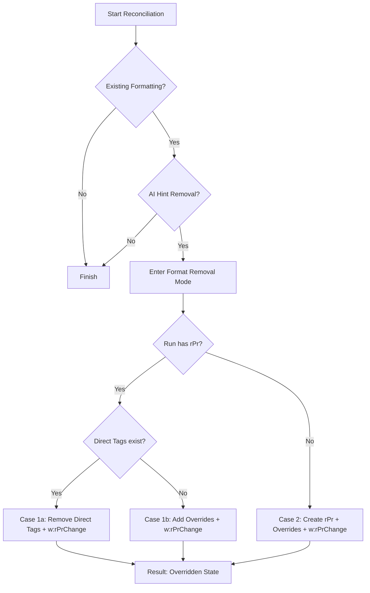

# Word Add-in: Document Reconciliation Architecture

This document describes the diff/reconciliation system for the Word Add-in. The architecture follows a **Hybrid Engine** pattern that intelligently routes operations between surgical in-place DOM manipulation and a full reconciliation pipeline, depending on the complexity of the change.

---

## Architecture Overview

The **OOXML Engine** (`oxml-engine.js`) acts as the central router/dispatcher. It analyzes the incoming request (original text vs. new text) and the document state (tables, lists) to select the most robust strategy.

```mermaid
graph TD
    A[Input: Original OOXML + New Text] --> B{OxmlEngine Router}
    
    B -- "No Text Changes + Format Hints" --> C[FORMAT-ONLY MODE]
    C --> L{Table Context?}
    L -- Yes --> M[Paragraph Unwrap/Rewrap]
    M --> D[In-Place DOM Modification]
    L -- No --> D
    
    B -- "Text Changes + Tables Detected" --> E[SURGICAL MODE]
    E --> L
    
    B -- "Markdown Table Detected" --> F[TABLE RECONCILIATION]
    F --> G[Virtual Grid Diff]
    G --> H[Replace Table Node]
    
    subgraph "Decision: Virtual Grid"
    G
    end
    
    B -- "List Expansion Detected" --> I[RECONCILIATION PIPELINE]
    I --> J[Full Pipeline (Ingest/Diff/Patch/Serialize)]
    
    B -- "Standard Text Edit" --> K[RECONSTRUCTION MODE]
    K --> D
```

### Hybrid Strategy
1.  **In-Place DOM Manipulation (Primary)**: For most operations (formatting, text edits, existing tables), we modify the XML DOM directly. This preserves all original attributes, ids, and properties that we don't explicitly intend to change.
2.  **Full Pipeline (Secondary)**: For complex structural generation (specifically turning a paragraph into a list), we use a `ReconciliationPipeline` that ingests content into a model, applies structural patches, and regenerates the OOXML with proper numbering definitions.

---

## ⚠️ IMPORTANT: V5.1 Hybrid Mode Engine

> **Word API Limitation**: The Word JavaScript API's `insertOoxml()` method does NOT respect pre-embedded `<w:ins>`/`<w:del>` track change markup. When OOXML is inserted, Word performs its own content comparison and treats the operation as a single replacement, regardless of internal track change tags.

### Solution: DOM Manipulation Instead of Serialization

The **V5.1 Hybrid Mode Engine** (`oxml-engine.js`) solves this by modifying the OOXML DOM **in-place** rather than serializing new content:

```javascript
// Instead of this (which doesn't work):
// 1. Build new OOXML string with w:ins/w:del
// 2. Call insertOoxml() - Word ignores our track changes

// We do this (which works):
// 1. Parse original OOXML to DOM tree
// 2. Modify DOM nodes in-place (split runs, wrap in w:del/w:ins)
// 3. Serialize modified DOM back to string
// 4. Call insertOoxml() - Word sees our embedded track changes
```

### Four Operating Modes

The engine automatically selects the appropriate mode based on content analysis:

| Mode | Trigger | Use Case | Implementation |
|------|---------|----------|----------------|
| **FORMAT-ONLY** | Text unchanged, has format hints | Bolding/italicizing existing text | In-Place DOM (+ Unwrap) |
| **SURGICAL** | Has tables in original | Safe edits preserving table structure | In-Place DOM (+ Unwrap) |
| **RECONSTRUCTION** | Standard text edits (no tables) | Paragraph splitting, text insertion | In-Place DOM |
| **LIST EXPANSION** | New text is a list, original is not | Turning a paragraph into a bulleted list | **ReconciliationPipeline** |

#### FORMAT-ONLY MODE
When the AI applies markdown formatting to existing text (e.g., `**bold this**`), the underlying text is unchanged after stripping markers. The engine splits runs at format boundaries and applies `<w:rPr>` changes directly.

#### SURGICAL MODE (for tables)
- Modifies existing run elements in place
- Never creates or deletes paragraph structure
- Newlines in insertions converted to spaces
- Critical for preserving complex table layouts

#### RECONSTRUCTION MODE (for body without tables)
- Rebuilds paragraph content allowing new paragraphs
- Supports splitting text flow into multiple runs or paragraphs
- Used for general text generation

#### LIST EXPANSION (Pipeline)
- Triggered when a simple paragraph expands into a markdown list
- Uses `ReconciliationPipeline` to:
  1. Ingest original content
  2. Generate new `w:p` elements for list items
  3. Inject proper `w:numPr` (numbering properties)
  4. Return a `fragment` type result for insertion

#### TABLE RECONCILIATION MODE
- Triggered when changes involve markdown tables
- Converts OOXML tables to a **Virtual Grid** for diffing
- Handles merged cells and span updates
- Honors `generateRedlines` flag to support clean direct edits in tables

### Table Cell Paragraph Handling: The Unwrap/Rewrap Strategy

When editing a paragraph within a table cell, the engine must handle a critical Word API behavior:

> [!WARNING]
> **Word API Limitation**: `Word.Paragraph.getOoxml()` on a paragraph inside a table cell returns the **entire table structure** (wrapped in `w:tbl`), not just the paragraph. Inserting this back via `insertOoxml("Replace")` results in a **nested table**.

#### The Solution: Surgical Extraction

1.  **Detection**: `detectTableCellContext(xmlDoc, originalText)` identifies if a table wrapper is present and uses exact text matching to find the specific `w:p` element from the many paragraphs that might exist in the table.
2.  **Scoping**: For format-only edits, we use `applyFormatToSingleParagraph()` to build text spans ONLY for the target paragraph. This ensures character-based format hints from the AI match the correct runs.
3.  **Serialization (Unwrap)**: `serializeParagraphOnly()` extracts the modified `w:p` element, strips redundant namespaces, and wraps it in a minimal `pkg:package` structure.
4.  **Insertion**: The resulting single-paragraph OOXML is inserted back into the document, effectively replacing the original paragraph without triggering table nesting.

### Key Decision: Virtual Grid

> **Problem**: OOXML tables are row-based, but users think of tables as a 2D grid. Merged cells (`vMerge`, `gridSpan`) create a complex sparse structure that makes spatial reasoning and diffing extremely difficult (e.g., "what is the cell at row 2, col 3?").
>
> **Solution**: We convert the table into a **Virtual Grid**—a 2D array where every physical cell is fully realized. Merged cells are "exploded" so the content is repeated in every grid slot it occupies. We diff this flat grid, and then re-serialize to OOXML, calculating the new spans. This allows us to use standard coordinate-based logic.

### Markdown Formatting Support

The engine preprocesses markdown and captures format hints with character offsets. It uses a **recursive parsing** approach to support nested styles.

| Markdown | OOXML Element |
|----------|---------------|
| `**bold**` | `<w:b/>` |
| `*italic*` | `<w:i/>` |
| `++underline++` | `<w:u w:val="single"/>` |
| `~~strike~~` | `<w:strike/>` |
| `++*nested*++` | `<w:u/>` + `<w:i/>` (captured recursively) |

Format hints are applied during both text changes (insertions) and format-only changes.

### Usage

```javascript
import { applyRedlineToOxml } from './modules/reconciliation/oxml-engine.js';

const result = await applyRedlineToOxml(
  originalOoxml,      // The paragraph's OOXML (pkg:package format)
  originalText,       // Plain text extracted from paragraph
  newText,            // New text from AI (may include markdown)
  { author: 'AI' }    // Track change author
);

if (result.hasChanges) {
  targetParagraph.insertOoxml(result.oxml, 'Replace');
}
```

---

## Formatting Reconciliation & Removal

### Full Property Synchronization

Formatting in Word isn't always direct tags on a run. It can be:
- **Direct**: `<w:b/>` on a `w:r`
- **Inherited**: Defined in Paragraph Properties (`w:pPr/w:rPr`)
- **Style-based**: Referenced via `<w:rStyle w:val="Strong"/>`

### The "Subtraction" Problem

> [!IMPORTANT]
> **Additive-Only vs. Synchronization**: Early versions of the engine only knew how to *add* tags. If a run was already bold (via style), adding `<w:b/>` did nothing, but *removing* the `**` markers didn't explicitly turn off the bold.
>
> **Solution**: The engine now performs **Full Synchronization**. For every format property (bold, italic, etc.), it explicitly emits either an "ON" tag or an "OFF" tag (e.g., `<w:b w:val="0"/>` or `<w:u w:val="none"/>`). This ensures that removing markdown markers Reliably removes the corresponding Word formatting.

### Three-Step Reconciliation Logic

When the AI sends text, the engine performs a **Semantic Comparison**:

1.  **Extract Formatting**: The engine walks the `w:r` structure and builds a hint map from the *original* OOXML.
2.  **Identify Target**: The markdown processor identifies the *target* state (including nesting).
3.  **Synchronize**: The engine compares the Target state with the Current state and emits explicit overrides where they differ.



### Removal Cases & Implementation

| Case | Scenario | Logic | Resulting OOXML |
|------|----------|-------|-----------------|
| **1a** | Direct tag exists | Remove tag, add `w:rPrChange` | `<w:rPr><w:b w:val="0"/><w:rPrChange.../></w:rPr>` |
| **1b** | Inherited from Style | Add explicit "0" override | `<w:rStyle w:val="Strong"/><w:b w:val="0"/><w:rPrChange.../>` |

### Tracked Changes for Formatting

All formatting changes (addition or removal) are wrapped in track change markers:
- **Run Level**: `w:rPrChange` captures the delta for specific runs.
- **Paragraph Level**: `w:pPrChange` ensures that when an entire paragraph's formatting is modified (e.g., bolding a whole line), the redline appears correctly in the sidebar.


---

## Core Data Types

```javascript
// operations.js
export const DiffOp = Object.freeze({
    EQUAL: 'equal',
    DELETE: 'delete',
    INSERT: 'insert'
});

export const PatchOp = Object.freeze({
    KEEP: 'keep',
    DELETE_TRACKED: 'delete_tracked',
    DELETE_SILENT: 'delete_silent',
    INSERT_TRACKED: 'insert_tracked',
    INSERT_SILENT: 'insert_silent'
});

export const RunKind = Object.freeze({
    TEXT: 'run',
    DELETION: 'deletion',
    INSERTION: 'insertion',
    HYPERLINK: 'hyperlink',
    BOOKMARK: 'bookmark'
});
```

---

## Pipeline Stages

The reconciliation pipeline has 6 explicit stages, each independently testable:

```javascript
    async execute(originalOoxml, newText) {
        // Stage 1: Ingest OOXML
        const { runModel, acceptedText, pPr } = ingestOoxml(originalOoxml);
        const numberingContext = detectNumberingContext(pElement); // Context from adjacent paragraph

        // Stage 2: Preprocess markdown
        const { cleanText, formatHints } = preprocessMarkdown(newText);

        // Stage 3: Compute word-level diff
        const diffOps = computeWordLevelDiffOps(acceptedText, cleanText);

        // Detect if this is a list expansion (single paragraph -> list)
        const isTargetList = cleanText.includes('\n') && /^([-*+]|\d+\.)/m.test(cleanText);
        const isExpansion = isTargetList && !acceptedText.includes('\n');

        if (isExpansion) {
            return this.executeListGeneration(cleanText, numberingContext, runModel);
        }

        // Stage 4: Pre-split runs at boundaries
        const splitModel = splitRunsAtDiffBoundaries(runModel, diffOps);

        // Stage 5: Apply patches
        const patchedModel = applyPatches(splitModel, diffOps, {
            generateRedlines: this.generateRedlines,
            author: this.author,
            formatHints
        });

        // Stage 6: Serialize to OOXML
        const resultOoxml = serializeToOoxml(patchedModel, pPr, formatHints, {
            author: this.author,
            generateRedlines: this.generateRedlines
        });
        
        return { ooxml: resultOoxml, isValid: true };
    }
}
```

---

## Stage 1: OOXML Ingestion (Unified Container-Aware)

Converts OOXML into a structured run model with character-level offset mapping. This **single unified implementation** handles all content types:
- Basic runs (`w:r`)
- Track changes (`w:ins`, `w:del`)
- Hyperlinks (`w:hyperlink`)
- Fields (`w:fldSimple`)
- Content controls (`w:sdt`)
- Smart tags (`w:smartTag`)

### Key Decision: Container Linearization

> **Problem**: Complex elements like Content Controls and Hyperlinks create nested tree structures that are difficult to diff against the flat text received from the AI.
>
> **Solution**: We flatten the tree into a linear `RunModel` using `CONTAINER_START` and `CONTAINER_END` tokens. This preserves the hierarchy as immutable "brackets" around the content, allowing us to use standard linear diff algorithms on the text between them without losing structural context. This essentially treats complex structures as "special text" that must be preserved paired.

### Extended Run Types

```javascript
const RunKind = Object.freeze({
    TEXT: 'run',
    DELETION: 'deletion',
    INSERTION: 'insertion',
    HYPERLINK: 'hyperlink',
    BOOKMARK: 'bookmark',
    FIELD: 'field',
    
    // Container delimiters for preserving hierarchy
    CONTAINER_START: 'container_start',
    CONTAINER_END: 'container_end'
});

const ContainerKind = Object.freeze({
    SDT: 'sdt',                 // Content Control
    SMART_TAG: 'smartTag',      // Smart Tag
    CUSTOM_XML: 'customXml',    // Custom XML
    FIELD_COMPLEX: 'fldComplex' // Complex field (fldChar-based)
});
```

### Unified Ingestion Function

```javascript
let containerIdCounter = 0;

function buildRunAwareTextModel(ooxmlDoc) {
    const runModel = [];
    let acceptedText = '';
    const offsetMap = new Map();

    const paragraph = ooxmlDoc.getElementsByTagNameNS(NS_W, 'p')[0];
    if (!paragraph) return { runModel, acceptedText, offsetMap };

    const result = processNodeRecursive(paragraph, 0, runModel, offsetMap);
    acceptedText = result.text;

    return { runModel, acceptedText, offsetMap };
}

/**
 * Unified recursive processor - handles all node types in a single function.
 * Container tokens (START/END) are emitted for complex elements to preserve hierarchy.
 * Simple runs are processed directly without container tokens.
 */
function processNodeRecursive(node, currentOffset, runModel, offsetMap) {
    let localOffset = currentOffset;
    let text = '';

    for (const child of node.childNodes) {
        const nodeName = child.nodeName;

        // Skip: paragraph properties, deleted content, proofing markers
        if (nodeName === 'w:pPr') continue;
        if (nodeName === 'w:del') continue;
        if (nodeName === 'w:proofErr') continue;

        // Bookmarks: preserve but no text contribution
        if (nodeName === 'w:bookmarkStart' || nodeName === 'w:bookmarkEnd') {
            runModel.push({
                kind: RunKind.BOOKMARK,
                nodeXml: new XMLSerializer().serializeToString(child),
                startOffset: localOffset,
                endOffset: localOffset,
                text: ''
            });
            continue;
        }

        // Insertions: content IS part of accepted text (recurse)
        if (nodeName === 'w:ins') {
            const result = processNodeRecursive(child, localOffset, runModel, offsetMap);
            localOffset = result.offset;
            text += result.text;
            continue;
        }

        // Hyperlinks: preserve structure, extract text
        if (nodeName === 'w:hyperlink') {
            const hyperlinkEntry = processHyperlink(child, localOffset);
            runModel.push(hyperlinkEntry);
            for (let i = 0; i < hyperlinkEntry.text.length; i++) {
                offsetMap.set(localOffset + i, { runIndex: runModel.length - 1, localOffset: i });
            }
            localOffset += hyperlinkEntry.text.length;
            text += hyperlinkEntry.text;
            continue;
        }

        // Simple fields: treat as atomic run
        if (nodeName === 'w:fldSimple') {
            const fieldEntry = processFieldSimple(child, localOffset);
            runModel.push(fieldEntry);
            localOffset += fieldEntry.text.length;
            text += fieldEntry.text;
            continue;
        }

        // Content Controls (SDT): emit container tokens
        if (nodeName === 'w:sdt') {
            const containerId = `sdt_${containerIdCounter++}`;
            const sdtPr = child.getElementsByTagNameNS(NS_W, 'sdtPr')[0];
            const sdtContent = child.getElementsByTagNameNS(NS_W, 'sdtContent')[0];

            runModel.push({
                kind: RunKind.CONTAINER_START,
                containerKind: ContainerKind.SDT,
                containerId,
                propertiesXml: sdtPr ? new XMLSerializer().serializeToString(sdtPr) : '',
                startOffset: localOffset,
                endOffset: localOffset,
                text: ''
            });

            if (sdtContent) {
                const result = processNodeRecursive(sdtContent, localOffset, runModel, offsetMap);
                localOffset = result.offset;
                text += result.text;
            }

            runModel.push({
                kind: RunKind.CONTAINER_END,
                containerKind: ContainerKind.SDT,
                containerId,
                startOffset: localOffset,
                endOffset: localOffset,
                text: ''
            });
            continue;
        }

        // Smart Tags: emit container tokens
        if (nodeName === 'w:smartTag') {
            const containerId = `smartTag_${containerIdCounter++}`;

            runModel.push({
                kind: RunKind.CONTAINER_START,
                containerKind: ContainerKind.SMART_TAG,
                containerId,
                propertiesXml: serializeAttributes(child),
                startOffset: localOffset,
                endOffset: localOffset,
                text: ''
            });

            const result = processNodeRecursive(child, localOffset, runModel, offsetMap);
            localOffset = result.offset;
            text += result.text;

            runModel.push({
                kind: RunKind.CONTAINER_END,
                containerKind: ContainerKind.SMART_TAG,
                containerId,
                startOffset: localOffset,
                endOffset: localOffset,
                text: ''
            });
            continue;
        }

        // Standard runs
        if (nodeName === 'w:r') {
            const runEntry = processRun(child, localOffset);
            if (runEntry && runEntry.text) {
                runModel.push(runEntry);
                for (let i = 0; i < runEntry.text.length; i++) {
                    offsetMap.set(localOffset + i, { runIndex: runModel.length - 1, localOffset: i });
                }
                localOffset += runEntry.text.length;
                text += runEntry.text;
            }
        }
    }

    return { offset: localOffset, text };
}

function processHyperlink(hyperlinkNode, startOffset) {
    const rId = hyperlinkNode.getAttribute('r:id') || '';
    const anchor = hyperlinkNode.getAttribute('w:anchor') || '';
    
    let text = '';
    const innerRuns = [];
    
    for (const child of hyperlinkNode.childNodes) {
        if (child.nodeName === 'w:r') {
            const runText = extractTextFromRun(child);
            innerRuns.push({ text: runText, rPrXml: extractRPr(child) });
            text += runText;
        }
    }
    
    return {
        kind: RunKind.HYPERLINK,
        text,
        startOffset,
        endOffset: startOffset + text.length,
        rId,
        anchor,
        innerRuns,
        nodeXml: new XMLSerializer().serializeToString(hyperlinkNode)
    };
}

function processFieldSimple(fieldNode, startOffset) {
    const instr = fieldNode.getAttribute('w:instr') || '';
    const text = extractTextFromNode(fieldNode);
    
    return {
        kind: RunKind.FIELD,
        text,
        startOffset,
        endOffset: startOffset + text.length,
        instruction: instr,
        nodeXml: new XMLSerializer().serializeToString(fieldNode)
    };
}
```

### Run Entry Structure

```javascript
// Standard text run
{
    kind: RunKind.TEXT,
    text: 'Hello world',
    rPrXml: '<w:rPr><w:b/></w:rPr>',  // Serialized formatting (preserved exactly)
    startOffset: 0,
    endOffset: 11
}

// Container start token (e.g., Content Control)
{
    kind: RunKind.CONTAINER_START,
    containerKind: ContainerKind.SDT,
    containerId: 'sdt_0',
    propertiesXml: '<w:sdtPr>...</w:sdtPr>',
    startOffset: 15,
    endOffset: 15,
    text: ''  // Container tokens have no text contribution
}
```

---

## Stage 2: Markdown Preprocessing

Strips markdown syntax BEFORE diffing to prevent markers from corrupting word boundaries. Format information is captured as position-based hints.

**Supported Formatting:**
| Syntax | Format | OOXML Element |
|--------|--------|---------------|
| `**text**` | Bold | `<w:b/>` |
| `*text*` | Italic | `<w:i/>` |
| `++text++` | Underline | `<w:u w:val="single"/>` |
| `~~text~~` | Strikethrough | `<w:strike/>` |
| `***text***` | Bold + Italic | `<w:b/><w:i/>` |
| `**++text++**` | Bold + Underline | `<w:b/><w:u/>` |
| `<b>text</b>` | Bold | `<w:b/>` |
| `<i>text</i>` | Italic | `<w:i/>` |
| `<u>text</u>` | Underline | `<w:u w:val="single"/>` |
| `<s>text</s>` | Strikethrough | `<w:strike/>` |

```javascript
/**
 * Recursive Markdown Processor
 * Identifies formatting tags (nested or simple) and returns clean text + position hints.
 */
function preprocessMarkdown(text) {
    // 1. Find all potential formatting matches in the string
    // 2. Sort by length descending (greedy) to handle overlaps
    // 3. For each match, recursively process the 'inner' text
    // 4. Merge parent format with child format
    // Result: A list of non-overlapping spans with merged format objects
}
```

**Example**:
```
Input:  "^^LIMITATION OF LIABILITY^^ - ~~old text~~ new text"
Output: { 
    cleanText: "LIMITATION OF LIABILITY - old text new text",
    formatHints: [
        { start: 0, end: 23, format: { caps: true } },
        { start: 26, end: 34, format: { strikethrough: true } }
    ]
}
```

### Supported HTML Tags
The processor also strips common HTML formatting tags used by AI models:
`<b>`, `<strong>`, `<i>`, `<em>`, `<u>`, `<s>`, `<strike>`, `<del>`.

### Applying Format to OOXML

```javascript
/**
 * Synchronizes formatting by comparing target vs current base properties.
 * Explicitly emits 'w:val="0"' or 'w:val="none"' for removed properties.
 */
function injectFormattingToRPr(xmlDoc, baseRPr, targetFormat, author, generateRedlines) {
    // 1. Clone baseRPr but skip synchronized properties (b, i, u, strike)
    // 2. For each target format property:
    //    - If target=ON and current=OFF -> Add tag
    //    - If target=OFF and current=ON -> Add tag with val="0" (explicit removal)
    // 3. Add w:rPrChange to capture delta
}
```


---

## Stage 3: Word-Level Diffing

Tokenizes text into words before diffing for cleaner results.

### Key Decision: Word-Level Tokenization

> **Problem**: Standard character-level diffs (like `git diff`) often split words unintuitively. For example, changing "The" to "There" might show as "The" + insert "re", which looks messy in a Word document redline.
>
> **Solution**: We tokenize the text into words, map each unique word to a single Unicode character, perform the diff on these characters, and then map back to words. This ensures that changes are always grouped by whole words, resulting in "native-looking" redlines that users expect in Word.

```javascript
function computeWordLevelDiffOps(originalText, newText) {
    const { chars1, chars2, tokenArray } = wordsToChars(originalText, newText);

    const dmp = new diff_match_patch();
    const charDiffs = dmp.diff_main(chars1, chars2);
    dmp.diff_cleanupSemantic(charDiffs);

    const operations = [];
    let originalOffset = 0;

    for (const [op, chars] of charDiffs) {
        let text = '';
        for (const char of chars) {
            text += tokenArray[char.charCodeAt(0)];
        }

        if (op === 0) {
            operations.push({ type: DiffOp.EQUAL, startOffset: originalOffset, endOffset: originalOffset + text.length, text });
            originalOffset += text.length;
        } else if (op === -1) {
            operations.push({ type: DiffOp.DELETE, startOffset: originalOffset, endOffset: originalOffset + text.length, text });
            originalOffset += text.length;
        } else if (op === 1) {
            operations.push({ type: DiffOp.INSERT, startOffset: originalOffset, endOffset: originalOffset, text });
        }
    }

    return operations;
}
```

---

## Stage 4: Pre-Split Runs at Boundaries

Before patching, split runs precisely at diff operation boundaries. This simplifies the patching stage - each run either stays, gets deleted, or receives an insertion.

```javascript
function splitRunsAtDiffBoundaries(runModel, diffOps) {
    const boundaries = new Set();
    for (const op of diffOps) {
        boundaries.add(op.startOffset);
        boundaries.add(op.endOffset);
    }
    
    const newModel = [];
    for (const run of runModel) {
        const runBoundaries = [...boundaries]
            .filter(b => b > run.startOffset && b < run.endOffset)
            .sort((a, b) => a - b);
        
        if (runBoundaries.length === 0) {
            newModel.push(run);
        } else {
            let currentStart = run.startOffset;
            for (const boundary of runBoundaries) {
                newModel.push({
                    ...run,
                    text: run.text.slice(currentStart - run.startOffset, boundary - run.startOffset),
                    startOffset: currentStart,
                    endOffset: boundary
                });
                currentStart = boundary;
            }
            newModel.push({
                ...run,
                text: run.text.slice(currentStart - run.startOffset),
                startOffset: currentStart,
                endOffset: run.endOffset
            });
        }
    }
    return newModel;
}
```

---

## Stage 5: Apply Patches

Walks through the split run model and applies diff operations. The `generateRedlines` flag controls whether changes are tracked or applied destructively.

### Key Decision: Context-Aware Style Inheritance

> **Problem**: When the AI inserts new text, what formatting should it have? If we insert "world" after "**Hello**", should it be bold?
>
> **Solution**: We use a heuristic based on whitespace:
> *   **Continuation**: If the new text directly follows characters (no space), it inherits the *previous* run's style (e.g., "**Hell**o" -> "**Hello**").
> *   **New Word**: If the new text starts with a space, it inherits the *next* run's style (or the paragraph default). This prevents "bleeding" styles where unbolded text accidentally picks up a previous bold header.

### Style Inheritance Strategy

When inserting text, determines which run's formatting to inherit:

```javascript
const StyleInheritance = {
    forInsertion(runModel, offset, insertText) {
        const prevRun = this.findRunBefore(runModel, offset);
        const nextRun = this.findRunAfter(runModel, offset);
        
        if (!prevRun && !nextRun) return null;
        if (!prevRun) return nextRun;
        if (!nextRun) return prevRun;
        
        // Text ending with space = new phrase → inherit from NEXT
        if (insertText && insertText.endsWith(' ')) return nextRun;
        
        // Text starting with space = continuation → inherit from PREV
        if (insertText && insertText.startsWith(' ')) return prevRun;
        
        return prevRun;
    },
    
    findRunBefore(model, offset) {
        return model.filter(r => r.endOffset <= offset && r.kind === RunKind.TEXT).pop();
    },
    
    findRunAfter(model, offset) {
        return model.find(r => r.startOffset >= offset && r.kind === RunKind.TEXT);
    }
};
```

### Patch Application

```javascript
function applyPatches(splitModel, diffOps, options) {
    const { generateRedlines, author, formatHints } = options;
    const patchedModel = [];
    
    for (const run of splitModel) {
        const op = diffOps.find(o => 
            o.startOffset <= run.startOffset && o.endOffset >= run.endOffset
        );
        
        if (!op || op.type === DiffOp.EQUAL) {
            patchedModel.push({ ...run, kind: RunKind.TEXT });
            continue;
        }
        
        if (op.type === DiffOp.DELETE) {
            if (generateRedlines) {
                patchedModel.push({ ...run, kind: RunKind.DELETION, author });
            }
            // If not generating redlines, simply omit the run
            continue;
        }
        
        if (op.type === DiffOp.INSERT) {
            const styleSource = StyleInheritance.forInsertion(splitModel, op.startOffset, op.text);
            const newRun = {
                kind: generateRedlines ? RunKind.INSERTION : RunKind.TEXT,
                text: op.text,
                rPrXml: styleSource?.rPrXml || '',
                startOffset: op.startOffset,
                author
            };
            patchedModel.push(newRun);
        }
    }
    
    return patchedModel;
}
```

---

## Stage 6: Serialize to OOXML

Converts the patched run model back to valid OOXML. This stage handles the reconstruction of complex container elements (like Content Controls and Hyperlinks) and applies format hints.

### Unified Container Serialization

The serializer reconstructs the hierarchy by tracking container tokens (`CONTAINER_START` / `CONTAINER_END`) encountered in the run model.

```javascript
function serializeToOoxml(patchedModel, pPr, formatHints = [], options = {}) {
    // ... setup ...
    for (const item of patchedModel) {
        switch (item.kind) {
            case RunKind.TEXT:
                currentRuns.push(buildRunXmlWithHints(item, formatHints, options));
                break;
                
            case RunKind.CONTAINER_START:
                if (item.containerKind === 'sdt') {
                    currentRuns.push(`<w:sdt>${item.propertiesXml}<w:sdtContent>`);
                } else if (item.containerKind === 'hyperlink') {
                    // Reconstruct w:hyperlink with r:id and anchor
                    currentRuns.push(`<w:hyperlink ...>`);
                }
                break;
                
            case RunKind.CONTAINER_END:
                if (item.containerKind === 'sdt') {
                    currentRuns.push(`</w:sdtContent></w:sdt>`);
                } else if (item.containerKind === 'hyperlink') {
                    currentRuns.push(`</w:hyperlink>`);
                }
                break;
                
            case RunKind.INSERTION:
                const insValue = buildRunXmlWithHints(item, formatHints, options);
                currentRuns.push(options.generateRedlines ? 
                    `<w:ins w:id="${getNextRevisionId()}" w:author="${escapeXml(options.author)}">${insValue}</w:ins>` : 
                    insValue);
                break;

            case RunKind.DELETION:
                if (options.generateRedlines) {
                    currentRuns.push(item.nodeXml);
                }
                break;
        }
    }
    // ...
}
```

### Document Wrapping

For insertions via `insertOoxml`, the serialized paragraphs must be wrapped in a full `pkg:package` structure, including relationships (specifically for numbering).

```javascript
export function wrapInDocumentFragment(paragraphXml, options = {}) {
    const { includeNumbering = false } = options;
    
    // Auto-generates pkg:package with:
    // 1. /word/document.xml (containing our paragraphXml)
    // 2. /word/_rels/document.xml.rels (relationships)
    // 3. /word/numbering.xml (if includeNumbering is true)
    
    return `<?xml version="1.0" ...><pkg:package>...</pkg:package>`;
}
```

### Applying Format Hints

```javascript
function buildRunXmlWithHints(text, baseRPrXml, formatHints, runStartOffset) {
    const relevantHints = formatHints.filter(h => 
        h.start < runStartOffset + text.length && h.end > runStartOffset
    );
    
    if (relevantHints.length === 0) {
        return `<w:r>${baseRPrXml}<w:t xml:space="preserve">${escapeXml(text)}</w:t></w:r>`;
    }
    
    const runs = [];
    let pos = 0;
    
    for (const hint of relevantHints) {
        const localStart = Math.max(0, hint.start - runStartOffset);
        const localEnd = Math.min(text.length, hint.end - runStartOffset);
        
        // Text before hint
        if (localStart > pos) {
            runs.push(`<w:r>${baseRPrXml}<w:t xml:space="preserve">${escapeXml(text.slice(pos, localStart))}</w:t></w:r>`);
        }
        
        // Formatted text
        const rPr = injectFormatting(baseRPrXml, hint.format, options.author, options.generateRedlines);
        runs.push(`<w:r>${rPr}<w:t xml:space="preserve">${escapeXml(text.slice(pos, localStart))}</w:t></w:r>`);
        pos = localEnd;
    }
    
    // Remaining text
    if (pos < text.length) {
        runs.push(`<w:r>${baseRPrXml}<w:t xml:space="preserve">${escapeXml(text.slice(pos))}</w:t></w:r>`);
    }
    
    return runs.join('');
}
```

---

## Redline vs. Direct Change Modes

The `generateRedlines` parameter controls output mode:

| Mode | Deletions | Insertions | Output |
|------|-----------|------------|--------|
| **Redline** (`true`) | `w:del` elements | `w:ins` elements | Track changes visible |
| **Direct** (`false`) | Omitted | Regular `w:r` | Clean replacement |

```javascript
// Determined by user's Advanced Settings
const isTrackingOn = context.document.changeTrackingMode !== Word.ChangeTrackingMode.off;
const pipeline = new ReconciliationPipeline({
    generateRedlines: isTrackingOn,
    author: getAuthorForTracking()
});
```

---

## Unified Block Model

Paragraphs, list items, and table cells share a common abstraction:

```javascript
class Block {
    constructor({ type, runModel, pPrXml, metadata = {} }) {
        this.type = type;  // 'paragraph' | 'list_item' | 'table_cell'
        this.runModel = runModel;
        this.pPrXml = pPrXml;
        this.metadata = metadata;  // { ilvl, numId, rowIdx, colIdx }
    }
    
    getText() {
        return this.runModel.map(r => r.text).join('');
    }
    
    diff(other) {
        return computeWordLevelDiffOps(this.getText(), other.getText());
    }
    
    applyPatch(diffOps, options) {
        const split = splitRunsAtDiffBoundaries(this.runModel, diffOps);
        this.runModel = applyPatches(split, diffOps, options);
        return this;
    }
    
    serialize(formatHints, options = {}) {
        const content = serializeToOoxml(this.runModel, null, formatHints, options);
        switch (this.type) {
            case 'paragraph':
            case 'list_item':
                return `<w:p>${this.pPrXml}${content}</w:p>`;
            case 'table_cell':
                return `<w:tc><w:p>${content}</w:p></w:tc>`;
        }
    }
}
```

### List Item Structure

```xml
<w:p>
    <w:pPr>
        <w:pStyle w:val="ListParagraph"/>
        <w:numPr>
            <w:ilvl w:val="1"/>  <!-- Level 1 = subbullet -->
            <w:numId w:val="1"/>
        </w:numPr>
        <w:ind w:left="1440" w:hanging="360"/>
    </w:pPr>
    <w:r><w:t>Sub-item text</w:t></w:r>
</w:p>
```

---

## Error Recovery Strategy Chain

Fallback strategies execute in order until one succeeds:

```javascript
const patchStrategies = [
    {
        name: 'run-aware',
        requirement: (ctx) => ctx.textMatches && ctx.runModel.length > 0,
        execute: runAwarePatch
    },
    {
        name: 'simple-diff-ooxml',
        requirement: (ctx) => ctx.ooxmlDoc !== null,
        execute: simpleDiffOoxmlPatch
    },
    {
        name: 'text-replacement',
        requirement: () => true,
        execute: textReplacementFallback
    }
];

async function executeWithFallback(context) {
    for (const strategy of patchStrategies) {
        if (!strategy.requirement(context)) continue;
        
        try {
            const result = await strategy.execute(context);
            console.log(`✅ ${strategy.name} succeeded`);
            return result;
        } catch (error) {
            console.warn(`❌ ${strategy.name} failed:`, error.message);
        }
    }
    throw new Error('All patching strategies exhausted');
}
```

---

## AI Content Generation

When AI creates new structured content (lists, tables, subbullets), the preprocessing stage parses extended markdown syntax and converts it to Block structures.

### Extended Markdown Syntax

The AI uses format specifiers to indicate numbering style. Format is detected from the marker used:

```
# Bullet lists
- Item 1
  - Sub-item 1.1

# Numbered lists (auto-detect format from marker)
1. Decimal              → 1, 2, 3
a. Lowercase alpha      → a, b, c
A. Uppercase alpha      → A, B, C
i. Lowercase roman      → i, ii, iii
I. Uppercase roman      → I, II, III
(a) Parenthesized alpha → (a), (b), (c)
(i) Parenthesized roman → (i), (ii), (iii)
(1) Parenthesized num   → (1), (2), (3)

# Hierarchical outline numbering (legal contracts)
1. Section One
   1.1. Subsection
      1.1.1. Sub-subsection
         1.1.1.1. Clause

# Mixed hierarchy (common in legal)
1. First Article
   (a) First paragraph
      (i) First sub-paragraph
   (b) Second paragraph
2. Second Article

# Tables
| Header 1 | Header 2 |
|----------|----------|
| Cell 1   | Cell 2   |
```

### Numbering Format Types

```javascript
const NumberFormat = Object.freeze({
    DECIMAL: 'decimal',           // 1, 2, 3
    LOWER_ALPHA: 'lowerLetter',   // a, b, c
    UPPER_ALPHA: 'upperLetter',   // A, B, C
    LOWER_ROMAN: 'lowerRoman',    // i, ii, iii
    UPPER_ROMAN: 'upperRoman',    // I, II, III
    BULLET: 'bullet',             // •
    OUTLINE: 'outline'            // 1.1.2.3
});

const NumberSuffix = Object.freeze({
    PERIOD: '.',                  // 1.
    PAREN_RIGHT: ')',             // 1)
    PAREN_BOTH: '()'              // (1)
});
```

### Legal Formatting Strategy

The `NumberingService` detects markers like `(a)`, `i.`, or `1.1.` using regex and selects the appropriate OOXML `numFmt`. If a complex outline is detected, it generates a custom `w:numbering` part.

```javascript
// numbering-service.js
detectNumberingFormat(marker) {
    if (/^\d+(\.\d+)+\.?$/.test(m)) return { format: NumberFormat.OUTLINE, suffix: NumberSuffix.PERIOD };
    if (/^\([a-z]\)$/.test(m))      return { format: NumberFormat.LOWER_ALPHA, suffix: NumberSuffix.PAREN_BOTH };
    // ...
}

generateNumberingXml(customConfigs) {
    // Generates <w:lvl> and <w:abstractNum> for standard legal schemes
}
```

### List Item Insertion
When a paragraph expands into a list, the pipeline uses `executeListGeneration` to create a multi-paragraph fragment.

```javascript
// pipeline.js
async executeListGeneration(cleanText, numberingContext, originalRunModel) {
    const lines = cleanText.split('\n');
    const indentStep = this.detectIndentationStep(lines); // Heuristically detects 2-space, 4-space, or tabs
    
    for (const line of lines) {
        const { format } = this.numberingService.detectNumberingFormat(extractMarker(line));
        const ilvl = Math.floor(indentSize / indentStep); // Level calculated from detected step
        const numId = this.numberingService.getOrCreateNumId({ type: format }, numberingContext);
        const pPrXml = this.numberingService.buildListPPr(numId, ilvl);
        // ...
    }
}
```

### Unified Pipeline

The system treats generation as reconciliation against empty content. By using a single code path, we ensure that new content inherits all the robust patching and track change logic of the reconciliation engine.

## OOXML Output Validation

Before returning reconciled OOXML, validate that the output is well-formed XML.

```javascript
// pipeline.js
validateBasic(ooxml) {
    const wrappedXml = `<root xmlns:w="..." xmlns:r="...">${ooxml}</root>`;
    const parser = new DOMParser();
    const doc = parser.parseFromString(wrappedXml, 'application/xml');
    if (doc.getElementsByTagName('parsererror').length > 0) {
        return { isValid: false, errors: ['Invalid XML structure'] };
    }
    return { isValid: true };
}
```

function generateListBlocks(items, listType, options) {
    
---

## Summary of Core Module Responsibilities

| Module | Responsibility |
|--------|----------------|
| `oxml-engine.js` | Entry point, context detection, and high-level orchestration. |
| `pipeline.js` | The 6-stage reconciliation logic, diffing, and patching. |
| `markdown-processor.js` | Stripping markdown/HTML and capturing format hints. |
| `numbering-service.js` | Legal marker detection and `w:numbering` XML generation. |
| `serialization.js` | Run model conversion to OOXML and document fragment wrapping. |
| `types.js` | Shared enums and data structures. |

This walkthrough describes the **V5.1 Hybrid Reconciliation Engine**, designed for surgical precision while maintaining document structural integrity.


---

## Gap Resolution: Track Change Placement Rules

Different contexts require different `w:ins`/`w:del` placement strategies.

### Placement Context Detection

```javascript
const InsertionContext = Object.freeze({
    BODY: 'body',           // Main document body
    HEADER: 'header',       // Header
    FOOTER: 'footer',       // Footer
    TEXTBOX: 'textbox',     // Text box / shape
    FOOTNOTE: 'footnote',   // Footnote
    COMMENT: 'comment',     // Comment content
    TABLE_CELL: 'table_cell'
});

function detectInsertionContext(range) {
    // Use Word API to determine context
    // This is simplified - actual implementation depends on your range access
    if (range.parentTable) return InsertionContext.TABLE_CELL;
    if (range.parentContentControlOrNullObject) {
        // Check content control type
    }
    return InsertionContext.BODY;
}
```

### Context-Aware Wrapping

```javascript
function wrapWithTrackChanges(ooxml, context, options) {
    const { author, isInsertion } = options;
    const date = new Date().toISOString();
    const revId = getNextRevisionId();
    
    // Determine appropriate wrapper
    switch (context) {
        case InsertionContext.BODY:
        case InsertionContext.TABLE_CELL:
            // Full block wrapping OK
            if (isInsertion) {
                return wrapBlockInsertion(ooxml, author, date, revId);
            } else {
                return wrapBlockDeletion(ooxml, author, date, revId);
            }
            
        case InsertionContext.HEADER:
        case InsertionContext.FOOTER:
            // More conservative: wrap runs only, not paragraphs
            return wrapRunsOnly(ooxml, author, date, revId, isInsertion);
            
        default:
            return wrapRunsOnly(ooxml, author, date, revId, isInsertion);
    }
}

function wrapBlockInsertion(ooxml, author, date, revId) {
    // Check if content is multiple paragraphs
    const paragraphCount = countElements(ooxml, 'w:p');
    
    if (paragraphCount <= 1) {
        // Single paragraph: wrap at run level for cleaner UX
        return wrapRunsOnly(ooxml, author, date, revId, true);
    }
    
    // Multiple paragraphs: wrap entire block
    // Note: This creates a "big green block" in Word
    return `<w:ins w:id="${revId}" w:author="${escapeXml(author)}" w:date="${date}">${ooxml}</w:ins>`;
}

function wrapRunsOnly(ooxml, author, date, revId, isInsertion) {
    const doc = new DOMParser().parseFromString(`<root xmlns:w="${NS_W}">${ooxml}</root>`, 'application/xml');
    
    // Find all w:r elements and wrap each
    const runs = doc.getElementsByTagNameNS(NS_W, 'r');
    const wrapper = isInsertion ? 'w:ins' : 'w:del';
    
    for (const run of runs) {
        const wrapperEl = doc.createElementNS(NS_W, wrapper);
        wrapperEl.setAttribute('w:id', revId.toString());
        wrapperEl.setAttribute('w:author', author);
        wrapperEl.setAttribute('w:date', date);
        
        run.parentNode.insertBefore(wrapperEl, run);
        wrapperEl.appendChild(run);
    }
    
    // Serialize back, removing root wrapper
    const serialized = new XMLSerializer().serializeToString(doc.documentElement);
    return serialized.replace(/^<root[^>]*>/, '').replace(/<\/root>$/, '');
}
```

### Per-Item Redlines for Lists

Instead of wrapping an entire new list in one `w:ins`, wrap each list item's runs individually:

```javascript
function generateListBlocksWithRedlines(items, listType, options) {
    const { generateRedlines, author } = options;
    const numId = listType === ContentType.BULLET_LIST ? '1' : '2';
    const date = new Date().toISOString();
    
    return items.map((item, idx) => {
        const { cleanText, formatHints } = preprocessMarkdown(item.text);
        let runModel = textToRunModel(cleanText, formatHints);
        
        // If redlines, mark each run as inserted
        if (generateRedlines) {
            runModel = runModel.map(run => ({
                ...run,
                kind: RunKind.INSERTION,
                author,
                revisionId: getNextRevisionId()
            }));
        }
        
        return new Block({
            type: 'list_item',
            runModel,
            pPrXml: buildListPPr(item.level, numId),
            metadata: { ilvl: item.level, numId }
        });
    });
}
```

This approach results in:
- Each list item appearing as a separate addition
- Users can accept/reject individual items
- Cleaner merge/review workflow

---

## Gap Resolution: Virtual Grid for Merged Cells

Simple index-based cell matching (`oldRow.cells[colIdx]`) breaks when tables contain merged cells (`w:vMerge`, `w:gridSpan`). A cell at raw index `[1]` in one row might physically align with index `[2]` in another row.

### The Problem: Cell Index Misalignment

```
Original Table Layout:
┌──────────┬──────────┬──────────┐
│ A (span2)          │    B     │  Row 0: cells[0] spans cols 0-1, cells[1] is col 2
├──────────┬──────────┼──────────┤
│    C     │    D     │    E     │  Row 1: cells[0]=col0, cells[1]=col1, cells[2]=col2
└──────────┴──────────┴──────────┘

Raw XML indices:
  Row 0: tc[0] = "A", tc[1] = "B"
  Row 1: tc[0] = "C", tc[1] = "D", tc[2] = "E"

Problem: tc[1] in Row 0 ("B") is NOT aligned with tc[1] in Row 1 ("D")!
         "B" should align with "E" (both at grid column 2).
```

### Virtual Grid Model

```javascript
/**
 * @typedef {Object} VirtualCell
 * @property {number} gridRow - Logical row in the virtual grid
 * @property {number} gridCol - Logical column in the virtual grid
 * @property {number} rowSpan - Number of rows this cell spans (from vMerge)
 * @property {number} colSpan - Number of columns this cell spans (from gridSpan)
 * @property {Element} tcNode - Original w:tc XML node
 * @property {Array} blocks - Array of parsed blocks (paragraphs) within the cell
 * @property {string} tcPrXml - Cell properties XML
 * @property {boolean} isMergeOrigin - True if this is the origin of a merge
 * @property {boolean} isMergeContinuation - True if this is a vMerge="continue" cell
 */

/**
 * @typedef {Object} VirtualGrid
 * @property {number} rowCount
 * @property {number} colCount
 * @property {Map<string, VirtualCell>} cellMap - Key: "row,col" -> VirtualCell
 * @property {Array<Array<VirtualCell>>} grid - 2D array for direct access
 */
```

### Grid Ingestion Algorithm

```javascript
function ingestTableToVirtualGrid(tableNode) {
    const tblGrid = tableNode.getElementsByTagNameNS(NS_W, 'tblGrid')[0];
    const gridCols = tblGrid?.getElementsByTagNameNS(NS_W, 'gridCol') || [];
    const colCount = gridCols.length;
    
    const trElements = tableNode.getElementsByTagNameNS(NS_W, 'tr');
    const rowCount = trElements.length;
    
    // Initialize empty grid
    const grid = Array.from({ length: rowCount }, () => 
        Array.from({ length: colCount }, () => null)
    );
    const cellMap = new Map();
    
    // Track vertical merge continuations
    const vMergeOrigins = new Map(); // Key: colIdx -> { originRow, cell }
    
    for (let rowIdx = 0; rowIdx < trElements.length; rowIdx++) {
        const tr = trElements[rowIdx];
        const tcElements = tr.getElementsByTagNameNS(NS_W, 'tc');
        
        let gridCol = 0; // Current position in virtual grid
        
        for (let tcIdx = 0; tcIdx < tcElements.length; tcIdx++) {
            const tc = tcElements[tcIdx];
            const tcPr = tc.getElementsByTagNameNS(NS_W, 'tcPr')[0];
            
            // Skip to next available grid column (may be occupied by vMerge from above)
            while (gridCol < colCount && grid[rowIdx][gridCol] !== null) {
                gridCol++;
            }
            
            if (gridCol >= colCount) break; // Row is full
            
            // Parse gridSpan (horizontal merge)
            const gridSpanEl = tcPr?.getElementsByTagNameNS(NS_W, 'gridSpan')[0];
            const colSpan = parseInt(gridSpanEl?.getAttribute('w:val') || '1', 10);
            
            // Parse vMerge (vertical merge)
            const vMergeEl = tcPr?.getElementsByTagNameNS(NS_W, 'vMerge')[0];
            const vMergeVal = vMergeEl?.getAttribute('w:val'); // "restart" or undefined (continue)
            const hasVMerge = vMergeEl !== null;
            
            let cell;
            
            if (hasVMerge && vMergeVal !== 'restart') {
                // This is a vMerge continuation - link to origin
                const origin = vMergeOrigins.get(gridCol);
                if (origin) {
                    origin.cell.rowSpan++;
                    cell = {
                        gridRow: rowIdx,
                        gridCol,
                        rowSpan: 0, // Continuation cells have rowSpan 0
                        colSpan,
                        tcNode: tc,
                        blocks: [], // Content comes from origin
                        tcPrXml: serializeTcPr(tcPr),
                        isMergeOrigin: false,
                        isMergeContinuation: true,
                        mergeOrigin: origin.cell
                    };
                }
            } else {
                // Regular cell or vMerge="restart" (origin of vertical merge)
                const blocks = parseCellBlocks(tc);
                
                cell = {
                    gridRow: rowIdx,
                    gridCol,
                    rowSpan: 1,
                    colSpan,
                    tcNode: tc,
                    blocks,
                    tcPrXml: serializeTcPr(tcPr),
                    isMergeOrigin: hasVMerge && vMergeVal === 'restart',
                    isMergeContinuation: false,
                    getText: () => blocks.map(b => b.acceptedText).join('\n')
                };
                
                // Register as vMerge origin if applicable
                if (hasVMerge && vMergeVal === 'restart') {
                    vMergeOrigins.set(gridCol, { originRow: rowIdx, cell });
                }
            }
            
            // Place cell in grid (spanning multiple columns if needed)
            for (let spanOffset = 0; spanOffset < colSpan; spanOffset++) {
                const targetCol = gridCol + spanOffset;
                if (targetCol < colCount) {
                    grid[rowIdx][targetCol] = cell;
                    cellMap.set(`${rowIdx},${targetCol}`, cell);
                }
            }
            
            gridCol += colSpan;
        }
    }
    
    return {
        rowCount,
        colCount,
        grid,
        cellMap,
        tblPrXml: extractTblPr(tableNode),
        tblGridXml: extractTblGrid(tableNode),
        trPrList: Array.from(trElements).map(tr => extractTrPr(tr))
    };
}
```

### Grid-Based Table Diffing

```javascript
function diffTablesWithVirtualGrid(oldGrid, newTableData) {
    const operations = [];
    const { headers, rows: newRows, hasHeader } = newTableData;
    const allNewRows = hasHeader ? [headers, ...newRows] : newRows;
    
    const maxRows = Math.max(oldGrid.rowCount, allNewRows.length);
    
    for (let row = 0; row < maxRows; row++) {
        for (let col = 0; col < oldGrid.colCount; col++) {
            const oldCell = oldGrid.grid[row]?.[col];
            const newCellText = allNewRows[row]?.[col] || '';
            
            if (oldCell?.isMergeContinuation) continue;
            if (oldCell && col > oldCell.gridCol) continue;
            
            if (oldCell && newCellText !== undefined) {
                // 3D Diff: Iterate through blocks in cell
                const oldText = oldCell.getText();
                if (oldText !== newCellText) {
                    operations.push({
                        type: 'cell_modify',
                        gridRow: row,
                        gridCol: col,
                        originalCell: oldCell,
                        newText: newCellText,
                        // If cell had multiple blocks, we may need structural reconciliation
                        isMultiBlock: oldCell.blocks.length > 1
                    });
                }
            }
            // ... row insert/delete cases
        }
    }
    
    return operations;
}
```

### Serializing with Merge Preservation

```javascript
function serializeVirtualGridToOoxml(grid, operations, options) {
    let rowsXml = '';
    
    for (let row = 0; row < grid.rowCount; row++) {
        // Check if row is deleted
        const rowDeleted = operations.find(o => o.type === 'row_delete' && o.gridRow === row);
        if (rowDeleted && !options.generateRedlines) continue;
        
        let cellsXml = '';
        let col = 0;
        
        while (col < grid.colCount) {
            const cell = grid.grid[row][col];
            
            if (!cell) {
                col++;
                continue;
            }
            
            // Skip continuation cells in serialization (handled by origin's rowSpan)
            if (cell.isMergeContinuation) {
                col++;
                continue;
            }
            
            // Find modification operation for this cell
            const modOp = operations.find(o => 
                o.type === 'cell_modify' && 
                o.gridRow === row && 
                o.gridCol === col
            );
            
            let cellContent;
            if (modOp) {
                // Apply text diff to cell
                cellContent = reconcileCellContent(cell, modOp.newText, options);
            } else {
                // Preserve original cell content
                cellContent = serializeCellBlocks(cell.blocks);
            }
            
            // Build w:tc with proper merge attributes
            cellsXml += buildTcXml(cell, cellContent, options);
            
            col += cell.colSpan;
        }
        
        const trPr = grid.trPrList[row] || '';
        const rowWrapper = rowDeleted && options.generateRedlines
            ? `<w:del ...>${trPr}${cellsXml}</w:del>`
            : `<w:tr>${trPr}${cellsXml}</w:tr>`;
        
        rowsXml += rowWrapper;
    }
    
    return `
        <w:tbl>
            ${grid.tblPrXml}
            ${grid.tblGridXml}
            ${rowsXml}
        </w:tbl>
    `;
}

function buildTcXml(cell, content, options) {
    let tcPr = cell.tcPrXml;
    
    // Ensure gridSpan is preserved
    if (cell.colSpan > 1 && !tcPr.includes('gridSpan')) {
        tcPr = tcPr.replace('</w:tcPr>', `<w:gridSpan w:val="${cell.colSpan}"/></w:tcPr>`);
    }
    
    // Ensure vMerge is preserved for origin cells
    if (cell.rowSpan > 1 && cell.isMergeOrigin && !tcPr.includes('vMerge')) {
        tcPr = tcPr.replace('</w:tcPr>', '<w:vMerge w:val="restart"/></w:tcPr>');
    }
    
    return `<w:tc>${tcPr}${content}</w:tc>`;
}
```

---

## Gap Resolution: Container Token Hierarchy

Flattening complex elements like `w:sdt` (Content Controls) and `w:fldSimple` into a flat `runModel` array loses the container hierarchy, making reconstruction impossible during serialization.

### The Problem: Lost Structure

```javascript
// Original OOXML:
// <w:sdt>
//   <w:sdtPr>...</w:sdtPr>
//   <w:sdtContent>
//     <w:r><w:t>Protected text</w:t></w:r>
//   </w:sdtContent>
// </w:sdt>

// Flat model loses the wrapper:
runModel = [
    { kind: 'run', text: 'Protected text', ... }
]
// ❌ No way to know this was inside a content control!
```

### Solution: Container Tokens

```javascript
// Extended RunKind with container markers
const RunKind = Object.freeze({
    TEXT: 'run',
    DELETION: 'deletion',
    INSERTION: 'insertion',
    HYPERLINK: 'hyperlink',
    BOOKMARK: 'bookmark',
    FIELD: 'field',
    
    // Container delimiters
    CONTAINER_START: 'container_start',
    CONTAINER_END: 'container_end'
});

const ContainerKind = Object.freeze({
    SDT: 'sdt',                 // Content Control
    SMART_TAG: 'smartTag',      // Smart Tag
    CUSTOM_XML: 'customXml',    // Custom XML
    FIELD_COMPLEX: 'fldComplex' // Complex field (fldChar-based)
});

/**
 * @typedef {Object} ContainerToken
 * @property {RunKind} kind - CONTAINER_START or CONTAINER_END
 * @property {ContainerKind} containerKind - Type of container
 * @property {string} containerId - Unique ID to match start/end pairs
 * @property {string} propertiesXml - For START: the container's properties (e.g., w:sdtPr)
 * @property {number} startOffset - Position in text stream (no text contribution)
 */
```

### Enhanced Ingestion with Container Tokens

```javascript
let containerIdCounter = 0;

function processNodeWithContainers(node, currentOffset, runModel, offsetMap) {
    let localOffset = currentOffset;
    
    for (const child of node.childNodes) {
        const nodeName = child.nodeName;
        
        // Content Control (SDT)
        if (nodeName === 'w:sdt') {
            const containerId = `sdt_${containerIdCounter++}`;
            const sdtPr = child.getElementsByTagNameNS(NS_W, 'sdtPr')[0];
            const sdtContent = child.getElementsByTagNameNS(NS_W, 'sdtContent')[0];
            
            // Emit START token
            runModel.push({
                kind: RunKind.CONTAINER_START,
                containerKind: ContainerKind.SDT,
                containerId,
                propertiesXml: sdtPr ? new XMLSerializer().serializeToString(sdtPr) : '',
                startOffset: localOffset,
                endOffset: localOffset,
                text: ''
            });
            
            // Recurse into content
            if (sdtContent) {
                localOffset = processNodeWithContainers(sdtContent, localOffset, runModel, offsetMap);
            }
            
            // Emit END token
            runModel.push({
                kind: RunKind.CONTAINER_END,
                containerKind: ContainerKind.SDT,
                containerId,
                startOffset: localOffset,
                endOffset: localOffset,
                text: ''
            });
            
            continue;
        }
        
        // Smart Tag
        if (nodeName === 'w:smartTag') {
            const containerId = `smartTag_${containerIdCounter++}`;
            
            runModel.push({
                kind: RunKind.CONTAINER_START,
                containerKind: ContainerKind.SMART_TAG,
                containerId,
                propertiesXml: serializeAttributes(child), // element, uri, etc.
                startOffset: localOffset,
                endOffset: localOffset,
                text: ''
            });
            
            localOffset = processNodeWithContainers(child, localOffset, runModel, offsetMap);
            
            runModel.push({
                kind: RunKind.CONTAINER_END,
                containerKind: ContainerKind.SMART_TAG,
                containerId,
                startOffset: localOffset,
                endOffset: localOffset,
                text: ''
            });
            
            continue;
        }
        
        // Regular run processing
        if (nodeName === 'w:r') {
            const runEntry = processRun(child, localOffset);
            if (runEntry && runEntry.text) {
                runModel.push(runEntry);
                for (let i = 0; i < runEntry.text.length; i++) {
                    offsetMap.set(localOffset + i, { 
                        runIndex: runModel.length - 1, 
                        localOffset: i 
                    });
                }
                localOffset += runEntry.text.length;
            }
        }
        
        // ... other node types
    }
    
    return localOffset;
}
```

### Container-Aware Patching

```javascript
function applyPatchesWithContainers(splitModel, diffOps, options) {
    const patchedModel = [];
    const containerStack = []; // Track open containers
    
    for (const item of splitModel) {
        // Container tokens always pass through
        if (item.kind === RunKind.CONTAINER_START) {
            containerStack.push(item);
            patchedModel.push({ ...item });
            continue;
        }
        
        if (item.kind === RunKind.CONTAINER_END) {
            containerStack.pop();
            patchedModel.push({ ...item });
            continue;
        }
        
        // Regular run processing
        const op = findDiffOpForRange(diffOps, item.startOffset, item.endOffset);
        
        if (!op || op.type === DiffOp.EQUAL) {
            patchedModel.push({ ...item });
            continue;
        }
        
        if (op.type === DiffOp.DELETE) {
            if (options.generateRedlines) {
                patchedModel.push({ 
                    ...item, 
                    kind: RunKind.DELETION, 
                    author: options.author 
                });
            }
            continue;
        }
        
        if (op.type === DiffOp.INSERT) {
            // Inherit container context for insertions
            const newRun = {
                kind: options.generateRedlines ? RunKind.INSERTION : RunKind.TEXT,
                text: op.text,
                rPrXml: item.rPrXml || '',
                startOffset: op.startOffset,
                author: options.author,
                // Copy container context if inserting within a container
                containerContext: containerStack.length > 0 
                    ? containerStack[containerStack.length - 1].containerId 
                    : null
            };
            patchedModel.push(newRun);
        }
    }
    
    return patchedModel;
}
```

### Container-Aware Serialization

```javascript
function serializeRunModelWithContainers(runModel) {
    let output = '';
    const containerStack = [];
    
    for (const item of runModel) {
        if (item.kind === RunKind.CONTAINER_START) {
            containerStack.push(item);
            
            switch (item.containerKind) {
                case ContainerKind.SDT:
                    output += `<w:sdt>${item.propertiesXml}<w:sdtContent>`;
                    break;
                case ContainerKind.SMART_TAG:
                    output += `<w:smartTag ${item.propertiesXml}>`;
                    break;
            }
            continue;
        }
        
        if (item.kind === RunKind.CONTAINER_END) {
            const start = containerStack.pop();
            
            switch (item.containerKind) {
                case ContainerKind.SDT:
                    output += '</w:sdtContent></w:sdt>';
                    break;
                case ContainerKind.SMART_TAG:
                    output += '</w:smartTag>';
                    break;
            }
            continue;
        }
        
        // Serialize run/deletion/insertion as before
        output += serializeRunItem(item);
    }
    
    return output;
}
```

### Validation: Container Balance Check

```javascript
function validateContainerBalance(runModel) {
    const stack = [];
    
    for (const item of runModel) {
        if (item.kind === RunKind.CONTAINER_START) {
            stack.push(item.containerId);
        } else if (item.kind === RunKind.CONTAINER_END) {
            const expected = stack.pop();
            if (expected !== item.containerId) {
                throw new Error(`Container mismatch: expected ${expected}, got ${item.containerId}`);
            }
        }
    }
    
    if (stack.length !== 0) {
        throw new Error(`Unclosed containers: ${stack.join(', ')}`);
    }
    
    return true;
}
```

---

## Gap Resolution: Sacrificial Buffer Anchoring Strategy

The naive approach of "Delete range, then Insert After" is unstable. Deleting a range often collapses the selection or invalidates the reference point, causing unpredictable merging with subsequent paragraphs.

### The Problem: Reference Invalidation

```javascript
// Naive approach (UNSTABLE):
range.delete();              // Range reference is now invalid!
await context.sync();
range.insertOoxml(...);      // ❌ Where does this insert? Undefined behavior!
```

### Solution: Sacrificial Buffer Strategy

The key insight is to **never delete the original content until the new content is anchored**. Use Track Changes deletions as a "soft delete" that preserves document structure.

```javascript
/**
 * Stable block expansion strategy using sacrificial buffer
 * 
 * Strategy:
 * 1. Insert new content BEFORE the target (stable anchor point)
 * 2. Mark original content as deleted (soft delete via Track Changes)
 * 3. The deleted content acts as a "buffer" between new content and following text
 */
async function applyBlockExpansionWithSacrificialBuffer(context, targetRange, result, options) {
    const { generateRedlines, author } = options;
    
    // Step 1: Get stable anchor BEFORE the target
    const anchorPoint = targetRange.getRange(Word.RangeLocation.before);
    anchorPoint.load('isEmpty');
    await context.sync();
    
    // Step 2: Insert new content BEFORE the target
    // This is stable because we're inserting relative to existing content
    const insertedRange = anchorPoint.insertOoxml(
        result.ooxml, 
        Word.InsertLocation.after
    );
    insertedRange.load('text');
    await context.sync();
    
    // Step 3: Handle original content based on mode
    if (generateRedlines) {
        // Soft delete: Wrap original content in w:del
        // The original content becomes a "sacrificial buffer"
        await wrapRangeAsDeletion(context, targetRange, author);
    } else {
        // Hard delete: Remove original content
        // Safe now because new content is already anchored
        targetRange.delete();
        await context.sync();
    }
    
    return insertedRange;
}
```

### OOXML-Level Soft Delete

```javascript
async function wrapRangeAsDeletion(context, range, author) {
    // Get original OOXML
    const originalOoxml = range.getOoxml();
    await context.sync();
    
    // Parse and wrap all runs in w:del
    const wrappedOoxml = wrapAllRunsAsDeletion(originalOoxml.value, author);
    
    // Replace in place with deleted version
    range.insertOoxml(wrappedOoxml, Word.InsertLocation.replace);
    await context.sync();
}

function wrapAllRunsAsDeletion(ooxml, author) {
    const date = new Date().toISOString();
    const doc = new DOMParser().parseFromString(ooxml, 'application/xml');
    
    // Find all w:r elements not already in a w:del or w:ins
    const runs = doc.getElementsByTagNameNS(NS_W, 'r');
    const runsToWrap = [];
    
    for (const run of runs) {
        let parent = run.parentNode;
        let isAlreadyTracked = false;
        
        while (parent) {
            if (parent.nodeName === 'w:del' || parent.nodeName === 'w:ins') {
                isAlreadyTracked = true;
                break;
            }
            parent = parent.parentNode;
        }
        
        if (!isAlreadyTracked) {
            runsToWrap.push(run);
        }
    }
    
    // Wrap each run
    for (const run of runsToWrap) {
        const delWrapper = doc.createElementNS(NS_W, 'w:del');
        delWrapper.setAttribute('w:id', getNextRevisionId().toString());
        delWrapper.setAttribute('w:author', author);
        delWrapper.setAttribute('w:date', date);
        
        // Convert w:t to w:delText inside deletion
        const textNodes = run.getElementsByTagNameNS(NS_W, 't');
        for (const t of textNodes) {
            const delText = doc.createElementNS(NS_W, 'delText');
            delText.textContent = t.textContent;
            if (t.getAttribute('xml:space')) {
                delText.setAttribute('xml:space', t.getAttribute('xml:space'));
            }
            t.parentNode.replaceChild(delText, t);
        }
        
        run.parentNode.insertBefore(delWrapper, run);
        delWrapper.appendChild(run);
    }
    
    return new XMLSerializer().serializeToString(doc);
}
```

### Complete Expansion Flow

```javascript
async function executeBlockExpansion(context, targetParagraph, newBlocks, options) {
    const { generateRedlines, author } = options;
    
    // Load target paragraph
    targetParagraph.load(['text', 'parentBody']);
    await context.sync();
    
    // 1. Find insertion anchor BEFORE target paragraph
    const beforeRange = targetParagraph.getRange(Word.RangeLocation.before);
    
    // 2. Build OOXML for all new blocks
    const blocksOoxml = newBlocks.map(block => {
        if (generateRedlines) {
            // Wrap each block's runs as insertions
            return wrapBlockRunsAsInsertion(block.serialize(), author);
        }
        return block.serialize();
    }).join('');
    
    // 3. Insert new blocks BEFORE target
    const insertedRange = beforeRange.insertOoxml(
        wrapInDocumentFragment(blocksOoxml),
        Word.InsertLocation.after
    );
    await context.sync();
    
    // 4. Handle original paragraph (sacrificial buffer)
    if (generateRedlines) {
        // Soft delete - original paragraph stays as strikethrough
        await wrapRangeAsDeletion(context, targetParagraph.getRange(), author);
    } else {
        // Hard delete: Transfer properties (spacing/alignment) from buffer to last new item
        const lastBlock = newBlocks[newBlocks.length - 1];
        lastBlock.pPrXml = transferLayoutProperties(targetParagraph, lastBlock.pPrXml);
        
        targetParagraph.delete();
        await context.sync();
    }
    
    return insertedRange;
}

function transferLayoutProperties(sourceParagraph, targetPPrXml) {
    // Extracts w:spacing, w:jc, w:pStyle from source and merges into target
    // Ensures visual continuity after structural expansion
    return mergePPr(sourceParagraph.getOoxml().pPr, targetPPrXml);
}
```

### Why This Works

1. **Stable Anchor**: Inserting BEFORE an existing element uses that element as a stable reference. The insert happens relative to content that exists, not a collapsed/deleted range.

2. **Buffer Effect**: The soft-deleted original content acts as a barrier between the new content and subsequent paragraphs. This prevents the new list from accidentally merging with the following paragraph.

3. **Clean Accept**: When users "Accept All Changes", the deleted content cleanly disappears, leaving the new blocks properly separated from subsequent content.

4. **Undo Safety**: If users reject the changes, they get back exactly the original content with no corruption.

```
Before:
┌────────────────────────────────┐
│ [Target Paragraph]             │
│ [Next Paragraph]               │
└────────────────────────────────┘

After Expansion (Redlines On):
┌────────────────────────────────┐
│ [New Block 1]        ← INSERT  │
│ [New Block 2]        ← INSERT  │
│ [New Block 3]        ← INSERT  │
│ [Target Paragraph]   ← DELETE  │ ← Sacrificial buffer
│ [Next Paragraph]               │
└────────────────────────────────┘

After Accept All:
┌────────────────────────────────┐
│ [New Block 1]                  │
│ [New Block 2]                  │
│ [New Block 3]                  │
│ [Next Paragraph]               │ ← Clean separation preserved! 
└────────────────────────────────┘
```

---

## Gap Resolution: Numbering Continuation Logic

When AI edits or extends an existing numbered list, the system must **continue the existing numbering sequence** rather than creating a new definition that restarts at 1. This is critical for legal contracts where `(a)`, `(b)`, `(c)` sequences must remain consistent.

### The Problem: List Restart on Insertion

```
Original Document:
1. First obligation
2. Second obligation
3. Third obligation

AI adds item after "Second obligation":
1. First obligation
2. Second obligation
2.1. New sub-obligation  ← AI intended this
3. Third obligation

Broken Result (without continuation logic):
1. First obligation
2. Second obligation
1. New sub-obligation   ← WRONG: Restarts at 1!
3. Third obligation
```

### Numbering Context Detection

```javascript
/**
 * @typedef {Object} NumberingContext
 * @property {string} numId - The numId currently in use by surrounding paragraphs
 * @property {number} ilvl - The indentation level
 * @property {string} abstractNumId - The underlying abstract numbering definition
 * @property {number} currentValue - Current counter value at this level
 * @property {Object} levelConfig - Format configuration for this level
 */

/**
 * Detects numbering context from surrounding paragraphs
 * @param {Range} targetRange - The range where content will be inserted/modified
 * @returns {NumberingContext|null}
 */
async function detectNumberingContext(context, targetRange) {
    // Get the paragraph containing or adjacent to the target
    const paragraph = targetRange.paragraphs.getFirst();
    paragraph.load(['listItem', 'listItemOrNullObject']);
    await context.sync();
    
    const listItem = paragraph.listItemOrNullObject;
    if (listItem.isNullObject) {
        // Check previous paragraph - we may be inserting after a list
        const prevParagraph = paragraph.getPreviousOrNullObject();
        prevParagraph.load('listItemOrNullObject');
        await context.sync();
        
        if (prevParagraph.isNullObject || prevParagraph.listItemOrNullObject.isNullObject) {
            return null; // Not in or adjacent to a list
        }
        
        listItem = prevParagraph.listItemOrNullObject;
    }
    
    listItem.load(['level', 'listString']);
    await context.sync();
    
    // Extract numId from the paragraph's OOXML
    const paraOoxml = paragraph.getOoxml();
    await context.sync();
    
    const numInfo = extractNumPrFromOoxml(paraOoxml.value);
    
    return {
        numId: numInfo.numId,
        ilvl: listItem.level,
        abstractNumId: await resolveAbstractNumId(numInfo.numId),
        currentValue: parseListValue(listItem.listString),
        levelConfig: await getLevelConfig(numInfo.numId, listItem.level)
    };
}

function extractNumPrFromOoxml(ooxml) {
    const doc = new DOMParser().parseFromString(ooxml, 'application/xml');
    const numPr = doc.getElementsByTagNameNS(NS_W, 'numPr')[0];
    
    if (!numPr) return { numId: null, ilvl: 0 };
    
    const numIdEl = numPr.getElementsByTagNameNS(NS_W, 'numId')[0];
    const ilvlEl = numPr.getElementsByTagNameNS(NS_W, 'ilvl')[0];
    
    return {
        numId: numIdEl?.getAttribute('w:val') || null,
        ilvl: parseInt(ilvlEl?.getAttribute('w:val') || '0', 10)
    };
}

function parseListValue(listString) {
    // "3." → 3, "(c)" → 3, "iii." → 3
    const match = listString.match(/(\d+)|([a-z])|([ivxlc]+)/i);
    if (!match) return 1;
    
    if (match[1]) return parseInt(match[1], 10);
    if (match[2]) return match[2].toLowerCase().charCodeAt(0) - 96; // a=1, b=2
    if (match[3]) return romanToInt(match[3]);
    
    return 1;
}
```

### Enhanced NumberingService with Continuation

```javascript
class NumberingService {
    constructor(documentPackage) {
        this.package = documentPackage;
        this.numberingXml = null;
        this.nextAbstractNumId = 100;
        this.nextNumId = 100;
        this.pendingDefinitions = [];
        this.numIdCache = new Map(); // Cache for quick lookups
    }
    
    async initialize() {
        try {
            const numberingPart = await this.package.getPartContent('word/numbering.xml');
            this.numberingXml = new DOMParser().parseFromString(numberingPart, 'application/xml');
            
            this.nextAbstractNumId = this.findMaxId('abstractNum', 'w:abstractNumId') + 1;
            this.nextNumId = this.findMaxId('num', 'w:numId') + 1;
            
            // Build cache of existing definitions
            this.buildNumIdCache();
        } catch (e) {
            this.numberingXml = this.createEmptyNumbering();
        }
    }
    
    buildNumIdCache() {
        const nums = this.numberingXml.getElementsByTagNameNS(NS_W, 'num');
        
        for (const num of nums) {
            const numId = num.getAttribute('w:numId');
            const abstractNumIdEl = num.getElementsByTagNameNS(NS_W, 'abstractNumId')[0];
            const abstractNumId = abstractNumIdEl?.getAttribute('w:val');
            
            if (abstractNumId) {
                const signature = this.buildDefinitionSignature(abstractNumId);
                this.numIdCache.set(signature, numId);
            }
        }
    }
    
    /**
     * Creates a signature string for a numbering definition to enable matching
     */
    buildDefinitionSignature(abstractNumId) {
        const abstractNum = this.findAbstractNum(abstractNumId);
        if (!abstractNum) return null;
        
        const levels = abstractNum.getElementsByTagNameNS(NS_W, 'lvl');
        const parts = [];
        
        for (const lvl of levels) {
            const ilvl = lvl.getAttribute('w:ilvl');
            const numFmt = lvl.getElementsByTagNameNS(NS_W, 'numFmt')[0]?.getAttribute('w:val');
            const lvlText = lvl.getElementsByTagNameNS(NS_W, 'lvlText')[0]?.getAttribute('w:val');
            parts.push(`${ilvl}:${numFmt}:${lvlText}`);
        }
        
        return parts.join('|');
    }
    
    findAbstractNum(abstractNumId) {
        const abstractNums = this.numberingXml.getElementsByTagNameNS(NS_W, 'abstractNum');
        for (const an of abstractNums) {
            if (an.getAttribute('w:abstractNumId') === abstractNumId) {
                return an;
            }
        }
        return null;
    }
    
    /**
     * Gets an existing numId that matches the given format configuration,
     * or creates a new one if no match exists.
     * 
     * @param {Object} levelConfigs - Format configuration per level
     * @param {NumberingContext} existingContext - Context from adjacent list (if any)
     * @returns {string} numId to use
     */
    getOrCreateNumId(levelConfigs, existingContext = null) {
        // Priority 1: If we have existing context and formats match, reuse it
        if (existingContext?.numId) {
            if (this.isCompatibleFormat(existingContext.numId, levelConfigs)) {
                return existingContext.numId;
            }
        }
        
        // Priority 2: Find an existing definition with matching format
        const signature = this.buildSignatureFromConfig(levelConfigs);
        if (this.numIdCache.has(signature)) {
            return this.numIdCache.get(signature);
        }
        
        // Priority 3: Create new definition
        return this.registerNumberingDefinition(levelConfigs);
    }
    
    /**
     * Checks if an existing numId is compatible with the desired format
     */
    isCompatibleFormat(numId, levelConfigs) {
        const num = this.findNum(numId);
        if (!num) return false;
        
        const abstractNumId = num.getElementsByTagNameNS(NS_W, 'abstractNumId')[0]?.getAttribute('w:val');
        const abstractNum = this.findAbstractNum(abstractNumId);
        if (!abstractNum) return false;
        
        for (const [level, config] of Object.entries(levelConfigs)) {
            const lvl = this.findLevelInAbstract(abstractNum, parseInt(level, 10));
            if (!lvl) return false;
            
            const numFmt = lvl.getElementsByTagNameNS(NS_W, 'numFmt')[0]?.getAttribute('w:val');
            const expectedFmt = formatToOoxmlNumFmt(config.format);
            
            if (numFmt !== expectedFmt) return false;
            
            // Check suffix pattern
            const lvlText = lvl.getElementsByTagNameNS(NS_W, 'lvlText')[0]?.getAttribute('w:val');
            const expectedLvlText = this.buildLevelText(config.format, config.suffix, parseInt(level, 10));
            
            if (lvlText !== expectedLvlText) return false;
        }
        
        return true;
    }
    
    findNum(numId) {
        const nums = this.numberingXml.getElementsByTagNameNS(NS_W, 'num');
        for (const num of nums) {
            if (num.getAttribute('w:numId') === numId) {
                return num;
            }
        }
        return null;
    }
    
    findLevelInAbstract(abstractNum, ilvl) {
        const levels = abstractNum.getElementsByTagNameNS(NS_W, 'lvl');
        for (const lvl of levels) {
            if (lvl.getAttribute('w:ilvl') === ilvl.toString()) {
                return lvl;
            }
        }
        return null;
    }
    
    buildSignatureFromConfig(levelConfigs) {
        const parts = [];
        for (const [level, config] of Object.entries(levelConfigs)) {
            const numFmt = formatToOoxmlNumFmt(config.format);
            const lvlText = this.buildLevelText(config.format, config.suffix, parseInt(level, 10));
            parts.push(`${level}:${numFmt}:${lvlText}`);
        }
        return parts.join('|');
    }
    
    // ... rest of NumberingService methods from earlier
}
```

### Integration: List Generation with Continuation

```javascript
async executeListGeneration(newText, targetRange) {
    const items = parseListItems(newText);
    
    // Detect if we're inserting into/adjacent to an existing list
    const numberingContext = await detectNumberingContext(this.context, targetRange);
    
    // Collect unique level configurations from AI output
    const levelConfigs = {};
    for (const item of items) {
        if (!levelConfigs[item.level]) {
            levelConfigs[item.level] = {
                format: item.format,
                suffix: item.suffix
            };
        }
    }
    
    // Get numId (reusing existing if compatible)
    const numId = this.numberingService.getOrCreateNumId(levelConfigs, numberingContext);
    
    // Generate blocks with the (possibly reused) numId
    const blocks = items.map(item => {
        const { cleanText, formatHints } = preprocessMarkdown(item.text);
        
        return new Block({
            type: 'list_item',
            runModel: textToRunModel(cleanText, formatHints),
            pPrXml: this.buildListPPr(item.level, numId),
            metadata: { ilvl: item.level, numId }
        });
    });
    
    // Serialize blocks
    let result = blocks.map(b => b.serialize([])).join('');
    
    if (this.generateRedlines) {
        result = wrapRunsAsInsertion(result, this.author);
    }
    
    return result;
}
```

### Explicit Restart Handling

Sometimes the AI intentionally wants to restart numbering (e.g., starting a new article). Use syntax markers:

```javascript
// AI syntax for explicit restart
const RESTART_MARKER = '<!RESTART>';

function parseListItems(text) {
    const lines = text.split('\n');
    const items = [];
    let forceRestart = false;
    
    for (const line of lines) {
        if (line.trim() === RESTART_MARKER) {
            forceRestart = true;
            continue;
        }
        
        const parsed = parseListLine(line);
        if (parsed) {
            items.push({
                ...parsed,
                forceRestart: forceRestart
            });
            forceRestart = false;
        }
    }
    
    return items;
}

// In generation:
if (item.forceRestart) {
    // Create fresh numId with w:startOverride
    const numId = this.numberingService.registerNumberingDefinition(levelConfigs, { start: 1 });
}
```

---

## Gap Resolution: Table Grid Reconciliation

When tables have columns added or removed, the underlying `<w:tblGrid>` must be updated to match. Without this, Word will display the table incorrectly or reject the OOXML entirely.

### The Problem: Grid/Cell Count Mismatch

```xml
<!-- Original table with 3 columns -->
<w:tbl>
    <w:tblGrid>
        <w:gridCol w:w="3000"/>
        <w:gridCol w:w="3000"/>
        <w:gridCol w:w="3000"/>
    </w:tblGrid>
    <w:tr>
        <w:tc>...</w:tc>
        <w:tc>...</w:tc>
        <w:tc>...</w:tc>
    </w:tr>
</w:tbl>

<!-- AI adds a 4th column - but tblGrid still shows 3! -->
<w:tbl>
    <w:tblGrid>
        <w:gridCol w:w="3000"/>
        <w:gridCol w:w="3000"/>
        <w:gridCol w:w="3000"/>
        <!-- ❌ MISSING: 4th gridCol -->
    </w:tblGrid>
    <w:tr>
        <w:tc>...</w:tc>
        <w:tc>...</w:tc>
        <w:tc>...</w:tc>
        <w:tc>...</w:tc>  <!-- This cell has no grid slot! -->
    </w:tr>
</w:tbl>
```

### Extended Table Diff with Grid Changes

```javascript
/**
 * @typedef {Object} TableDiffResult
 * @property {Array} cellOperations - Cell-level modifications
 * @property {Object} gridChange - Grid structure change (if any)
 */

function diffTablesWithGridChanges(oldGrid, newTableData) {
    const { headers, rows: newRows, hasHeader } = newTableData;
    const allNewRows = hasHeader ? [headers, ...newRows] : newRows;
    
    // Detect column count change
    const newColCount = Math.max(...allNewRows.map(r => r.length), 0);
    const gridChange = detectGridChange(oldGrid, newColCount, allNewRows.length);
    
    // Cell-level operations
    const cellOperations = [];
    const maxRows = Math.max(oldGrid.rowCount, allNewRows.length);
    const maxCols = Math.max(oldGrid.colCount, newColCount);
    
    for (let row = 0; row < maxRows; row++) {
        const oldRow = oldGrid.grid[row];
        const newRow = allNewRows[row];
        
        // Row insertion
        if (!oldRow && newRow) {
            cellOperations.push({
                type: 'row_insert',
                gridRow: row,
                cells: newRow.map((text, col) => ({ 
                    gridCol: col, 
                    text,
                    isNew: true 
                }))
            });
            continue;
        }
        
        // Row deletion
        if (oldRow && !newRow) {
            cellOperations.push({
                type: 'row_delete',
                gridRow: row,
                originalCells: oldRow.filter(c => c && !c.isMergeContinuation)
            });
            continue;
        }
        
        // Row exists in both - check cells
        for (let col = 0; col < maxCols; col++) {
            const oldCell = oldRow?.[col];
            const newCellText = newRow?.[col];
            
            // Skip merge continuations (handled by origin cell)
            if (oldCell?.isMergeContinuation) continue;
            
            // Skip cells that span from earlier columns
            if (oldCell && col > oldCell.gridCol) continue;
            
            // New column added
            if (col >= oldGrid.colCount && newCellText !== undefined) {
                cellOperations.push({
                    type: 'cell_insert',
                    gridRow: row,
                    gridCol: col,
                    text: newCellText,
                    isNewColumn: true
                });
                continue;
            }
            
            // Column removed
            if (col >= newColCount && oldCell) {
                cellOperations.push({
                    type: 'cell_delete',
                    gridRow: row,
                    gridCol: col,
                    originalCell: oldCell,
                    isDeletedColumn: true
                });
                continue;
            }
            
            // Both exist - check for content changes
            if (oldCell && newCellText !== undefined) {
                const oldText = oldCell.getText();
                if (oldText !== newCellText) {
                    cellOperations.push({
                        type: 'cell_modify',
                        gridRow: row,
                        gridCol: col,
                        originalCell: oldCell,
                        newText: newCellText
                    });
                }
            }
        }
    }
    
    return { cellOperations, gridChange };
}

/**
 * Detects changes to table grid structure
 */
function detectGridChange(oldGrid, newColCount, newRowCount) {
    const colDelta = newColCount - oldGrid.colCount;
    const rowDelta = newRowCount - oldGrid.rowCount;
    
    if (colDelta === 0 && rowDelta === 0) {
        return null; // No structural change
    }
    
    return {
        oldColCount: oldGrid.colCount,
        newColCount: newColCount,
        colDelta: colDelta,
        oldRowCount: oldGrid.rowCount,
        newRowCount: newRowCount,
        rowDelta: rowDelta,
        // Calculate column widths for new columns
        newColumnWidths: calculateNewColumnWidths(oldGrid, newColCount)
    };
}

/**
 * Calculates widths for columns when table is resized
 */
function calculateNewColumnWidths(oldGrid, newColCount) {
    // Parse existing column widths
    const existingWidths = parseGridColWidths(oldGrid.tblGridXml);
    
    if (newColCount <= existingWidths.length) {
        // Columns removed - return truncated widths
        return existingWidths.slice(0, newColCount);
    }
    
    // Columns added - calculate width for new columns
    // Strategy: New columns get average width of existing columns
    const totalExistingWidth = existingWidths.reduce((a, b) => a + b, 0);
    const avgWidth = Math.round(totalExistingWidth / existingWidths.length) || 2000;
    
    const newWidths = [...existingWidths];
    for (let i = existingWidths.length; i < newColCount; i++) {
        newWidths.push(avgWidth);
    }
    
    return newWidths;
}

function parseGridColWidths(tblGridXml) {
    const doc = new DOMParser().parseFromString(`<root xmlns:w="${NS_W}">${tblGridXml}</root>`, 'application/xml');
    const gridCols = doc.getElementsByTagNameNS(NS_W, 'gridCol');
    
    return Array.from(gridCols).map(gc => {
        const width = gc.getAttribute('w:w');
        return parseInt(width, 10) || 2000;
    });
}
```

### Table Serialization with Grid Updates

```javascript
function serializeTableWithGridChanges(oldGrid, diffResult, options) {
    const { cellOperations, gridChange } = diffResult;
    const { generateRedlines, author } = options;
    
    // Build new tblGrid if columns changed
    let tblGridXml = oldGrid.tblGridXml;
    if (gridChange && gridChange.colDelta !== 0) {
        tblGridXml = buildUpdatedTblGrid(gridChange.newColumnWidths);
    }
    
    // Build rows with applied operations
    const rowsXml = serializeRowsWithOperations(oldGrid, cellOperations, gridChange, options);
    
    // Assemble table
    return `
        <w:tbl xmlns:w="${NS_W}">
            ${oldGrid.tblPrXml}
            ${tblGridXml}
            ${rowsXml}
        </w:tbl>
    `;
}

function buildUpdatedTblGrid(columnWidths) {
    const gridCols = columnWidths.map(w => `<w:gridCol w:w="${w}"/>`).join('');
    return `<w:tblGrid>${gridCols}</w:tblGrid>`;
}

function serializeRowsWithOperations(oldGrid, cellOperations, gridChange, options) {
    const { generateRedlines, author } = options;
    const date = new Date().toISOString();
    
    // Group operations by row
    const rowOps = new Map();
    for (const op of cellOperations) {
        if (!rowOps.has(op.gridRow)) {
            rowOps.set(op.gridRow, []);
        }
        rowOps.get(op.gridRow).push(op);
    }
    
    // Determine final row count
    const finalRowCount = gridChange ? gridChange.newRowCount : oldGrid.rowCount;
    let rowsXml = '';
    
    for (let rowIdx = 0; rowIdx < Math.max(finalRowCount, oldGrid.rowCount); rowIdx++) {
        const ops = rowOps.get(rowIdx) || [];
        const isRowInsert = ops.some(o => o.type === 'row_insert');
        const isRowDelete = ops.some(o => o.type === 'row_delete');
        
        if (isRowInsert) {
            // New row
            const insertOp = ops.find(o => o.type === 'row_insert');
            const cellsXml = insertOp.cells.map(cell => buildNewCell(cell.text, options)).join('');
            
            if (generateRedlines) {
                const revId = getNextRevisionId();
                rowsXml += `<w:tr><w:trPr><w:ins w:id="${revId}" w:author="${escapeXml(author)}" w:date="${date}"/></w:trPr>${cellsXml}</w:tr>`;
            } else {
                rowsXml += `<w:tr>${cellsXml}</w:tr>`;
            }
            continue;
        }
        
        if (isRowDelete && !generateRedlines) {
            continue; // Skip deleted rows in non-redline mode
        }
        
        // Existing row (possibly modified or deleted)
        const trPr = oldGrid.trPrList[rowIdx] || '';
        let modifiedTrPr = trPr;
        
        if (isRowDelete && generateRedlines) {
            // Mark entire row as deleted
            const revId = getNextRevisionId();
            const delMark = `<w:del w:id="${revId}" w:author="${escapeXml(author)}" w:date="${date}"/>`;
            modifiedTrPr = trPr.replace('</w:trPr>', `${delMark}</w:trPr>`) || `<w:trPr>${delMark}</w:trPr>`;
        }
        
        // Build cells for this row
        const cellsXml = serializeRowCells(oldGrid, rowIdx, ops, gridChange, options);
        rowsXml += `<w:tr>${modifiedTrPr}${cellsXml}</w:tr>`;
    }
    
    return rowsXml;
}

function serializeRowCells(oldGrid, rowIdx, ops, gridChange, options) {
    const { generateRedlines, author } = options;
    const newColCount = gridChange ? gridChange.newColCount : oldGrid.colCount;
    
    let cellsXml = '';
    let col = 0;
    
    while (col < newColCount) {
        const oldCell = oldGrid.grid[rowIdx]?.[col];
        const cellOp = ops.find(o => o.gridCol === col);
        
        // Skip merge continuations
        if (oldCell?.isMergeContinuation) {
            col++;
            continue;
        }
        
        // New column cell
        if (cellOp?.isNewColumn) {
            cellsXml += buildNewCell(cellOp.text, options);
            col++;
            continue;
        }
        
        // Deleted column
        if (cellOp?.isDeletedColumn) {
            if (generateRedlines) {
                cellsXml += buildDeletedCell(oldCell, options);
            }
            col++;
            continue;
        }
        
        // Modified cell
        if (cellOp?.type === 'cell_modify') {
            cellsXml += buildModifiedCell(oldCell, cellOp.newText, options);
            col += oldCell?.colSpan || 1;
            continue;
        }
        
        // Unchanged cell
        if (oldCell) {
            cellsXml += buildUnchangedCell(oldCell);
            col += oldCell.colSpan || 1;
            continue;
        }
        
        col++;
    }
    
    return cellsXml;
}

function buildNewCell(text, options) {
    const { generateRedlines, author } = options;
    const { cleanText, formatHints } = preprocessMarkdown(text);
    let runsXml = textToRunModelXml(cleanText, formatHints);
    
    if (generateRedlines) {
        runsXml = wrapRunsAsInsertion(runsXml, author);
    }
    
    return `
        <w:tc>
            <w:tcPr><w:tcW w:w="0" w:type="auto"/></w:tcPr>
            <w:p><w:pPr/>${runsXml}</w:p>
        </w:tc>
    `;
}

function buildDeletedCell(oldCell, options) {
    const { author } = options;
    const date = new Date().toISOString();
    const revId = getNextRevisionId();
    
    // Serialize original content with deletion markup
    let contentXml = serializeCellBlocks(oldCell.blocks);
    contentXml = wrapAllRunsAsDeletion(contentXml, author);
    
    return `
        <w:tc>
            ${oldCell.tcPrXml}
            ${contentXml}
        </w:tc>
    `;
}

function buildModifiedCell(oldCell, newText, options) {
    // Run word-level diff on cell content
    const oldText = oldCell.getText();
    const diffOps = computeWordLevelDiffOps(oldText, newText);
    
    // Apply patches to first block (simplified - full impl handles multi-block)
    const block = oldCell.blocks[0];
    if (block) {
        const split = splitRunsAtDiffBoundaries(block.runModel, diffOps);
        block.runModel = applyPatches(split, diffOps, options);
    }
    
    const contentXml = serializeCellBlocks(oldCell.blocks);
    
    return `
        <w:tc>
            ${oldCell.tcPrXml}
            ${contentXml}
        </w:tc>
    `;
}

function buildUnchangedCell(oldCell) {
    const contentXml = serializeCellBlocks(oldCell.blocks);
    return `
        <w:tc>
            ${oldCell.tcPrXml}
            ${contentXml}
        </w:tc>
    `;
}
```

### Handling gridSpan Updates for Column Changes

When columns are added or removed, existing `gridSpan` values may need adjustment:

```javascript
/**
 * Adjusts gridSpan for cells when columns are inserted/deleted
 */
function adjustCellGridSpans(oldGrid, gridChange, options) {
    if (!gridChange || gridChange.colDelta === 0) return;
    
    const { colDelta, insertAtCol, deleteAtCol } = gridChange;
    
    for (let row = 0; row < oldGrid.rowCount; row++) {
        for (let col = 0; col < oldGrid.colCount; col++) {
            const cell = oldGrid.grid[row][col];
            if (!cell || cell.isMergeContinuation) continue;
            if (col !== cell.gridCol) continue; // Only process origin cell
            
            // Cell spans across insertion/deletion point
            const cellEnd = cell.gridCol + cell.colSpan;
            
            if (colDelta > 0 && insertAtCol !== undefined) {
                // Columns added
                if (cell.gridCol < insertAtCol && cellEnd > insertAtCol) {
                    // Cell spans the insertion point - extend its span
                    cell.colSpan += colDelta;
                }
            }
            
            if (colDelta < 0 && deleteAtCol !== undefined) {
                // Columns deleted
                const deleteEnd = deleteAtCol + Math.abs(colDelta);
                
                if (cell.gridCol >= deleteAtCol && cellEnd <= deleteEnd) {
                    // Entire cell is in deleted range - mark for deletion
                    cell.isDeleted = true;
                } else if (cell.gridCol < deleteAtCol && cellEnd > deleteEnd) {
                    // Cell spans beyond deleted range - shrink span
                    cell.colSpan -= Math.abs(colDelta);
                } else if (cell.gridCol < deleteAtCol && cellEnd > deleteAtCol) {
                    // Cell partially in deleted range - shrink to edge
                    cell.colSpan = deleteAtCol - cell.gridCol;
                }
            }
        }
    }
}
```

---

## Gap Resolution: Formatting-Only Redlines

When AI changes only formatting (e.g., `"text"` → `"**text**"`) without modifying the actual text, the diff reports `EQUAL` and no change is applied. For proper track changes, formatting modifications must produce `w:rPrChange` elements.

### The Problem: Silent Formatting Changes

```
Original: "The parties agree to..."
AI Output: "The **parties** agree to..."  ← "parties" is now bold

Text diff: EQUAL (same characters)
Result: ❌ No redline, no formatting change applied
```

### Format Hint Comparison

```javascript
/**
 * @typedef {Object} FormatChange
 * @property {number} start - Start offset in text
 * @property {number} end - End offset in text  
 * @property {Object} oldFormat - Original formatting (may be empty)
 * @property {Object} newFormat - New formatting from AI
 */

/**
 * Detects formatting-only changes between original and new text
 * @param {Array} originalRuns - Run model from original document
 * @param {string} newText - New text (after markdown preprocessing)
 * @param {Array} newFormatHints - Format hints from preprocessMarkdown()
 * @returns {Array<FormatChange>}
 */
function detectFormattingChanges(originalRuns, newText, newFormatHints) {
    const formatChanges = [];
    
    // Build format map from original runs
    const originalFormatMap = buildFormatMapFromRuns(originalRuns);
    
    // Compare each new format hint against original
    for (const hint of newFormatHints) {
        const originalFormat = getFormatAtRange(originalFormatMap, hint.start, hint.end);
        
        // Check if any format property is being added
        const addedFormats = {};
        let hasChange = false;
        
        for (const [prop, value] of Object.entries(hint.format)) {
            if (value && !originalFormat[prop]) {
                addedFormats[prop] = value;
                hasChange = true;
            }
        }
        
        // Check if any format property is being removed
        const removedFormats = {};
        for (const [prop, value] of Object.entries(originalFormat)) {
            if (value && !hint.format[prop]) {
                removedFormats[prop] = value;
                hasChange = true;
            }
        }
        
        if (hasChange) {
            formatChanges.push({
                start: hint.start,
                end: hint.end,
                oldFormat: originalFormat,
                newFormat: hint.format,
                addedFormats,
                removedFormats
            });
        }
    }
    
    // Also check for removed formatting (original had format, new doesn't)
    for (const [range, format] of originalFormatMap) {
        const [start, end] = range.split('-').map(Number);
        const coveredByHint = newFormatHints.some(h => 
            h.start <= start && h.end >= end
        );
        
        if (!coveredByHint && Object.keys(format).length > 0) {
            // Original had formatting that's not in new text
            formatChanges.push({
                start,
                end,
                oldFormat: format,
                newFormat: {},
                addedFormats: {},
                removedFormats: format
            });
        }
    }
    
    return formatChanges;
}

/**
 * Builds a map of offset ranges to formatting
 */
function buildFormatMapFromRuns(runs) {
    const formatMap = new Map();
    
    for (const run of runs) {
        if (run.kind === RunKind.CONTAINER_START || run.kind === RunKind.CONTAINER_END) {
            continue;
        }
        
        const format = parseRPrFormat(run.rPrXml);
        if (Object.keys(format).length > 0) {
            formatMap.set(`${run.startOffset}-${run.endOffset}`, format);
        }
    }
    
    return formatMap;
}

function parseRPrFormat(rPrXml) {
    if (!rPrXml) return {};
    
    const format = {};
    if (rPrXml.includes('<w:b') && !rPrXml.includes('<w:b w:val="0"')) {
        format.bold = true;
    }
    if (rPrXml.includes('<w:i') && !rPrXml.includes('<w:i w:val="0"')) {
        format.italic = true;
    }
    if (rPrXml.includes('<w:u') && !rPrXml.includes('<w:u w:val="none"')) {
        format.underline = true;
    }
    if (rPrXml.includes('<w:strike')) {
        format.strikethrough = true;
    }
    if (rPrXml.includes('<w:caps')) {
        format.caps = true;
    }
    
    return format;
}

function getFormatAtRange(formatMap, start, end) {
    // Find format that covers this range
    for (const [range, format] of formatMap) {
        const [rStart, rEnd] = range.split('-').map(Number);
        if (rStart <= start && rEnd >= end) {
            return format;
        }
    }
    return {};
}
```

### Applying Format Changes with w:rPrChange

```javascript
/**
 * Applies formatting changes to runs, producing w:rPrChange for redlines
 */
function applyFormattingChanges(runModel, formatChanges, options) {
    const { generateRedlines, author } = options;
    
    if (formatChanges.length === 0) return runModel;
    
    const date = new Date().toISOString();
    const modifiedModel = [];
    
    for (const run of runModel) {
        // Skip non-text runs
        if (run.kind !== RunKind.TEXT) {
            modifiedModel.push(run);
            continue;
        }
        
        // Find formatting changes that affect this run
        const affectingChanges = formatChanges.filter(fc =>
            fc.start < run.endOffset && fc.end > run.startOffset
        );
        
        if (affectingChanges.length === 0) {
            modifiedModel.push(run);
            continue;
        }
        
        // Split run at format change boundaries and apply changes
        const splitRuns = splitRunAtFormatBoundaries(run, affectingChanges);
        
        for (const splitRun of splitRuns) {
            const change = affectingChanges.find(fc =>
                fc.start <= splitRun.startOffset && fc.end >= splitRun.endOffset
            );
            
            if (change) {
                // Apply new formatting with rPrChange
                const newRPr = buildRPrWithChange(
                    splitRun.rPrXml,
                    change.newFormat,
                    change.oldFormat,
                    generateRedlines ? { author, date } : null
                );
                
                modifiedModel.push({
                    ...splitRun,
                    rPrXml: newRPr,
                    hasFormatChange: true
                });
            } else {
                modifiedModel.push(splitRun);
            }
        }
    }
    
    return modifiedModel;
}

function splitRunAtFormatBoundaries(run, formatChanges) {
    // Collect all unique boundaries within this run
    const boundaries = new Set([run.startOffset, run.endOffset]);
    
    for (const fc of formatChanges) {
        if (fc.start > run.startOffset && fc.start < run.endOffset) {
            boundaries.add(fc.start);
        }
        if (fc.end > run.startOffset && fc.end < run.endOffset) {
            boundaries.add(fc.end);
        }
    }
    
    const sortedBoundaries = [...boundaries].sort((a, b) => a - b);
    const splits = [];
    
    for (let i = 0; i < sortedBoundaries.length - 1; i++) {
        const start = sortedBoundaries[i];
        const end = sortedBoundaries[i + 1];
        const localStart = start - run.startOffset;
        const localEnd = end - run.startOffset;
        
        splits.push({
            ...run,
            text: run.text.slice(localStart, localEnd),
            startOffset: start,
            endOffset: end
        });
    }
    
    return splits;
}

/**
 * Builds w:rPr with w:rPrChange for tracked formatting changes
 */
function buildRPrWithChange(baseRPrXml, newFormat, oldFormat, trackingInfo) {
    // Start with base or empty rPr
    let rPrContent = baseRPrXml ? 
        baseRPrXml.replace(/<\/?w:rPr[^>]*>/g, '') : '';
    
    // Apply new formatting
    if (newFormat.bold && !rPrContent.includes('<w:b')) {
        rPrContent = '<w:b/>' + rPrContent;
    }
    if (newFormat.italic && !rPrContent.includes('<w:i')) {
        rPrContent = '<w:i/>' + rPrContent;
    }
    if (newFormat.underline && !rPrContent.includes('<w:u')) {
        rPrContent = '<w:u w:val="single"/>' + rPrContent;
    }
    if (newFormat.strikethrough && !rPrContent.includes('<w:strike')) {
        rPrContent = '<w:strike/>' + rPrContent;
    }
    if (newFormat.caps && !rPrContent.includes('<w:caps')) {
        rPrContent = '<w:caps/>' + rPrContent;
    }
    
    // Remove formatting that was cleared
    if (!newFormat.bold && oldFormat.bold) {
        rPrContent = rPrContent.replace(/<w:b[^/>]*\/?>/, '');
    }
    if (!newFormat.italic && oldFormat.italic) {
        rPrContent = rPrContent.replace(/<w:i[^/>]*\/?>/, '');
    }
    if (!newFormat.underline && oldFormat.underline) {
        rPrContent = rPrContent.replace(/<w:u[^/>]*\/?>/, '');
    }
    
    // Add rPrChange if tracking is enabled
    if (trackingInfo) {
        const { author, date } = trackingInfo;
        
        // Build original rPr content for the change record
        let originalRPr = '';
        if (oldFormat.bold) originalRPr += '<w:b/>';
        if (oldFormat.italic) originalRPr += '<w:i/>';
        if (oldFormat.underline) originalRPr += '<w:u w:val="single"/>';
        if (oldFormat.strikethrough) originalRPr += '<w:strike/>';
        if (oldFormat.caps) originalRPr += '<w:caps/>';
        
        rPrContent += `<w:rPrChange w:author="${escapeXml(author)}" w:date="${date}"><w:rPr>${originalRPr}</w:rPr></w:rPrChange>`;
    }
    
    return `<w:rPr>${rPrContent}</w:rPr>`;
}
```

### Integration with Main Pipeline

```javascript
async execute(originalOoxml, newText) {
    // Stage 1: Ingest OOXML
    const { runModel, acceptedText, pPr } = ingestOoxml(originalOoxml);
    
    // Stage 2: Preprocess markdown
    const { cleanText, formatHints } = preprocessMarkdown(newText);
    
    // Stage 3: Detect formatting-only changes
    const formatChanges = detectFormattingChanges(runModel, cleanText, formatHints);
    
    // Stage 4: Compute word-level diff (text changes)
    const diffOps = computeWordLevelDiffOps(acceptedText, cleanText);
    
    // Stage 5: Pre-split runs at boundaries (both diff and format boundaries)
    const allBoundaries = collectAllBoundaries(diffOps, formatChanges);
    const splitModel = splitRunsAtBoundaries(runModel, allBoundaries);
    
    // Stage 6: Apply text patches
    let patchedModel = applyPatches(splitModel, diffOps, {
        generateRedlines: this.generateRedlines,
        author: this.author,
        formatHints
    });
    
    // Stage 7: Apply formatting changes (produces w:rPrChange)
    patchedModel = applyFormattingChanges(patchedModel, formatChanges, {
        generateRedlines: this.generateRedlines,
        author: this.author
    });
    
    // Stage 8: Serialize to OOXML
    return serializeToOoxml(patchedModel, pPr, formatHints);
}

function collectAllBoundaries(diffOps, formatChanges) {
    const boundaries = new Set();
    
    for (const op of diffOps) {
        boundaries.add(op.startOffset);
        boundaries.add(op.endOffset);
    }
    
    for (const fc of formatChanges) {
        boundaries.add(fc.start);
        boundaries.add(fc.end);
    }
    
    return boundaries;
}
```

---

## Gap Resolution: OOXML Output Validation

Before returning reconciled OOXML, validate that the output is well-formed XML.

```javascript
// pipeline.js
validateBasic(ooxml) {
    const wrappedXml = `<root xmlns:w="..." xmlns:r="...">${ooxml}</root>`;
    const parser = new DOMParser();
    const doc = parser.parseFromString(wrappedXml, 'application/xml');
    if (doc.getElementsByTagName('parsererror').length > 0) {
        return { isValid: false, errors: ['Invalid XML structure'] };
    }
    return { isValid: true };
}
```

