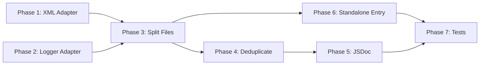

# OXML-Engine Refactoring Plan

## Goals

1. **Portability** — The OXML engine must be able to run outside the Word JS API environment, so it can be used as a standalone JS library to modify `.docx` files on a webpage (e.g., with JSZip + browser DOMParser).
2. **Readability & Performance** — Clean up the code for maintainability without changing any underlying logic.

> **Constraint**: Do NOT change the underlying logic. Every refactoring step preserves behavior exactly.

---

## Current State Analysis

### All Files in the Reconciliation Folder

The folder `src/taskpane/modules/reconciliation/` contains **13 files** that collectively form the OOXML reconciliation system:

| # | File | Lines | Role | DOMParser/XMLSerializer? | console.log? | Word JS API? |
|---|------|-------|------|--------------------------|--------------|-------------|
| 1 | [`oxml-engine.js`](src/taskpane/modules/reconciliation/oxml-engine.js) | 3,207 | Main router + surgical/reconstruction modes | Yes | ~50+ calls | No |
| 2 | [`pipeline.js`](src/taskpane/modules/reconciliation/pipeline.js) | 499 | ReconciliationPipeline class, list generation, table gen | Yes | ~15 calls | No |
| 3 | [`ingestion.js`](src/taskpane/modules/reconciliation/ingestion.js) | ~300 | Parses OOXML into RunModel | Yes | ~5 calls | No |
| 4 | [`serialization.js`](src/taskpane/modules/reconciliation/serialization.js) | 398 | RunModel to OOXML XML strings, pkg:package wrapping | Yes | No | No |
| 5 | [`diff-engine.js`](src/taskpane/modules/reconciliation/diff-engine.js) | 181 | Word-level diffing via diff-match-patch | No | No | No |
| 6 | [`patching.js`](src/taskpane/modules/reconciliation/patching.js) | 338 | Splits runs at boundaries, applies patches | No | ~1 call | No |
| 7 | [`markdown-processor.js`](src/taskpane/modules/reconciliation/markdown-processor.js) | 160 | Strips markdown, extracts format hints | No | No | No |
| 8 | [`numbering-service.js`](src/taskpane/modules/reconciliation/numbering-service.js) | 290 | List numbering management, numbering.xml generation | No | No | No |
| 9 | [`table-reconciliation.js`](src/taskpane/modules/reconciliation/table-reconciliation.js) | 312 | Virtual Grid diffing, table OOXML serialization | No | No | No |
| 10 | [`comment-engine.js`](src/taskpane/modules/reconciliation/comment-engine.js) | 725 | Pure OOXML comment injection | Yes | ~5 calls | No |
| 11 | [`types.js`](src/taskpane/modules/reconciliation/types.js) | 159 | Enums, typedefs, `escapeXml()`, revision ID counter | No | No | No |
| 12 | [`integration.js`](src/taskpane/modules/reconciliation/integration.js) | 112 | Word JS API bridge | No | ~3 calls | **Yes** |
| 13 | [`index.js`](src/taskpane/modules/reconciliation/index.js) | 30 | Barrel re-exports | No | No | No |

**Also affected** (outside the folder): [`ooxml-formatting-removal.js`](src/taskpane/ooxml-formatting-removal.js) (329 lines) — imports `parseOoxml`/`serializeOoxml` from oxml-engine.

**Key findings**:
- **5 files** use `DOMParser`/`XMLSerializer`: oxml-engine, pipeline, ingestion, serialization, comment-engine
- **~80+** `console.log/warn/error` calls across the folder
- **Only 1 file** (`integration.js`) has Word JS API dependencies
- **7 files** are already fully portable: diff-engine, patching, markdown-processor, numbering-service, table-reconciliation, types, index
- **1 file** has duplicated utilities: `comment-engine.js` re-declares `NS_W`, `escapeXml()`, and its own `revisionIdCounter` instead of importing from `types.js`

### oxml-engine.js Breakdown

[`oxml-engine.js`](src/taskpane/modules/reconciliation/oxml-engine.js) is a **3,207-line** monolithic file containing:

| Section | Lines | Responsibility |
|---------|-------|----------------|
| Type definitions & imports | 1–20 | JSDoc types, module imports |
| Paragraph filtering | 62–86 | `getDocumentParagraphs()` |
| Surgical OOXML builders | 88–401 | `buildSurgicalReplacementOoxml()`, rPr manipulation helpers |
| Table cell context detection | 404–532 | `detectTableCellContext()`, `serializeParagraphOnly()`, `wrapParagraphInPackage()` |
| Main export `applyRedlineToOxml()` | 534–753 | Router / orchestrator function |
| Format extraction & removal | 755–1346 | `extractFormattingFromOoxml()`, surgical removal, legacy checker |
| Format-only mode | 1348–1641 | `applyFormatOnlyChanges()`, `applyFormatOnlyChangesSurgical()` |
| Table reconciliation | 1893–2050 | `applyTableReconciliation()`, `applyTextToTableTransformation()` |
| Surgical mode | 2052–2458 | `applySurgicalMode()`, processDelete/Insert |
| Reconstruction mode | 2460–2930 | `applyReconstructionMode()`, `appendTextToCurrent()` |
| Helper functions | 2932–3207 | `createTrackChange()`, `createTextRun()`, `injectFormattingToRPr()`, etc. |

### Coupling Points Identified

#### A. Browser API Dependencies (in oxml-engine.js)

| API | Usage Locations | Notes |
|-----|-----------------|-------|
| `DOMParser` | Line 556 inside `applyRedlineToOxml()` | Standard Web API; also available in Node via `xmldom` or `linkedom` |
| `XMLSerializer` | Line 557, and passed around extensively | Standard Web API; same story |
| `console.log/warn/error` | ~50+ call sites | Logging throughout |
| `new Date().toISOString()` | ~10 call sites | Standard JS, no issue |
| `Math.random()` | ~10 call sites for revision IDs | Standard JS, no issue |

#### B. Browser API Dependencies (in sibling modules)

| Module | API | Notes |
|--------|-----|-------|
| [`pipeline.js`](src/taskpane/modules/reconciliation/pipeline.js) | `DOMParser` | Used for OOXML parsing |
| [`ingestion.js`](src/taskpane/modules/reconciliation/ingestion.js) | `DOMParser`, `XMLSerializer` | Parses OOXML, serializes pPr |
| [`serialization.js`](src/taskpane/modules/reconciliation/serialization.js) | `XMLSerializer` | In `flushParagraph()` for pPr |
| [`comment-engine.js`](src/taskpane/modules/reconciliation/comment-engine.js) | `DOMParser`, `XMLSerializer` | Full OOXML manipulation |
| [`integration.js`](src/taskpane/modules/reconciliation/integration.js) | `Word.run()`, `paragraph.getOoxml()`, `paragraph.insertOoxml()`, `localStorage` | **Only file with direct Word JS API** |

#### C. Word JS API Dependencies (NOT in oxml-engine.js)

The engine itself has **zero** direct Word JS API dependencies. The coupling point is [`integration.js`](src/taskpane/modules/reconciliation/integration.js), which bridges the engine to Word's `insertOoxml()` API. This is already a clean separation.

---

## Refactoring Plan

### Phase 1: Extract Shared XML Utilities into an Adapter Module

**What**: Create a new file [`xml-adapter.js`](src/taskpane/modules/reconciliation/xml-adapter.js) that centralizes all `DOMParser` and `XMLSerializer` usage behind a thin adapter layer.

**Why**: This is the single change needed to make the engine portable. In a browser, the adapter uses native `DOMParser`/`XMLSerializer`. In Node.js or a standalone library, the consumer can provide `xmldom`, `linkedom`, or `@xmldom/xmldom` equivalents.

**Detailed Steps**:

1. **Create [`xml-adapter.js`](src/taskpane/modules/reconciliation/xml-adapter.js)** with the following exports:

   ```js
   // Default implementations use browser-native APIs
   let _DOMParser = globalThis.DOMParser;
   let _XMLSerializer = globalThis.XMLSerializer;

   /**
    * Allows external consumers to inject custom XML implementations.
    * Call this before using any engine functions when running outside a browser.
    *
    * @param {Object} options
    * @param {typeof DOMParser} options.DOMParser
    * @param {typeof XMLSerializer} options.XMLSerializer
    */
   export function configureXmlProvider(options) {
       if (options.DOMParser) _DOMParser = options.DOMParser;
       if (options.XMLSerializer) _XMLSerializer = options.XMLSerializer;
   }

   /** @returns {DOMParser} */
   export function createParser() { return new _DOMParser(); }

   /** @returns {XMLSerializer} */
   export function createSerializer() { return new _XMLSerializer(); }

   /**
    * Parses an XML string into a Document.
    * @param {string} xmlString
    * @param {string} [contentType='text/xml']
    * @returns {Document}
    */
   export function parseXml(xmlString, contentType = 'text/xml') {
       const parser = createParser();
       return parser.parseFromString(xmlString, contentType);
   }

   /**
    * Serializes a DOM node to string.
    * @param {Node} node
    * @returns {string}
    */
   export function serializeXml(node) {
       const serializer = createSerializer();
       return serializer.serializeToString(node);
   }
   ```

2. **Update [`oxml-engine.js`](src/taskpane/modules/reconciliation/oxml-engine.js:556)** — Replace `new DOMParser()` and `new XMLSerializer()` with imports from the adapter:
   - Line 556: `const parser = new DOMParser();` → `const parser = createParser();`
   - Line 557: `const serializer = new XMLSerializer();` → `const serializer = createSerializer();`
   - Export helpers [`parseOoxml()`](src/taskpane/modules/reconciliation/oxml-engine.js:3194) and [`serializeOoxml()`](src/taskpane/modules/reconciliation/oxml-engine.js:3202) should delegate to adapter

3. **Update sibling modules** the same way:
   - [`pipeline.js`](src/taskpane/modules/reconciliation/pipeline.js:49): Replace `parser.parseFromString()`
   - [`ingestion.js`](src/taskpane/modules/reconciliation/ingestion.js:26): Replace `parser.parseFromString()` and `new XMLSerializer()` at line 51, 262
   - [`serialization.js`](src/taskpane/modules/reconciliation/serialization.js:38): Replace `new XMLSerializer()` in `flushParagraph()`
   - [`comment-engine.js`](src/taskpane/modules/reconciliation/comment-engine.js): Replace all `DOMParser`/`XMLSerializer` usage

4. **Update [`index.js`](src/taskpane/modules/reconciliation/index.js)** to re-export `configureXmlProvider` so consumers can configure it at the package level.

5. **Update [`ooxml-formatting-removal.js`](src/taskpane/ooxml-formatting-removal.js:8)** — It imports `parseOoxml` and `serializeOoxml` from oxml-engine; those already delegate, so no change needed beyond ensuring the adapter is used.

---

### Phase 2: Extract a Logger Adapter

**What**: Replace all `console.log/warn/error` calls with a lightweight logger adapter that can be silenced, redirected, or replaced.

**Why**: When running as a library on a webpage processing docx files, the ~50+ `console.log` statements will pollute the consumer's console. A logger adapter lets consumers control verbosity.

**Detailed Steps**:

1. **Create [`logger.js`](src/taskpane/modules/reconciliation/logger.js)** with:

   ```js
   let _logger = console;

   /**
    * Replace the default logger.
    * Pass `{ log: ()=>{}, warn: ()=>{}, error: ()=>{} }` to silence all output.
    */
   export function configureLogger(logger) {
       _logger = logger;
   }

   export const log = (...args) => _logger.log(...args);
   export const warn = (...args) => _logger.warn(...args);
   export const error = (...args) => _logger.error(...args);
   ```

2. **Find and replace** across all files in `src/taskpane/modules/reconciliation/`:
   - `console.log(` → `log(`
   - `console.warn(` → `warn(`
   - `console.error(` → `error(`
   - Add `import { log, warn, error } from './logger.js';` to each file

3. **Re-export** `configureLogger` from [`index.js`](src/taskpane/modules/reconciliation/index.js).

---

### Phase 3: Split oxml-engine.js into Focused Modules

**What**: Break the 3,207-line monolith into 5–6 smaller files, each with a single responsibility.

**Why**: Readability. A 3,200-line file with 50+ functions is hard to navigate. Splitting by responsibility makes each file understandable in isolation.

**Constraint**: No logic changes. Every function moves as-is. The main export `applyRedlineToOxml()` stays in `oxml-engine.js` as the router, but delegates to extracted modules.

**Proposed File Structure**:

```
src/taskpane/modules/reconciliation/
├── oxml-engine.js              (router - ~150 lines, down from 3207)
├── xml-adapter.js              (Phase 1 - new)
├── logger.js                   (Phase 2 - new)
├── rpr-helpers.js              (new - ~250 lines)
├── format-extraction.js        (new - ~300 lines)
├── format-application.js       (new - ~400 lines)
├── table-cell-context.js       (new - ~130 lines)
├── surgical-mode.js            (new - ~400 lines)
├── reconstruction-mode.js      (new - ~500 lines)
├── run-builders.js             (new - ~300 lines)
├── ... (existing files unchanged)
```

**Detailed extraction plan**:

#### 3a. Create [`rpr-helpers.js`](src/taskpane/modules/reconciliation/rpr-helpers.js)

Move these functions from [`oxml-engine.js`](src/taskpane/modules/reconciliation/oxml-engine.js):

| Function | Current Lines | Purpose |
|----------|--------------|---------|
| [`insertRPrChildInOrder()`](src/taskpane/modules/reconciliation/oxml-engine.js:232) | 232–250 | Inserts rPr child in schema order |
| [`applyFormatOverridesToRPr()`](src/taskpane/modules/reconciliation/oxml-engine.js:255) | 255–315 | Removes formatting tags, adds overrides |
| [`applyFormatAdditionsToRPr()`](src/taskpane/modules/reconciliation/oxml-engine.js:320) | 320–380 | Adds formatting tags to rPr |
| [`stripRPrChangeNodes()`](src/taskpane/modules/reconciliation/oxml-engine.js:382) | 382–393 | Strips w:rPrChange from rPr |
| [`buildAddedFormatRPr()`](src/taskpane/modules/reconciliation/oxml-engine.js:395) | 395–401 | Clones rPr with format additions |
| [`buildOverrideRPrXml()`](src/taskpane/modules/reconciliation/oxml-engine.js:162) | 162–227 | Builds override rPr XML string |
| [`extractFormatFromRPr()`](src/taskpane/modules/reconciliation/oxml-engine.js:824) | 824–848 | Extracts format flags from rPr element |

These are all pure DOM-manipulation utilities for `w:rPr` elements. They share the `RPR_PRIORITY_ORDER` constant (currently duplicated in lines 233 and 3080).

**Deduplication opportunity**: The priority array `['w:rStyle', 'w:rFonts', 'w:b', ...]` appears in both [`insertRPrChildInOrder()`](src/taskpane/modules/reconciliation/oxml-engine.js:233) and [`injectFormattingToRPr()`](src/taskpane/modules/reconciliation/oxml-engine.js:3080). Extract it as a single `RPR_SCHEMA_ORDER` constant at the top of `rpr-helpers.js`.

#### 3b. Create [`format-extraction.js`](src/taskpane/modules/reconciliation/format-extraction.js)

Move these functions:

| Function | Current Lines | Purpose |
|----------|--------------|---------|
| [`extractFormattingFromOoxml()`](src/taskpane/modules/reconciliation/oxml-engine.js:771) | 771–819 | Main extraction entry point |
| [`processRunForFormatting()`](src/taskpane/modules/reconciliation/oxml-engine.js:853) | 853–914 | Processes single run for format hints |
| [`checkOxmlForFormatting()`](src/taskpane/modules/reconciliation/oxml-engine.js:1338) | 1338–1346 | Legacy formatting check |
| [`getDocumentParagraphs()`](src/taskpane/modules/reconciliation/oxml-engine.js:72) | 72–86 | Paragraph filtering utility |

`getDocumentParagraphs()` is used by multiple modules, so it becomes a shared utility exported from this file.

#### 3c. Create [`format-application.js`](src/taskpane/modules/reconciliation/format-application.js)

Move these functions:

| Function | Current Lines | Purpose |
|----------|--------------|---------|
| [`applyFormatRemovalAsSurgicalReplacement()`](src/taskpane/modules/reconciliation/oxml-engine.js:921) | 921–993 | Format removal via w:rPrChange |
| [`applyFormatAdditionsAsSurgicalReplacement()`](src/taskpane/modules/reconciliation/oxml-engine.js:1000) | 1000–1112 | Format addition via w:rPrChange |
| [`applyFormatRemovalWithSpans()`](src/taskpane/modules/reconciliation/oxml-engine.js:1119) | 1119–1332 | Format removal with span tracking |
| [`applyFormatOnlyChanges()`](src/taskpane/modules/reconciliation/oxml-engine.js:1413) | 1413–1526 | Format-only changes (standard) |
| [`applyFormatOnlyChangesSurgical()`](src/taskpane/modules/reconciliation/oxml-engine.js:1528) | 1528–1641 | Format-only changes (surgical) |
| [`applyFormatToSingleParagraph()`](src/taskpane/modules/reconciliation/oxml-engine.js:1362) | 1362–1407 | Single paragraph formatting |
| [`applyFormatHintsToSpansRobust()`](src/taskpane/modules/reconciliation/oxml-engine.js:1755) | 1755–1805 | Robust format hint application |
| [`splitSpanAtOffset()`](src/taskpane/modules/reconciliation/oxml-engine.js:1812) | 1812–1839 | Span splitting utility |
| [`applyFormatHintToSpans()`](src/taskpane/modules/reconciliation/oxml-engine.js:1847) | 1847–1849 | Deprecated wrapper |
| [`addFormattingToRun()`](src/taskpane/modules/reconciliation/oxml-engine.js:1874) | 1874–1890 | Adds formatting to run |
| [`createFormattedRunWithElement()`](src/taskpane/modules/reconciliation/oxml-engine.js:1854) | 1854–1869 | Creates formatted run |

Also move the paragraph info helpers:

| Function | Current Lines | Purpose |
|----------|--------------|---------|
| [`buildParagraphInfos()`](src/taskpane/modules/reconciliation/oxml-engine.js:1646) | 1646–1677 | Builds paragraph metadata |
| [`buildParagraphTextFromSpans()`](src/taskpane/modules/reconciliation/oxml-engine.js:1682) | 1682–1700 | Reconstructs text from spans |
| [`findMatchingParagraphInfo()`](src/taskpane/modules/reconciliation/oxml-engine.js:1705) | 1705–1727 | Finds matching paragraph |
| [`getContainingParagraph()`](src/taskpane/modules/reconciliation/oxml-engine.js:1732) | 1732–1738 | DOM traversal utility |
| [`normalizeParagraphComparisonText()`](src/taskpane/modules/reconciliation/oxml-engine.js:1744) | 1744–1749 | Text normalization |

#### 3d. Create [`table-cell-context.js`](src/taskpane/modules/reconciliation/table-cell-context.js)

Move these functions:

| Function | Current Lines | Purpose |
|----------|--------------|---------|
| [`detectTableCellContext()`](src/taskpane/modules/reconciliation/oxml-engine.js:417) | 417–465 | Table context detection |
| [`serializeParagraphOnly()`](src/taskpane/modules/reconciliation/oxml-engine.js:476) | 476–498 | Paragraph extraction from table |
| [`wrapParagraphInPackage()`](src/taskpane/modules/reconciliation/oxml-engine.js:506) | 506–532 | Package wrapping for standalone paragraphs |

#### 3e. Create [`surgical-mode.js`](src/taskpane/modules/reconciliation/surgical-mode.js)

Move these functions:

| Function | Current Lines | Purpose |
|----------|--------------|---------|
| [`applySurgicalMode()`](src/taskpane/modules/reconciliation/oxml-engine.js:2060) | 2060–2161 | Main surgical mode entry |
| [`reconcileFormattingForTextSpan()`](src/taskpane/modules/reconciliation/oxml-engine.js:2167) | 2167–2242 | Format reconciliation for spans |
| [`processRunElement()`](src/taskpane/modules/reconciliation/oxml-engine.js:2247) | 2247–2302 | Run element processing |
| [`getUpdatedFullText()`](src/taskpane/modules/reconciliation/oxml-engine.js:2307) | 2307–2321 | Text tracking utility |
| [`processDelete()`](src/taskpane/modules/reconciliation/oxml-engine.js:2326) | 2326–2393 | Deletion processing |
| [`processInsert()`](src/taskpane/modules/reconciliation/oxml-engine.js:2398) | 2398–2458 | Insertion processing |
| [`buildSurgicalReplacementOoxml()`](src/taskpane/modules/reconciliation/oxml-engine.js:104) | 104–138 | Surgical replacement builder |
| [`buildUnformattedRunOoxml()`](src/taskpane/modules/reconciliation/oxml-engine.js:146) | 146–157 | Unformatted run builder |

#### 3f. Create [`reconstruction-mode.js`](src/taskpane/modules/reconciliation/reconstruction-mode.js)

Move these functions:

| Function | Current Lines | Purpose |
|----------|--------------|---------|
| [`applyReconstructionMode()`](src/taskpane/modules/reconciliation/oxml-engine.js:2468) | 2468–2687 | Main reconstruction entry |
| [`processChildNode()`](src/taskpane/modules/reconciliation/oxml-engine.js:2692) | 2692–2706 | Child node processing |
| [`processRunForReconstruction()`](src/taskpane/modules/reconciliation/oxml-engine.js:2711) | 2711–2769 | Run processing for reconstruction |
| [`processHyperlinkForReconstruction()`](src/taskpane/modules/reconciliation/oxml-engine.js:2775) | 2775–2799 | Hyperlink processing |
| [`appendTextToCurrent()`](src/taskpane/modules/reconciliation/oxml-engine.js:2807) | 2807–2930 | Text appending with track changes |

#### 3g. Create [`run-builders.js`](src/taskpane/modules/reconciliation/run-builders.js)

Move these shared helper functions:

| Function | Current Lines | Purpose |
|----------|--------------|---------|
| [`createTrackChange()`](src/taskpane/modules/reconciliation/oxml-engine.js:2939) | 2939–2948 | Creates w:ins/w:del wrapper |
| [`createTextRun()`](src/taskpane/modules/reconciliation/oxml-engine.js:2953) | 2953–2963 | Creates w:r with text |
| [`createFormattedRuns()`](src/taskpane/modules/reconciliation/oxml-engine.js:2979) | 2979–3020 | Creates formatted run array |
| [`createTextRunWithRPrElement()`](src/taskpane/modules/reconciliation/oxml-engine.js:3025) | 3025–3035 | Creates w:r with rPr element |
| [`injectFormattingToRPr()`](src/taskpane/modules/reconciliation/oxml-engine.js:3047) | 3047–3109 | Master formatting injector |
| [`createRPrChange()`](src/taskpane/modules/reconciliation/oxml-engine.js:3119) | 3119–3142 | Track change for rPr |
| [`createPPrChange()`](src/taskpane/modules/reconciliation/oxml-engine.js:3152) | 3152–3174 | Track change for pPr |

#### 3h. Slim down [`oxml-engine.js`](src/taskpane/modules/reconciliation/oxml-engine.js)

After extractions, `oxml-engine.js` retains only:

1. The main export [`applyRedlineToOxml()`](src/taskpane/modules/reconciliation/oxml-engine.js:548) (~200 lines) — the router
2. [`sanitizeAiResponse()`](src/taskpane/modules/reconciliation/oxml-engine.js:3179) (~10 lines) — small utility
3. [`parseOoxml()`](src/taskpane/modules/reconciliation/oxml-engine.js:3194) and [`serializeOoxml()`](src/taskpane/modules/reconciliation/oxml-engine.js:3202) — delegates to xml-adapter
4. Table reconciliation router calls: [`applyTableReconciliation()`](src/taskpane/modules/reconciliation/oxml-engine.js:1899) and [`applyTextToTableTransformation()`](src/taskpane/modules/reconciliation/oxml-engine.js:1959) (~150 lines) — could stay here or move to a `table-mode.js`
5. Imports from all the new modules

This should bring `oxml-engine.js` down to roughly **400–500 lines** — a manageable router file.

---

### Phase 4: Deduplicate Repeated Code Patterns

**What**: Consolidate duplicated logic without changing behavior.

**Why**: Several patterns are copy-pasted across functions. This hurts readability and makes future changes error-prone.

**Specific Deduplication Targets**:

#### 4a. RPR Priority Array Duplication

The schema-order priority array appears identically in:
- [`insertRPrChildInOrder()`](src/taskpane/modules/reconciliation/oxml-engine.js:233) (line 233)
- [`injectFormattingToRPr()` → `syncElement()`](src/taskpane/modules/reconciliation/oxml-engine.js:3080) (line 3080)

**Action**: Extract to a single `RPR_SCHEMA_ORDER` constant in `rpr-helpers.js`, imported by both.

#### 4b. Format Override Duplication

[`applyFormatOverridesToRPr()`](src/taskpane/modules/reconciliation/oxml-engine.js:255) and [`buildOverrideRPrXml()`](src/taskpane/modules/reconciliation/oxml-engine.js:162) share nearly identical logic for:
- Building a `removalSet`
- Removing existing elements
- Adding override elements (`w:val="0"`)

**Action**: Extract the shared "remove-then-add-overrides" pattern into a single private helper `_applyOverrides(rPr, formatFlags, mode)` where `mode` is `'remove'` (val=0/none) or `'add'` (val=1/single). Both functions delegate to it.

#### 4c. rPrChange Snapshot Pattern

The pattern of:
1. Create `w:rPrChange` element
2. Set `w:id`, `w:author`, `w:date`
3. Snapshot current rPr children (excluding existing rPrChange)
4. Append snapshot as child
5. Remove existing rPrChange if present
6. Append new rPrChange

...appears in at least **4 places**:
- [`applyFormatRemovalAsSurgicalReplacement()`](src/taskpane/modules/reconciliation/oxml-engine.js:956) (lines 956–977)
- [`applyFormatAdditionsAsSurgicalReplacement()`](src/taskpane/modules/reconciliation/oxml-engine.js:1079) (lines 1079–1102)
- [`applyFormatRemovalWithSpans()`](src/taskpane/modules/reconciliation/oxml-engine.js:1199) (lines 1199–1219 and 1233–1255)
- [`createRPrChange()`](src/taskpane/modules/reconciliation/oxml-engine.js:3119) (lines 3119–3142)

**Action**: Consolidate into a single `snapshotAndAttachRPrChange(xmlDoc, rPr, author, dateStr)` function in `run-builders.js`. All four call sites delegate to it.

#### 4d. Text Span Building Duplication

The pattern of iterating paragraph children to build text spans appears in:
- [`extractFormattingFromOoxml()`](src/taskpane/modules/reconciliation/oxml-engine.js:799) (lines 799–815)
- [`applySurgicalMode()`](src/taskpane/modules/reconciliation/oxml-engine.js:2068) (lines 2068–2091)
- [`applyFormatOnlyChanges()`](src/taskpane/modules/reconciliation/oxml-engine.js:1422) (lines 1422–1440)
- [`applyFormatOnlyChangesSurgical()`](src/taskpane/modules/reconciliation/oxml-engine.js:1533) (lines 1533–1553)
- [`applyFormatToSingleParagraph()`](src/taskpane/modules/reconciliation/oxml-engine.js:1367) (lines 1367–1401)

**Action**: Extract a single `buildTextSpansFromParagraphs(paragraphs)` function in `format-extraction.js`. All call sites use it.

#### 4e. Paragraph-Matching Logic Duplication

The pattern of:
1. Build `paragraphInfos`
2. Normalize text
3. Try exact match, then trim match, then substring search

...appears identically in:
- [`applyFormatOnlyChanges()`](src/taskpane/modules/reconciliation/oxml-engine.js:1458) (lines 1458–1506)
- [`applyFormatOnlyChangesSurgical()`](src/taskpane/modules/reconciliation/oxml-engine.js:1569) (lines 1569–1618)

**Action**: Extract `findTargetParagraphInfo(paragraphInfos, originalText)` returning `{ targetInfo, matchOffset }`. Both functions call it.

#### 4f. comment-engine.js Duplicates from types.js

[`comment-engine.js`](src/taskpane/modules/reconciliation/comment-engine.js) re-declares three items that already exist in [`types.js`](src/taskpane/modules/reconciliation/types.js):

| Duplicated Item | comment-engine.js Location | Canonical Source in types.js |
|-----------------|---------------------------|------------------------------|
| `NS_W` constant | Top of file (hardcoded `http://schemas.openxmlformats.org/wordprocessingml/2006/main`) | [`NS_W`](src/taskpane/modules/reconciliation/types.js:131) |
| `escapeXml()` function | [Lines 39–47](src/taskpane/modules/reconciliation/comment-engine.js:39) | [`escapeXml()`](src/taskpane/modules/reconciliation/types.js:131) |
| `revisionIdCounter` (local) | Own counter variable for generating unique IDs | `getNextRevisionId()` / `revisionIdCounter` in types.js |

**Action**:
1. Remove the local `NS_W`, `escapeXml()`, and revision counter from `comment-engine.js`
2. Add `import { NS_W, escapeXml, getNextRevisionId } from './types.js';` at the top
3. Replace all local usages with the imported versions
4. This eliminates the risk of the two copies diverging silently

#### 4g. console.log Calls in patching.js

[`patching.js`](src/taskpane/modules/reconciliation/patching.js) has a single `console.log` call that should be replaced with the logger adapter from Phase 2. While minor, consistency matters for the library use case.

**Action**: Import `{ log }` from `./logger.js` and replace the one `console.log` call.

---

### Phase 5: Add JSDoc & Section Headers to All New Modules

**What**: Ensure every exported function has complete JSDoc with `@param` and `@returns` tags.

**Why**: Readability. The existing file has some good JSDoc but many functions lack parameter types or return types.

**Detailed Steps**:

1. For each new module file created in Phase 3, add a file-level comment block explaining:
   - What the module does
   - Which part of the OOXML pipeline it serves
   - Key data types it works with

2. For every exported function, ensure JSDoc includes:
   - `@param` with type for every parameter
   - `@returns` with type
   - A one-line description

3. For long functions (>30 lines), add inline `// Step N:` comments to delineate logical sections (these already exist in some places, extend the pattern).

---

### Phase 6: Ensure Standalone Library Compatibility

**What**: Create an entry point for standalone (non-Word-add-in) usage.

**Why**: The second goal is to run on a webpage to modify docx files. This requires a clean public API that doesn't assume Word's `insertOoxml()`.

**Detailed Steps**:

1. **Create [`standalone.js`](src/taskpane/modules/reconciliation/standalone.js)** — a new entry point that:
    - Re-exports `configureXmlProvider` and `configureLogger`
    - Re-exports `applyRedlineToOxml` (the main engine)
    - Re-exports `sanitizeAiResponse`, `parseOoxml`, `serializeOoxml`
    - Re-exports pipeline components: `ReconciliationPipeline`, `ingestOoxml`, `preprocessMarkdown`, `serializeToOoxml`, `wrapInDocumentFragment`
    - Re-exports comment engine: `injectCommentsIntoOoxml`, `injectCommentsIntoPackage`, `buildCommentElement`, `buildCommentsPartXml`
    - Re-exports formatting removal: `removeFormattingFromRPr`, `applyFormattingRemovalToOoxml`, `applyHighlightToOoxml` (from `ooxml-formatting-removal.js`)
    - Re-exports table/list tools: `generateTableOoxml`, `NumberingService`
    - Re-exports types/enums: `DiffOp`, `RunKind`, `ContainerKind`, `ContentType`, `NS_W`, `escapeXml`
    - Does NOT export anything from `integration.js` (which has Word JS API deps)

2. **Document the standalone API** in a new `STANDALONE_USAGE.md` showing:
   - How to configure XML provider (e.g., `xmldom` for Node, native for browser)
   - How to load a .docx file (JSZip → extract `word/document.xml` → pass to engine)
   - How to apply changes and write back

3. **Verify no `Word.*` or `Office.*` references** exist in any file imported by `standalone.js`. Currently the only such file is [`integration.js`](src/taskpane/modules/reconciliation/integration.js), which is deliberately excluded.

4. **Verify no `localStorage`** references in engine files. Currently only [`integration.js`](src/taskpane/modules/reconciliation/integration.js:108) uses it.

---

### Phase 7: Improve Test Infrastructure

**What**: Update existing tests and add new ones to validate the refactoring.

**Why**: The existing tests in `/tests/` use `.mjs` files and import from reconciliation modules. After the refactoring, imports will change and we need to verify nothing broke.

**Detailed Steps**:

1. **Create a test harness** that provides `xmldom` as the DOMParser/XMLSerializer for Node.js test runs:
   ```js
   import { configureXmlProvider } from '../src/taskpane/modules/reconciliation/xml-adapter.js';
   import { DOMParser, XMLSerializer } from '@xmldom/xmldom';
   configureXmlProvider({ DOMParser, XMLSerializer });
   ```

2. **Update existing test imports** — any test importing from `oxml-engine.js` should still work since `applyRedlineToOxml` stays exported from the same path.

3. **Add smoke tests** for the standalone entry point:
   - Parse a sample `.docx` (already exists in `tests/sample_doc/`)
   - Run `applyRedlineToOxml()` on `word/document.xml` content
   - Verify output is valid XML
   - Verify track change elements are present

4. **Add a "no Word API" lint check**: A simple grep/regex test that ensures no file imported by `standalone.js` contains `Word.run`, `Office.`, `paragraph.`, or `context.sync`.

---

## Execution Order & Dependencies



- **Phases 1 & 2** can be done in parallel — they are independent adapters.
- **Phase 3** depends on 1 & 2 because the new files will import from the adapters.
- **Phase 4** depends on 3 because deduplication operates on the newly split files.
- **Phase 5** can happen alongside or after Phase 4.
- **Phase 6** depends on 3 (needs the clean module split to define a standalone entry).
- **Phase 7** depends on all others to validate the result.

---

## Files Changed Summary

| Action | File | Phase |
|--------|------|-------|
| **Create** | `src/taskpane/modules/reconciliation/xml-adapter.js` | 1 |
| **Create** | `src/taskpane/modules/reconciliation/logger.js` | 2 |
| **Create** | `src/taskpane/modules/reconciliation/rpr-helpers.js` | 3a |
| **Create** | `src/taskpane/modules/reconciliation/format-extraction.js` | 3b |
| **Create** | `src/taskpane/modules/reconciliation/format-application.js` | 3c |
| **Create** | `src/taskpane/modules/reconciliation/table-cell-context.js` | 3d |
| **Create** | `src/taskpane/modules/reconciliation/surgical-mode.js` | 3e |
| **Create** | `src/taskpane/modules/reconciliation/reconstruction-mode.js` | 3f |
| **Create** | `src/taskpane/modules/reconciliation/run-builders.js` | 3g |
| **Create** | `src/taskpane/modules/reconciliation/standalone.js` | 6 |
| **Create** | `STANDALONE_USAGE.md` | 6 |
| **Modify** | `src/taskpane/modules/reconciliation/oxml-engine.js` | 1, 2, 3h |
| **Modify** | `src/taskpane/modules/reconciliation/pipeline.js` | 1, 2 |
| **Modify** | `src/taskpane/modules/reconciliation/ingestion.js` | 1, 2 |
| **Modify** | `src/taskpane/modules/reconciliation/serialization.js` | 1, 2 |
| **Modify** | `src/taskpane/modules/reconciliation/comment-engine.js` | 1, 2, 4f |
| **Modify** | `src/taskpane/modules/reconciliation/patching.js` | 2, 4g |
| **Modify** | `src/taskpane/modules/reconciliation/index.js` | 1, 2, 6 |
| **Modify** | `src/taskpane/ooxml-formatting-removal.js` | 1 (verify adapter usage) |
| **Modify** | `tests/*.mjs` | 7 |

---

## Risk Mitigation

1. **Run existing tests after every phase** to catch regressions immediately.
2. **Phase 3 is the riskiest** (moving functions between files). Do it function-by-function, testing after each move.
3. **Do NOT change any function signatures** — all parameters and return types stay identical.
4. **Do NOT rename any exported functions** from `oxml-engine.js` — consumers of `applyRedlineToOxml`, `sanitizeAiResponse`, `parseOoxml`, `serializeOoxml` should see zero breaking changes.
5. **The `integration.js` file is intentionally not touched** — it remains the Word JS API bridge and is the only file that couples to Word.
